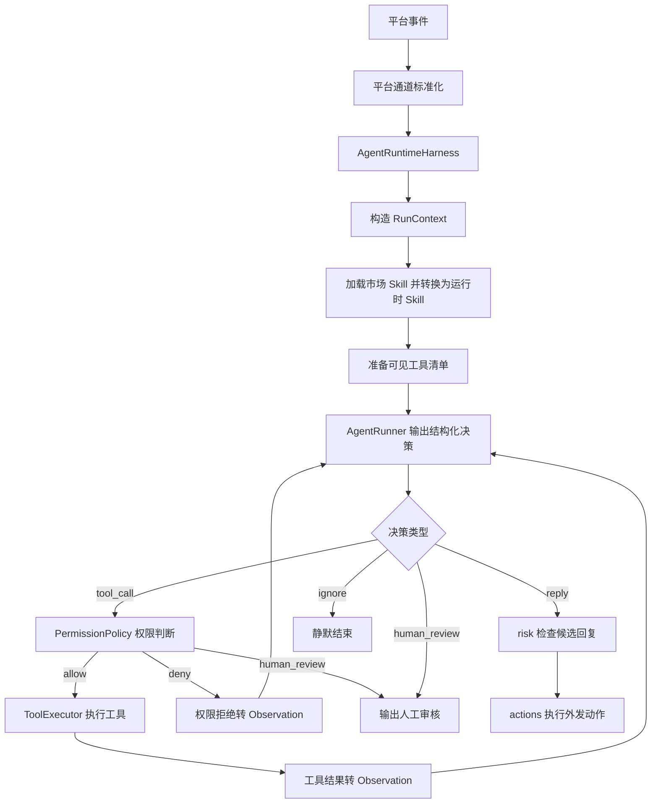

# Harness Agent 第二版设计方案

## 背景

当前 Ye-Kitty 的 QQ Agent 链路以 `QqReplyAgentPort.generateReply()` 为核心能力。它能在收到一条 QQ 消息后生成一条回复，但缺少循环观察能力：模型无法先判断需要哪些信息，再调用工具获取新信息，再把工具结果作为新的 Observation 继续决策。

第二版 Harness Agent 要参考 Claude Code 这类 Agent Harness 的核心思路：模型负责推理，Harness 负责循环、权限、工具、Skill、日志和最终动作边界。Ye-Kitty 不直接复制外部实现，而是在 `agent-runtime` 内建立自己的可审计循环运行时。

## 目标

- 支持 `observe -> think -> guard -> act -> re-observe -> final` 的多轮循环。
- 支持使用市场 Agent Skills 协议描述能力包，并转换成 Ye-Kitty 运行时 Skill。
- 支持工具注册、权限判断、工具执行、工具结果回灌和调用预算。
- 支持输出 `reply`、`ignore`、`human_review` 和候选动作，而不是只输出文本。
- 支持记录每次运行、每轮决策、工具调用、权限判断、最终结果和错误。
- 保持平台层、Harness、risk、actions 的边界清晰，避免模型直接执行外部动作。

## 非目标

- 第一阶段不实现完整 MCP 市场、长期记忆、控制面和 LangGraph 长任务。
- 第一阶段不允许 Harness 直接执行高风险外发动作，外发动作必须进入 `risk -> actions`。
- 第一阶段不建立跨所有服务的统一 Agent 抽象，只在 `services/agent-runtime` 内完成 QQ 短链路 Harness。
- 第一阶段不要求兼容所有 Claude Code 扩展字段，只保证市场 Agent Skills 基线字段可读取、未知字段可保留。

## 角色共识

- 产品关注：叶猫猫能根据上下文判断是否参与聊天，必要时先查信息再回复，而不是机械地每条消息都回。
- 设计关注：后续控制面需要能解释 Agent 为什么调用工具、为什么回复、为什么静默或转人工。
- 开发关注：循环、权限、工具和审计必须由 Ye-Kitty 掌控，OpenAI Agents SDK 只作为底层 Runner。
- Agent 关注：设计、实现、测试和 `design-docs/Task.md` 状态必须同步，所有说明、Prompt、Skill 和日志保持中文。

## 整体设计



核心原则：

- 平台层只负责接收、标准化和发送，不实现 Agent 循环。
- Skill 只声明能力、Prompt 片段、建议工具和风险元数据，不拥有工具执行权。
- 模型只输出结构化决策，不直接执行工具。
- `ToolExecutor` 是唯一工具执行入口。
- `PermissionPolicy` 是唯一权限判断入口。
- Harness 只产出候选回复或候选动作，真正对外动作进入 `risk -> actions`。

## 设计思想

第二版要解决的是“谁掌控 Agent 循环”的问题。答案不是 QQ 平台层，也不是 OpenAI Agents SDK，而是 Ye-Kitty 自己的 `agent-runtime`。

这样做有三个取舍：

1. 先具体、后抽象。第一阶段只围绕 QQ 短链路实现 Harness，避免提前做全平台统一框架。
2. 权限在 Harness，不在 Prompt。Prompt 可以提醒模型，但不能作为安全边界；工具必须经过注册、权限判断和审计。
3. 市场 Skill 是外部协议，运行时 Skill 是内部结构。磁盘格式对齐市场，执行权限由 Ye-Kitty 决定。

### Prompt 三层治理

MVP 的 Harness Prompt 采用三层描述，目标是让模型先理解输出协议，再理解 Skill 和 Tool 的用途，最后知道如何用 JSON 触发 Harness 行动。

1. JSON 输出契约层：强制每轮只返回一个可解析 JSON 对象，禁止 Markdown、解释文字、代码块和多个 JSON。
2. Skill 与 Tool 定义层：说明 Skill 是已启用的能力说明，Tool 是获取新观察的能力；当缺少上下文、历史消息或事实信息时，应优先请求 `tool_call`。
3. JSON 调用方式层：给出 `tool_call`、`reply`、`ignore`、`human_review` 的具体 JSON 模板，特别标明 `get_recent_messages` 的触发场景。

这套分层参考 Codex 类 Harness 的思路：系统提示先说明 Agent 能力和工具边界，再由工具 schema 或协议约束具体调用。Ye-Kitty 当前 MVP 还没有动态 `invoke_skill` 决策，模型只能使用“本轮已启用 Skill”，并通过 `tool_call` 请求 Harness 执行工具。

三层运行协议保存在 `packages/kitty-service/src/services/agent-runtime/infrastructure/prompt/markdown/harness-runtime.prompt.md`，代码只负责读取 Markdown 并与基础身份、Skill、Tool 和 Observation 拼接，避免前置约束长期内嵌在 TypeScript 字符串中。

## 关键实现

### 模块一：AgentRuntimeHarness

- 入口：`packages/kitty-service/src/services/agent-runtime/application/agent-runtime-harness.ts`
- 职责：控制一次 Agent 运行的主循环，组织 Observation、Runner 决策、权限判断、工具执行和最终结果。
- 重要细节：MVP 默认限制 `maxTurns=4`、`maxToolCalls=3`；Runner 单次决策超时继续复用 `YE_KITTY_AGENT_REPLY_TIMEOUT_MS`；每轮循环通过结构化日志记录。
- 边界：不直接发送 QQ 消息，不直接绕过 `risk/actions` 执行平台动作。

### 模块二：AgentRunnerPort

- 入口：`packages/kitty-service/src/services/agent-runtime/ports/agent-runner.port.ts`
- 职责：屏蔽 OpenAI Agents SDK、测试桩和未来其他模型 SDK 的差异。
- 重要细节：Runner 输入是 Harness 构造后的 Observation 和可见工具描述，输出必须是结构化 `AgentDecision`。
- 边界：Runner 不拥有工具执行能力，只能提出 `tool_call`、`reply`、`ignore` 或 `human_review`。

### 模块三：RuntimeSkillLoader

- 入口：`packages/kitty-service/src/services/agent-runtime/infrastructure/skill-market/skill-frontmatter.parser.ts`
- 职责：读取市场 Agent Skills 协议中的基础字段，将 `SKILL.md` 转换成 Ye-Kitty 可使用的运行时 Skill 元信息。
- 重要细节：MVP 已支持 `name`、`description`、`metadata` 和单行 `allowed-tools`；未知字段不阻断加载，`license`、`compatibility`、`references/`、`scripts/` 和 `assets/` 留到后续阶段。
- 边界：Skill 只声明建议能力和建议工具，不直接执行工具，不直接扩大权限。

### 模块四：ToolRegistry 与 ToolExecutor

- 入口：`packages/kitty-service/src/services/agent-runtime/ports/tool-registry.port.ts`、`packages/kitty-service/src/services/agent-runtime/ports/tool-executor.port.ts`、`packages/kitty-service/src/services/agent-runtime/application/runtime-tools.ts`
- 职责：`ToolRegistry` 暴露工具元信息，`ToolExecutor` 执行经过授权的工具调用。
- 重要细节：MVP 已实现 `get_recent_messages` 只读工具，输入支持 `{ limit?: number }`，默认 5，最大 10，输出转成中文 Observation。
- 边界：MCP、内置工具、长期记忆工具都只是工具来源，不能成为信任边界。

### 模块五：PermissionPolicy

- 入口：`packages/kitty-service/src/services/agent-runtime/ports/permission-policy.port.ts`
- 职责：判断工具是否允许执行、是否拒绝、是否需要人工审核。
- 重要细节：MVP 暂未建立独立 `PermissionPolicy` 实现，只执行注册表中存在的内置只读工具，并通过 `maxToolCalls` 控制预算；完整权限策略进入后续阶段。
- 边界：不执行工具，只返回权限决策。

### 模块六：RunTrace

- 入口：`packages/kitty-service/src/services/agent-runtime/ports/run-trace.port.ts`
- 职责：记录每次运行、每轮决策、工具调用、权限结果、最终结果和错误。
- 重要细节：MVP 暂未建立持久化 RunTrace 端口，通过 Harness、工具和订阅器日志覆盖进入循环、模型决策、工具执行、降级和静默。
- 边界：持久化运行记录、回放和控制面查询进入后续阶段。

## 推荐目录结构

```text
packages/kitty-service/src/services/agent-runtime/
  domain/
    agent-decision.ts
    agent-observation.ts
    tool.ts
  ports/
    agent-runtime-harness.port.ts
    agent-runner.port.ts
    tool-registry.port.ts
    tool-executor.port.ts
    conversation-history.port.ts
  application/
    agent-runtime-harness.ts
    in-memory-conversation-history.ts
    runtime-tools.ts
  infrastructure/
    openai-harness-agent-runner.ts
    prompt/harness.prompt.ts
    prompt/markdown/harness-runtime.prompt.md
```

## 数据与接口

| 名称                          | 方向 | 说明                                                  |
| ----------------------------- | ---- | ----------------------------------------------------- |
| `AgentRuntimeHarnessPort.run` | 输入 | 外部事件进入 Harness 的唯一运行入口。                 |
| `AgentRuntimeRunResult`       | 输出 | MVP 返回 `reply`、`ignore` 或 `human_review`。        |
| `AgentDecision`               | 双向 | Runner 输出给 Harness 的结构化决策。                  |
| `RuntimeSkill`                | 输入 | 从市场 Skill 转换而来的运行时能力包。                 |
| `RuntimeTool`                 | 输入 | Harness 暴露给 Runner 的工具描述，不包含直接执行权。  |
| `PermissionDecision`          | 输出 | 权限策略返回 `allow`、`deny` 或 `human_review`。      |
| `ToolExecutionResult`         | 输出 | 工具执行结果，供 RunTrace 和下一轮 Observation 使用。 |

推荐端口：

```ts
export interface AgentRuntimeHarnessPort {
  run(input: AgentRuntimeRunInput): Promise<AgentRuntimeRunResult>;
}

export type AgentRuntimeRunResult =
  | { readonly type: 'reply'; readonly text: string; readonly traceId: string }
  | { readonly type: 'ignore'; readonly reason: string; readonly traceId: string }
  | { readonly type: 'human_review'; readonly reason: string; readonly traceId: string };

export type AgentDecision =
  | {
      readonly type: 'tool_call';
      readonly toolName: string;
      readonly input: unknown;
      readonly reason: string;
    }
  | { readonly type: 'reply'; readonly text: string; readonly reason: string }
  | { readonly type: 'ignore'; readonly reason: string }
  | { readonly type: 'human_review'; readonly reason: string };
```

## Skill 协议

第二版 Skill 对齐市场 Agent Skills 协议。磁盘结构：

```text
skill-name/
  SKILL.md
  references/
  scripts/
  assets/
```

`SKILL.md` 使用 YAML frontmatter 和 Markdown 正文。Ye-Kitty 私有字段统一放在 `metadata.ye-kitty.*`，避免破坏市场协议兼容性。

```yaml
---
name: qq-chat
description: 用于 QQ 群聊和私聊中的自然中文回复，适合判断是否参与聊天并生成短回复。
license: Proprietary
compatibility: Designed for Ye-Kitty Agent Runtime
allowed-tools: get_recent_messages search_memory
metadata:
  ye-kitty.version: '1'
  ye-kitty.locale: 'zh-CN'
  ye-kitty.platforms: 'qq'
  ye-kitty.intent: 'chat-reply'
  ye-kitty.risk-level: 'low'
  ye-kitty.output-contract: 'agent-decision-v1'
---
```

运行时转换：

```text
SKILL.md
  -> SkillManifest
  -> RuntimeSkill
  -> RuntimeSkillPolicy
  -> AgentRuntimeContext
```

`allowed-tools` 只表示 Skill 建议工具。MVP 会把建议工具展示到 Prompt，但最终只执行 `ToolRegistry` 内已注册的内置工具，并受 `maxToolCalls` 约束。

## 工具体系

第一阶段内置工具建议：

| 工具                  | 风险等级 | 说明                                                            |
| --------------------- | -------- | --------------------------------------------------------------- |
| `get_recent_messages` | low      | 已实现。读取当前会话最近消息，帮助 Agent 判断上下文和是否回复。 |
| `get_skill_reference` | low      | 后续阶段。按需读取当前 Skill 的 `references/` 内容。            |
| `search_memory`       | medium   | 后续阶段。查询长期记忆或项目知识库。                            |

工具调用过程：

```text
Runner 提出 tool_call
  -> DecisionRouter 识别工具调用
  -> ToolRegistry 判断工具是否注册
  -> ToolExecutor 执行工具
  -> ToolExecutionResult 写入 RunTrace
  -> ToolExecutionResult 转 Observation
  -> Runner 进入下一轮决策
```

## 权限模型

MVP 权限判断包含：

- 工具是否在 `ToolRegistry` 中存在。
- 本次运行是否超过 `maxToolCalls`。
- 本次运行是否超过 `maxTurns` 或 `timeoutMs`。

独立 `PermissionPolicy`、风险等级审批、参数 schema 校验和人工确认流进入后续阶段。

## 运行记录与日志

一次运行至少记录：

- `runId`、`eventId`、平台、会话、触发用户和触发时间。
- 命中的 Skill、Skill 版本、Skill 风险等级和建议工具。
- 每轮 Observation 摘要。
- 每轮模型结构化决策。
- 每次工具调用、参数摘要、权限判断、执行结果和错误。
- 最终结果、耗时、模型用量、工具调用次数和停止原因。

日志位置：

- 平台事件进入 Harness。
- Skill 命中和 Skill 正文加载。
- 工具权限判断。
- 工具执行开始和结束。
- 模型输出结构化决策。
- 最终决策进入 `risk/actions` 或静默结束。

## 迁移方案

当前链路：

```text
QqReplyEventSubscriber
  -> replyAgent.generateReply()
  -> botClient.sendTextMessage()
```

第二版链路：

```text
QqReplyEventSubscriber
  -> agentRuntimeHarness.run()
  -> reply: botClient.sendTextMessage()
  -> ignore: 不发送
  -> human_review: 记录审核
  -> action_candidate: 交给 risk/actions
```

迁移步骤：

1. 保留 `QqReplyAgentPort` 一段时间，避免一次性替换所有测试。
2. 新增 `AgentRuntimeHarnessPort`，让 factory 内部优先组装 Harness。
3. 使用 `HarnessQqReplyAgentAdapter` 兼容现有 `QqReplyEventSubscriber`。
4. 待 Harness 路径稳定后，再评估订阅器是否直接依赖 `AgentRuntimeHarnessPort`。

## 分阶段建设

### 第一阶段：最小闭环

- 新增 Harness 主循环。
- 新增 Runner、ToolRegistry、ToolExecutor 和会话历史端口。
- 新增 `get_recent_messages` 只读工具。
- 支持市场 Skill 的 `allowed-tools` 读取和运行时转换。
- 默认 `maxTurns=4`、`maxToolCalls=3`、`timeoutMs=30000`。
- 跑通“收到 QQ 消息 -> 调工具获取上下文 -> 再观察 -> 输出最终回复”的闭环。
- 当前状态：已完成实现，等待完整环境验收。

### 第二阶段：能力扩展

- 增加 `get_skill_reference` 和 `search_memory`。
- 接入 MCP 作为工具来源，但所有 MCP 调用仍经过 Harness 权限治理。
- 增加人工审核队列。
- 将 RunTrace 从内存记录升级为可查询持久化记录。

### 第三阶段：治理与控制面

- 接入正式 `risk/actions` 链路。
- 在控制面展示运行记录、Skill 版本、工具调用、人工审核和回放入口。
- 增加工具预算、频率限制、域名白名单、参数脱敏和返回结果脱敏。
- 评估 LangGraph 类长任务 Runner，只用于可暂停恢复、多步骤运营和多 Agent 协作。

## 风险与边界条件

| 风险                                 | 触发条件                                                    | 处理方式                                                                     |
| ------------------------------------ | ----------------------------------------------------------- | ---------------------------------------------------------------------------- |
| 模型输出不合法 JSON 或不符合决策协议 | Runner 返回无法解析的结构化决策                             | 本轮记录错误，要求 Runner 重新输出；超过重试次数后转 `human_review` 或降级。 |
| 工具调用超预算                       | 模型反复要求调用工具                                        | `AgentTurnController` 终止运行，返回 `human_review` 或降级回复。             |
| Skill 声明高风险工具                 | Skill 的 `allowed-tools` 包含发消息、删内容、外部写入等工具 | `PermissionPolicy` 默认拒绝或转人工，不能仅凭 Skill 声明放行。               |
| MCP 工具返回不可信内容               | 外部工具结果包含提示注入或敏感内容                          | 工具结果进入 Observation 前做摘要、脱敏和来源标记。                          |
| risk/actions 未落地                  | Harness 生成候选动作但没有执行链路                          | 第一阶段只允许候选动作进入待处理，不直接执行。                               |

## 测试方案

- 单元测试：已覆盖 Harness 正常循环、工具调用回灌、`maxToolCalls` 降级、Runner 非法输出恢复、`ignore`、`human_review` 和最近消息会话隔离。
- 集成测试：保持 `QqReplyEventSubscriber` 现有文本和 QQ 受控动作执行行为不回退。
- Skill 测试：覆盖标准 `SKILL.md` frontmatter 解析、未知字段保留、`allowed-tools` 建议工具转换和 `metadata.ye-kitty.*` 读取。
- 工具测试：覆盖 `get_recent_messages` 成功、空结果、异常和返回摘要。
- 手动验证：使用 NapCat 发送 QQ 消息，确认 Agent 能先读取最近消息，再结合工具结果回复。
- 回归范围：现有 `FallbackQqReplyAgent`、`SafeQqReplyAgent`、Skill 加载和 QQ 平台白名单过滤不能被破坏。

## 验收方式

- 产品验收：叶猫猫能根据最近消息和 Skill 判断是否回复，并能在信息不足时先调用只读工具。
- 设计验收：控制面未来能从 RunTrace 解释“为什么调用工具、为什么回复、为什么静默、为什么转人工”。
- 开发验收：Harness 相关定向测试通过；完整 `pnpm check` 当前受 `listen EPERM: operation not permitted 127.0.0.1` 环境限制影响。
- Agent 验收：本设计文档、`design-docs/Task.md`、代码入口、测试入口和实际状态保持一致。

## 唯一入口

- 使用入口：QQ 消息进入 Ye-Kitty 后由 Agent Runtime Harness 决策。
- 代码入口：`packages/kitty-service/src/services/agent-runtime/application/agent-runtime-harness.ts`
- 测试入口：`pnpm --filter @ye-kitty/kitty-service test`
- 验证入口：`pnpm --filter @ye-kitty/kitty-service start-platform:qq`
- 文档入口：`design-docs/Agent/agent-runtime-harness.md`
- 团队进度入口：`design-docs/Task.md`

## 进度记录

| 日期       | 状态   | 说明                                                                                                                |
| ---------- | ------ | ------------------------------------------------------------------------------------------------------------------- |
| 2026-07-06 | 设计中 | 已将第二版 Harness Agent 的循环、Skill 协议、工具治理、权限、日志、迁移和验收方案落入设计文档，并同步到 `Task.md`。 |
| 2026-07-06 | 待验收 | MVP 已实现 Harness 主循环、OpenAI Harness Runner、进程内 `get_recent_messages`、Prompt 分层治理和 Skill 扩展字段。  |
