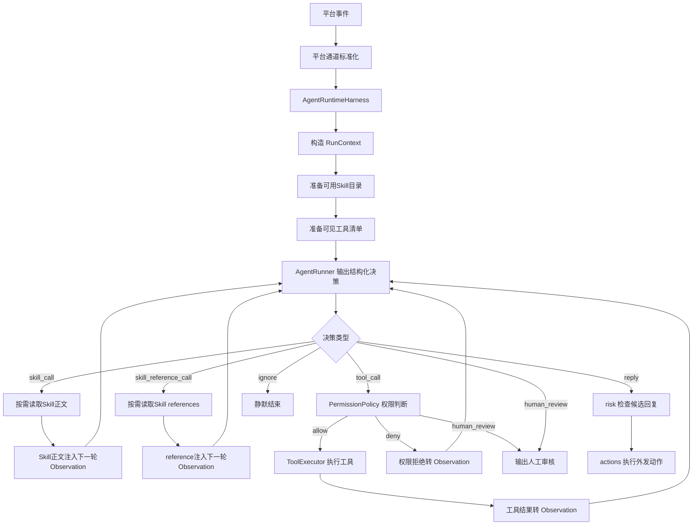

# Harness Agent 第二版设计方案

## 背景

当前 Ye-Kitty 的 QQ Agent 链路以 `QqReplyAgentPort.generateReply()` 为核心能力。它能在收到一条 QQ 消息后生成一条回复，但缺少循环观察能力：模型无法先判断需要哪些信息，再调用工具获取新信息，再把工具结果作为新的 Observation 继续决策。

第二版 Harness Agent 要参考 Claude Code 这类 Agent Harness 的核心思路：模型负责推理，Harness 负责循环、权限、工具、Skill、日志和最终动作边界。Ye-Kitty 不直接复制外部实现，而是在 `agent-runtime` 内建立自己的可审计循环运行时。

## 目标

- 支持 `observe -> think -> guard -> act -> re-observe -> final` 的多轮循环。
- 支持使用市场 Agent Skills 协议描述能力包，并转换成 Ye-Kitty 运行时 Skill。
- 支持平台无关 Skill 目录、Skill 正文和 `references/` 的渐进式注入，让模型基于 `name` 与 `description` 自主请求能力。
- 支持工具注册、权限判断、工具执行、工具结果回灌和调用预算。
- 支持输出 `reply`、`ignore`、`human_review` 和候选动作，而不是只输出文本。
- 支持记录每次运行、每轮决策、工具调用、权限判断、最终结果和错误。
- 保持平台层、Harness、risk、actions 的边界清晰，避免模型直接执行外部动作。

## 非目标

- 第一阶段不实现完整 MCP 市场、长期记忆、控制面和 LangGraph 长任务。
- 第一阶段不允许 Harness 直接执行高风险外发动作，外发动作必须进入 `risk -> actions`。
- 第一阶段不建立跨所有服务的统一 Agent 抽象，只在 `services/agent-runtime` 内完成 QQ 短链路 Harness。
- 第一阶段不要求兼容所有 Claude Code 扩展字段，只保证市场 Agent Skills 基线字段可读取、未知字段可保留。

## 角色共识

- 产品关注：叶猫猫能根据上下文判断是否参与聊天，必要时先查信息再回复，而不是机械地每条消息都回。
- 设计关注：后续控制面需要能解释 Agent 为什么调用工具、为什么回复、为什么静默或转人工。
- 开发关注：循环、权限、工具和审计必须由 Ye-Kitty 掌控，OpenAI Agents SDK 只作为底层 Runner。
- Agent 关注：设计、实现、测试和 `design-docs/Task.md` 状态必须同步，所有说明、Prompt、Skill 和日志保持中文。

## 整体设计



核心原则：

- 平台层只负责接收、标准化和发送，不实现 Agent 循环。
- Skill 只声明能力、Prompt 片段、补充引用和风险元数据，不拥有工具执行权。
- 模型只输出结构化决策，不直接执行工具或读取 Skill 文件。
- `ToolExecutor` 是唯一工具执行入口。
- `PermissionPolicy` 是唯一权限判断入口。
- Harness 只产出候选回复或候选动作，真正对外动作进入 `risk -> actions`。

## 设计思想

第二版要解决的是“谁掌控 Agent 循环”的问题。答案不是 QQ 平台层，也不是 OpenAI Agents SDK，而是 Ye-Kitty 自己的 `agent-runtime`。

这样做有三个取舍：

1. 先具体、后抽象。第一阶段只围绕 QQ 短链路实现 Harness，避免提前做全平台统一框架。
2. 权限在 Harness，不在 Prompt。Prompt 可以提醒模型，但不能作为安全边界；工具必须经过注册、权限判断和审计。
3. 市场 Skill 是外部协议，运行时 Skill 是内部结构。磁盘格式对齐市场，执行权限由 Ye-Kitty 决定。

### Prompt 三章治理

MVP 的 Harness Prompt 采用三章描述，目标是把不可覆盖的系统协议、稳定外界能力目录和每轮运行观察拆开治理。第一章 System Prompt 只承载最高优先级约束、状态机转移和 JSON 输出协议；第二章 Outside Context Prompt 维护在 `instructions` 中，承载 Skill Prompt 与 Tool Prompt；第三章 Runtime Observation 维护在 `input` 中，只承载本轮显式状态、用户事件、工具结果和错误恢复信息。

1. 第一章 System Prompt：拆分为宪法约束、状态机约束和 JSON 行动契约；强制每轮只返回一个可解析 JSON 对象，禁止 Markdown、解释文字、代码块和多个 JSON；只允许 `skill_call`、`skill_reference_call`、`tool_call`、`reply`、`ignore`、`human_review` 六类决策。
2. 第二章 Outside Context Prompt：`2.1 Skill Prompt` 在前，`2.2 Tool Prompt` 在后，并随 `instructions` 传入模型。Skill 目录只展示 `name` 与 `description`；已启用 Skill 正文和 reference 会被渲染为结构化文档；Tool 目录只描述 Harness 当前可见工具，不授予额外权限。
3. 第三章 Runtime Observation：承载 `<run_state>`、`<decision_history>`、用户事件、当前轮次、工具结果和决策错误，并作为每次 Agent 循环的 `input`。Skill 和 Tool 的具体目录不再散落在运行观察中。

这套分章参考 DeepAgents 的状态分层、渐进式披露和上下文压缩思想：稳定宪法、Skill 目录和 Tool 目录由 `instructions` 维护，运行状态由 Harness 显式维护并在每轮 `input` 中渲染成快照，完整 Skill 由模型请求后进入后续 instruction 上下文。Ye-Kitty 在此基础上把 Skill 正文和 reference 都转成结构化 Prompt 文档，使用 `<skill_document>`、`<skill_reference_document>`、JSON 结构头和正文 body 保证可定位、可审计、可压缩。

第一章运行协议保存在 `packages/kitty-service/src/services/agent-runtime/infrastructure/prompt/markdown/System/harness-runtime.prompt.md`。第二章由 `outside-context-prompt.ts` 组装 `skill.prompt.ts` 和 `tool.prompt.ts`，并由 `composeHarnessPrompt()` 拼入 `instructions`。第三章由 `harness.prompt.ts` 渲染 `HarnessPromptState`，并由 `conversation-renderer.ts` 渲染事件与观察，最终作为每轮 `input`。后续新增系统约束时应优先修改 Markdown；新增 Skill/Tool 目录结构时应优先修改对应 TS Prompt 模块。

## 关键实现

### 模块一：AgentRuntimeHarness

- 入口：`packages/kitty-service/src/services/agent-runtime/application/agent-runtime-harness.ts`
- 职责：控制一次 Agent 运行的主循环，组织 Observation、Runner 决策、权限判断、工具执行和最终结果。
- 重要细节：MVP 默认限制 `maxTurns=100`、`maxToolCalls=3`；Runner 单次决策超时继续复用 `YE_KITTY_AGENT_REPLY_TIMEOUT_MS`；每轮循环通过结构化日志记录。
- 状态细节：Harness 内部维护显式 `HarnessPromptState`，包含 `phase`、预算、已启用 Skill、已读取 reference、可见工具、最近观察和决策历史；Prompt 只渲染状态快照，不把 `conversationMessages` 当成隐式状态机。
- Skill 细节：Harness 内部维护 `conversationMessages`、已启用 Skill 和已读取 reference；`skill_call` 与 `skill_reference_call` 不消耗工具预算，但仍受最大轮次和单次运行 reference 次数限制。
- 边界：不直接发送 QQ 消息，不直接绕过 `risk/actions` 执行平台动作。

### 模块二：AgentRunnerPort

- 入口：`packages/kitty-service/src/services/agent-runtime/ports/agent-runner.port.ts`
- 职责：屏蔽 OpenAI Agents SDK、测试桩和未来其他模型 SDK 的差异。
- 重要细节：Runner 输入是 Harness 构造后的 Conversation Observation 和可见工具描述，输出必须是结构化 `AgentDecision`。
- 边界：Runner 不拥有工具执行能力，也不直接读取 Skill 文件，只能提出 `skill_call`、`skill_reference_call`、`tool_call`、`reply`、`ignore` 或 `human_review`。

### 模块三：RuntimeSkillLoader

- 入口：`packages/kitty-service/src/services/agent-runtime/infrastructure/skill-market/skill-frontmatter.parser.ts`
- 职责：启动期读取市场 Agent Skills 协议中的基础字段，运行期按需读取 `SKILL.md` 正文并转换成 Ye-Kitty 可使用的运行时 Skill。
- 重要细节：MVP 已支持 `name`、`description`、`metadata` 和单行 `allowed-tools` 的磁盘解析；未知字段不阻断加载，但首轮 Prompt 目录只展示 `name` 和 `description`，不展示工具、metadata、平台字段或正文；正文只在 `skill_call` 命中后注入下一轮 Observation。
- 边界：Skill 只声明建议能力和建议工具，不直接执行工具，不直接扩大权限。

### 模块四：SkillReferenceLoader

- 入口：`packages/kitty-service/src/services/agent-runtime/infrastructure/skill-market/filesystem-skill-reference-loader.ts`
- 职责：在 Skill 已启用后，按需读取该 Skill 根目录 `references/` 下的补充材料。
- 重要细节：MVP 只允许 `.md`、`.txt`、`.json`，拒绝绝对路径、`..` 路径逃逸、软链、非文件、真实路径逃逸和超过 20KB 的内容；单次运行最多读取 3 个 reference，重复 reference 不重复注入。
- 边界：reference 是低优先级补充上下文，不能覆盖 SystemPrompt、Harness 协议、工具权限和安全规则。

### 模块五：ToolRegistry 与 ToolExecutor

- 入口：`packages/kitty-service/src/services/agent-runtime/ports/tool-registry.port.ts`、`packages/kitty-service/src/services/agent-runtime/ports/tool-executor.port.ts`、`packages/kitty-service/src/services/agent-runtime/application/runtime-tools.ts`
- 职责：`ToolRegistry` 暴露工具元信息，`ToolExecutor` 执行经过授权的工具调用。
- 重要细节：MVP 已实现 `get_recent_messages` 只读工具，私聊固定读取最近 100 条消息，群聊固定读取最近 50 条消息，输出转成中文 Observation。
- 边界：MCP、内置工具、长期记忆工具都只是工具来源，不能成为信任边界。

### 模块六：PermissionPolicy

- 入口：`packages/kitty-service/src/services/agent-runtime/ports/permission-policy.port.ts`
- 职责：判断工具是否允许执行、是否拒绝、是否需要人工审核。
- 重要细节：MVP 暂未建立独立 `PermissionPolicy` 实现，只执行注册表中存在的内置只读工具，并通过 `maxToolCalls` 控制预算；完整权限策略进入后续阶段。
- 边界：不执行工具，只返回权限决策。

### 模块七：RunTrace

- 入口：`packages/kitty-service/src/services/agent-runtime/ports/run-trace.port.ts`
- 职责：记录每次运行、每轮决策、工具调用、权限结果、最终结果和错误。
- 重要细节：MVP 暂未建立持久化 RunTrace 端口，通过 Harness、工具和订阅器日志覆盖进入循环、模型决策、工具执行、降级和静默。
- 边界：持久化运行记录、回放和控制面查询进入后续阶段。

## 推荐目录结构

```text
packages/kitty-service/src/services/agent-runtime/
  domain/
    agent-decision.ts
    agent-conversation-message.ts
    agent-observation.ts
    harness-prompt-state.ts
    skill-reference.ts
    skill-selection-context.ts
    tool.ts
  ports/
    agent-runtime-harness.port.ts
    agent-runner.port.ts
    tool-registry.port.ts
    tool-executor.port.ts
    skill-reference-loader.port.ts
    conversation-history.port.ts
  application/
    agent-runtime-harness.ts
    in-memory-conversation-history.ts
    runtime-tools.ts
  infrastructure/
    openai-harness-agent-runner.ts
    prompt/conversation-renderer.ts
    prompt/harness.prompt.ts
    prompt/outside-context-prompt.ts
    prompt/skill.prompt.ts
    prompt/tool.prompt.ts
    prompt/markdown/System/harness-runtime.prompt.md
```

## 数据与接口

| 名称                           | 方向 | 说明                                                                |
| ------------------------------ | ---- | ------------------------------------------------------------------- |
| `AgentRuntimeHarnessPort.run`  | 输入 | 外部事件进入 Harness 的唯一运行入口。                               |
| `AgentRuntimeRunResult`        | 输出 | MVP 返回 `reply`、`ignore` 或 `human_review`。                      |
| `AgentDecision`                | 双向 | Runner 输出给 Harness 的结构化决策，包含 Skill、工具和最终决策。    |
| `AgentConversationMessage`     | 输入 | Harness 渲染给 Runner 的平台无关 Observation 消息模型。             |
| `HarnessPromptState`           | 输入 | Harness 渲染给 Runner 的显式状态快照，包含 phase、预算和决策历史。  |
| `SkillMetadata`                | 输入 | 启动期扫描的 Skill 元信息，首轮目录只渲染 `name` 和 `description`。 |
| `SkillContent`                 | 输入 | `skill_call` 命中后按需读取并注入 Observation 的 Skill 正文。       |
| `SkillReferenceContent`        | 输入 | `skill_reference_call` 命中后按需读取并注入 Observation 的引用。    |
| `SkillPromptDocument`          | 输入 | 第二章中用于定位、审计和压缩 Skill 正文的结构化 Prompt 文档。       |
| `SkillReferencePromptDocument` | 输入 | 第二章中用于定位、审计和压缩 reference 正文的结构化 Prompt 文档。   |
| `RuntimeTool`                  | 输入 | Harness 暴露给 Runner 的工具描述，不包含直接执行权。                |
| `PermissionDecision`           | 输出 | 权限策略返回 `allow`、`deny` 或 `human_review`。                    |
| `ToolExecutionResult`          | 输出 | 工具执行结果，供 RunTrace 和下一轮 Observation 使用。               |
| `QqReplyAction`                | 输出 | `reply.actions` 中的 QQ 受控回复动作，由订阅器绑定当前会话后执行。  |

推荐端口：

```ts
export interface AgentRuntimeHarnessPort {
  run(input: AgentRuntimeRunInput): Promise<AgentRuntimeRunResult>;
}

export type AgentRuntimeRunResult =
  | { readonly type: 'reply'; readonly text: string; readonly traceId: string }
  | { readonly type: 'ignore'; readonly reason: string; readonly traceId: string }
  | { readonly type: 'human_review'; readonly reason: string; readonly traceId: string };

export type AgentDecision =
  | {
      readonly type: 'skill_call';
      readonly skillName: string;
      readonly input: unknown;
      readonly reason: string;
    }
  | {
      readonly type: 'skill_reference_call';
      readonly skillName: string;
      readonly referencePath: string;
      readonly reason: string;
    }
  | {
      readonly type: 'tool_call';
      readonly toolName: string;
      readonly input: unknown;
      readonly reason: string;
    }
  | { readonly type: 'reply'; readonly text: string; readonly reason: string }
  | { readonly type: 'ignore'; readonly reason: string }
  | { readonly type: 'human_review'; readonly reason: string };
```

## Skill 协议

第二版 Skill 对齐市场 Agent Skills 协议。磁盘结构：

```text
skill-name/
  SKILL.md
  references/
  scripts/
  assets/
```

`SKILL.md` 使用 YAML frontmatter 和 Markdown 正文。Ye-Kitty 私有字段统一放在 `metadata.ye-kitty.*`，避免破坏市场协议兼容性。

```yaml
---
name: qq-chat
description: 用于 QQ 群聊和私聊中的自然中文回复，适合判断是否参与聊天并生成短回复。
license: Proprietary
compatibility: Designed for Ye-Kitty Agent Runtime
allowed-tools: get_recent_messages search_memory
metadata:
  ye-kitty.version: '1'
  ye-kitty.locale: 'zh-CN'
  ye-kitty.platforms: 'qq'
  ye-kitty.intent: 'chat-reply'
  ye-kitty.risk-level: 'low'
  ye-kitty.output-contract: 'agent-decision-v1'
---
```

运行时转换：

```text
SKILL.md frontmatter
  -> SkillMetadata
  -> availableSkills
  -> skill_call
  -> SkillContent
  -> enabledSkills
  -> AgentRuntimeContext
```

`allowed-tools` 只表示 Skill 建议工具，不进入首轮 Skill 目录 Prompt。MVP 目录只展示 `name` 和 `description`，并允许模型通过 `skill_call` 请求 Harness 启用某个本轮可见 Skill；如果 Skill 不在可见目录中，Harness 会把失败原因写入 Observation，不读取磁盘正文。启用成功后，正文进入第二章 `2.1 Skill Prompt`，并被渲染为 `<skill_document>` 结构化文档。模型如需补充材料，可通过 `skill_reference_call` 请求已启用 Skill 的 `references/` 文件，合法内容进入第二章 `<skill_reference_document>`。最终只执行 `ToolRegistry` 内已注册的内置工具，并受 `maxToolCalls` 约束；`skill_call` 和 `skill_reference_call` 只改变上下文，不消耗工具调用预算。

## QQ受控回复动作

QQ 回复动作仍然采用白名单模型，入口是 `packages/kitty-service/src/services/agent-runtime/domain/qq-reply-action.ts`。模型只能在 `reply.actions` 中声明项目允许的动作，不能指定任意群、任意好友、任意消息或任意 NapCat action；`QqReplyActionExecutor` 会把动作绑定到当前收到的 QQ 消息上下文，再交给 `QqBotClientPort`。

群聊触发采用保守门禁：`QqReplyEventSubscriber` 只把明确 @ `YE_KITTY_QQ_SELF_ID` 的群聊消息交给 Agent，未 @ 或只 @ 其他人的普通群聊直接跳过。私聊仍由 QQ 好友白名单控制，不要求 @。

执行层会对文本发送做兜底去重：当模型同时输出外层 `reply.text` 和同内容的 `send_text` 或 `send_text_with_face` 文本段时，只发送一次，避免群聊出现相同内容重复回复。

目标 QQ 回复动作：

| 动作               | 平台消息段或动作         | 说明                                                                                                                                              |
| ------------------ | ------------------------ | ------------------------------------------------------------------------------------------------------------------------------------------------- |
| `send_msg`         | NapCat `send_msg`        | 统一发送普通 QQ 消息，`message` 使用 OneBot 11 混合消息结构，由执行层补齐当前会话目标；文字类消息补齐触发消息引用和发送者 @，自定义表情单独发送。 |
| `poke_sender`      | `group_poke/friend_poke` | 只戳当前消息发送者；一旦使用，本轮不再发送文字、表情或其他发送动作。                                                                              |
| `react_to_message` | `set_msg_emoji_like`     | 只对当前收到的消息添加表情回应。                                                                                                                  |

`send_msg` 设计为替代 `send_text`、`send_text_with_face`、`send_face`、`send_custom_image` 和 `send_market_face` 的统一消息出口。模型只允许声明消息内容，不能声明 `message_type`、`group_id`、`user_id` 或 `reply` 消息段；这些字段和上下文消息段由 `QqReplyActionExecutor` 根据当前 `QqChatMessageEvent` 补齐。群聊补 `message_type: "group"` 和当前群号，私聊补 `message_type: "private"` 和当前好友号。

所有 Agent 普通文字类外发消息只要最终通过 `send_msg` 发送，执行层都会在消息段最前面注入 `reply` 和 `at`：`reply` 引用当前触发消息 `message.id`，`at` 提醒当前触发消息发送者。这个规则覆盖纯文本、内置表情和商城表情；自定义表情使用 `image` 段单独发送，不注入引用和 @，避免表情消息重复提醒。若模型把文字和自定义表情放在同一个 `send_msg.message`，执行层会兜底拆成“文字带上下文”和“自定义表情裸发”两次发送。`poke_sender` 和 `react_to_message` 不经过 `send_msg`，因此不注入引用和 @。如果模型已经在文字类 `send_msg.message` 中 @ 当前发送者，执行层只保留一次发送者 @，避免重复提醒。

NapCat WebUI `send_msg` 调试页确认的参数为：`message_type`、`user_id`、`group_id`、`message`、`auto_escape`、`source`、`news`、`summary`、`prompt`、`timeout`。当前 Agent Harness 只接收 `message`，目标字段由运行时补齐，其余发送控制字段暂不对模型开放。

`message` 使用受控 OneBot 11 消息混合类型，当前只允许消息段数组，并只接收模型声明的 `text`、`at`、`face`、`mface`、`image` 五类段。自定义表情通过 `image` 段发送，`file` 必须来自 `get_custom_faces` 工具返回的目录结果，不能由模型编造。更宽的 NapCat 段类型如模型手写 `reply`、`record`、`video`、`file`、`music`、`json`、`markdown`、`node`、`forward`、`contact`、`location`、`xml`、`poke`、`miniapp`、`onlinefile`、`flashtransfer` 暂不开放。

统一 `send_msg` 接入 Harness 的过程：

1. `qq-chat` Skill 暴露 `send_msg` JSON 结构，禁止模型输出 `send_group_msg`、`send_private_msg` 或任意 HTTP 调用。
2. `harness-runtime.prompt.md` 将 `reply.actions` 白名单调整为 `send_msg`、`poke_sender`、`react_to_message`。
3. `parseQqReplyAction` 新增 `send_msg`，保留 OneBot 11 内容消息段结构，过滤空消息、模型手写 `reply` 和会话目标字段。
4. `QqReplyActionExecutor` 仍处理 `poke_sender` 独占；普通回复统一调用 `QqBotClientPort.sendMessage`，文字类 `send_msg` 补齐当前触发消息 `reply` 和发送者 `at`，自定义表情 `image` 段单独发送。
5. `QqBotClientPort` 和 `OneBotWsExternalActionApi` 合并文字、图片、内置表情、商城表情发送入口，最终统一发 NapCat `send_msg`。
6. RunTrace 记录模型原始 `send_msg`、运行时补齐后的参数摘要、NapCat 响应和错误。
7. 单元测试覆盖消息段透传、目标字段过滤、自定义表情图片段、触发消息引用、发送者 @ 去重、戳一戳独占和旧动作兼容迁移。

## 自定义表情理解与选择

自定义表情采用“平台读取、视觉理解、目录缓存、聊天最终决策”的链路。`OneBotWsExternalActionApi.fetchCustomFaces` 只调用 NapCat `fetch_custom_face` 并归一化可发送资源；`CustomFaceCatalogService` 只在启动期调用独立视觉 Agent 生成中文描述，并把结果缓存为聊天 Agent 可读取的目录。聊天 Agent 不直接理解图片；当它需要自定义表情时，通过 `get_custom_faces` 读取启动期缓存，再根据工具返回的内容、情绪、适用场景和 `file` 自行选择是否用 `send_msg` 的 `image` 段发送。

启动期由 `packages/kitty-service/scripts/start-platform-qq.ts` 组装 `CustomFaceCatalogService`。NapCat 连接建立后触发一次刷新；后续聊天 Agent 调用 `get_custom_faces` 时只读取启动期缓存，不再重新拉取平台自定义表情、重新理解图片或调用视觉 Agent 推荐表情，默认同一进程会话内自定义表情列表不变化。视觉 Agent 使用 `YE_KITTY_VISION_AGENT_MODEL`、`YE_KITTY_VISION_AGENT_API_KEY`、`YE_KITTY_VISION_AGENT_BASE_URL` 和 `YE_KITTY_VISION_AGENT_TIMEOUT_MS` 独立配置；未配置视觉模型或单张表情理解失败时，目录保留可发送表情，并用平台 `summary/name` 生成低置信度降级描述。NapCat 拉取失败、目录为空或工具读取异常时，`get_custom_faces` 返回中文降级观察，让聊天 Agent 可以用网络不好、暂时看不到图片或无法理解表情等方式自然回复，不中断 Harness。

## 工具体系

第一阶段内置工具建议：

| 工具                  | 风险等级 | 说明                                                                 |
| --------------------- | -------- | -------------------------------------------------------------------- |
| `get_recent_messages` | low      | 已实现。读取当前会话最近消息，帮助 Agent 判断上下文和是否回复。      |
| `get_custom_faces`    | low      | 已实现。读取启动期缓存的 QQ 自定义表情目录，异常时返回中文降级观察。 |
| `search_memory`       | medium   | 后续阶段。查询长期记忆或项目知识库。                                 |

工具调用过程：

```text
Runner 提出 tool_call
  -> DecisionRouter 识别工具调用
  -> ToolRegistry 判断工具是否注册
  -> ToolExecutor 执行工具
  -> ToolExecutionResult 写入 RunTrace
  -> ToolExecutionResult 转 Observation
  -> Runner 进入下一轮决策
```

## 权限模型

MVP 权限判断包含：

- 工具是否在 `ToolRegistry` 中存在。
- 本次运行是否超过 `maxToolCalls`。
- 本次运行是否超过 `maxTurns` 或 `timeoutMs`。
- `skill_reference_call` 是否来自已启用 Skill、是否位于 `references/`、是否未超过单次运行读取次数。

独立 `PermissionPolicy`、风险等级审批、参数 schema 校验和人工确认流进入后续阶段。

## 运行记录与日志

一次运行至少记录：

- `runId`、`eventId`、平台、会话、触发用户和触发时间。
- 命中的 Skill、Skill 版本、Skill 风险等级和建议工具。
- 每轮 Observation 摘要。
- 每轮模型结构化决策。
- 每次工具调用、参数摘要、权限判断、执行结果和错误。
- 最终结果、耗时、模型用量、工具调用次数和停止原因。

日志位置：

- 平台事件进入 Harness。
- Skill 命中和 Skill 正文加载。
- Skill reference 命中、拒绝和加载。
- 工具权限判断。
- 工具执行开始和结束。
- 模型输出结构化决策。
- 最终决策进入 `risk/actions` 或静默结束。

## 迁移方案

当前链路：

```text
QqReplyEventSubscriber
  -> replyAgent.generateReply()
  -> botClient.sendMessageSegments()
  -> NapCat send_msg
```

第二版链路：

```text
QqReplyEventSubscriber
  -> agentRuntimeHarness.run()
  -> reply: botClient.sendMessageSegments()
  -> NapCat send_msg
  -> ignore: 不发送
  -> human_review: 记录审核
  -> action_candidate: 交给 risk/actions
```

迁移步骤：

1. 保留 `QqReplyAgentPort` 一段时间，避免一次性替换所有测试。
2. 新增 `AgentRuntimeHarnessPort`，让 factory 内部优先组装 Harness。
3. 使用 `HarnessQqReplyAgentAdapter` 兼容现有 `QqReplyEventSubscriber`。
4. 待 Harness 路径稳定后，再评估订阅器是否直接依赖 `AgentRuntimeHarnessPort`。

## 分阶段建设

### 第一阶段：最小闭环

- 新增 Harness 主循环。
- 新增 Runner、ToolRegistry、ToolExecutor 和会话历史端口。
- 新增 `get_recent_messages` 只读工具。
- 支持市场 Skill 的最小目录、按需正文和 `references/` 按需读取。
- 默认 `maxTurns=100`、`maxToolCalls=3`、`timeoutMs=30000`。
- 跑通“收到 QQ 消息 -> 调工具获取上下文 -> 再观察 -> 输出最终回复”的闭环。
- 当前状态：已完成实现，等待完整环境验收。

### 第二阶段：能力扩展

- 增加 `search_memory`。
- 接入 MCP 作为工具来源，但所有 MCP 调用仍经过 Harness 权限治理。
- 增加人工审核队列。
- 将 RunTrace 从内存记录升级为可查询持久化记录。

### 第三阶段：治理与控制面

- 接入正式 `risk/actions` 链路。
- 在控制面展示运行记录、Skill 版本、工具调用、人工审核和回放入口。
- 增加工具预算、频率限制、域名白名单、参数脱敏和返回结果脱敏。
- 评估 LangGraph 类长任务 Runner，只用于可暂停恢复、多步骤运营和多 Agent 协作。

## 风险与边界条件

| 风险                                 | 触发条件                                                    | 处理方式                                                                     |
| ------------------------------------ | ----------------------------------------------------------- | ---------------------------------------------------------------------------- |
| 模型输出不合法 JSON 或不符合决策协议 | Runner 返回无法解析的结构化决策                             | 本轮记录错误，要求 Runner 重新输出；超过重试次数后转 `human_review` 或降级。 |
| 工具调用超预算                       | 模型反复要求调用工具                                        | `AgentTurnController` 终止运行，返回 `human_review` 或降级回复。             |
| Skill 声明高风险工具                 | Skill 的 `allowed-tools` 包含发消息、删内容、外部写入等工具 | `PermissionPolicy` 默认拒绝或转人工，不能仅凭 Skill 声明放行。               |
| Skill reference 路径逃逸             | 模型请求绝对路径、`..`、软链或非白名单扩展                  | `SkillReferenceLoader` 拒绝读取，并把错误写入下一轮 Observation。            |
| MCP 工具返回不可信内容               | 外部工具结果包含提示注入或敏感内容                          | 工具结果进入 Observation 前做摘要、脱敏和来源标记。                          |
| risk/actions 未落地                  | Harness 生成候选动作但没有执行链路                          | 第一阶段只允许候选动作进入待处理，不直接执行。                               |

## 测试方案

- 单元测试：已覆盖 Harness 正常循环、工具调用回灌、`maxToolCalls` 降级、Runner 非法输出恢复、`ignore`、`human_review` 和最近消息会话隔离。
- 状态机测试：覆盖 `skill_call -> skill_loaded`、`skill_reference_call -> reference_loaded`、`tool_call -> tool_observing`、reference 超限后进入 `ready_to_decide`，并断言 `<run_state>`、预算和决策历史进入 Prompt。
- 集成测试：保持 `QqReplyEventSubscriber` 现有文本和 QQ 受控动作执行行为不回退，覆盖群聊未 @ 静默、@ 机器人触发、私聊无需 @、NapCat `mface` 商城表情、`text` + `face` 混排消息段映射、文字类 `send_msg` 自动注入触发消息引用和发送者 @，以及自定义表情 `image` 段单独发送。
- Skill 测试：覆盖标准 `SKILL.md` frontmatter 解析、最小目录渲染、结构化 Skill 文档、reference 索引、按需正文注入、`references/` 合法读取、路径逃逸拒绝、`qq-chat` 动作协议、自动引用提醒说明、自定义表情单独发送说明和戳一戳独占说明。
- 工具测试：覆盖 `get_recent_messages` 成功、空结果、异常和返回摘要；覆盖 `get_custom_faces` 缓存刷新、视觉失败降级、视觉推荐和返回摘要。
- 手动验证：使用 NapCat 发送 QQ 消息，确认 Agent 能先读取最近消息，再结合工具结果回复。
- 回归范围：现有 `FallbackQqReplyAgent`、`SafeQqReplyAgent`、Skill 加载和 QQ 平台白名单过滤不能被破坏。

## 验收方式

- 产品验收：叶猫猫能根据最近消息和 Skill 判断是否回复，并能在信息不足时先调用只读工具。
- 设计验收：控制面未来能从 RunTrace 解释“为什么调用工具、为什么回复、为什么静默、为什么转人工”。
- 开发验收：Harness 相关定向测试通过；完整 `pnpm check` 当前受 `listen EPERM: operation not permitted 127.0.0.1` 环境限制影响。
- Agent 验收：本设计文档、`design-docs/Task.md`、代码入口、测试入口和实际状态保持一致。

## 唯一入口

- 使用入口：QQ 消息进入 Ye-Kitty 后由 Agent Runtime Harness 决策。
- 代码入口：`packages/kitty-service/src/services/agent-runtime/application/agent-runtime-harness.ts`
- 测试入口：`pnpm --filter @ye-kitty/kitty-service test`
- 验证入口：`pnpm --filter @ye-kitty/kitty-service start-platform:qq`
- 文档入口：`design-docs/Agent/agent-runtime-harness.md`
- 团队进度入口：`design-docs/Task.md`

## 进度记录

| 日期       | 状态   | 说明                                                                                                                |
| ---------- | ------ | ------------------------------------------------------------------------------------------------------------------- |
| 2026-07-06 | 设计中 | 已将第二版 Harness Agent 的循环、Skill 协议、工具治理、权限、日志、迁移和验收方案落入设计文档，并同步到 `Task.md`。 |
| 2026-07-06 | 待验收 | MVP 已实现 Harness 主循环、OpenAI Harness Runner、进程内 `get_recent_messages`、Prompt 分层治理和 Skill 扩展字段。  |
| 2026-07-06 | 待验收 | 完成平台无关 Skill 渐进式注入：目录仅含 `name`/`description`，正文和 reference 由 Harness 按需注入 Prompt。         |
| 2026-07-07 | 待验收 | 完成 Prompt 三章治理：Skill Prompt 与 Tool Prompt 抽离到第二章 Outside Context，并引入结构化 Skill 文档。           |
| 2026-07-07 | 待验收 | 扩展 QQ 受控回复动作，新增 NapCat `mface` 商城表情发送能力，并补充解析、执行和 OneBot 映射测试。                    |
| 2026-07-07 | 待验收 | 新增自定义表情目录工具、独立视觉 Agent 配置和 `send_msg` 图片段发送能力，支持聊天 Agent 自主选择自定义表情。        |
| 2026-07-07 | 待验收 | 所有 Agent 普通 `send_msg` 回复自动引用触发消息并 @ 当前发送者，模型不能手写任意 `reply` 消息段。                   |
| 2026-07-08 | 待验收 | 调整自定义表情发送方式：文字消息保留引用和 @，自定义表情 `image` 段单独发送且不携带 @/reply 上下文。                |
| 2026-07-08 | 待验收 | 优化 Harness Prompt 宪法与状态机：第一章拆成宪法、状态机和行动契约，第三章渲染显式 `HarnessPromptState`。           |
| 2026-07-08 | 待验收 | 调整 Prompt 承载边界：第二章 Outside Context 进入 `instructions`，第三章 `input` 只保留本轮循环观察。               |
