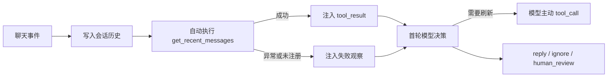

# Harness 最近消息前置观察设计方案

## 背景

`get_recent_messages` 已经是 Harness 的只读工具，但模型在绝大多数 QQ 请求中仍要先返回一次 `tool_call` 才能获得会话历史。最近消息属于每次聊天决策都需要的基础上下文，让模型重复决定是否读取只会增加一轮请求、延迟和工具协议噪音。

## 目标

- 每次 Harness 运行都在首轮模型决策前自动执行 `get_recent_messages`。
- 将成功或失败结果写入首轮 `toolResults`、`conversationMessages` 和 `latestObservation`。
- 前置读取不占用模型可支配的工具预算，也不伪造模型决策历史。
- 保留模型在前置失败或确需刷新时主动重读的能力。

## 非目标

- 不在一次 Harness 循环的每个模型轮次前重复读取同一份历史。
- 不删除 `get_recent_messages` 的可见 Tool 定义和主动调用协议。
- 不改变私聊与群聊都读取最近 100 条消息的现有窗口。
- 不改变 QQ 节奏门控、准入优先级或外发动作协议。

## 角色共识

- 产品关注：普通 QQ 请求减少一次固定的模型工具决策，首轮即可结合上下文回复或静默。
- 设计关注：用户可见行为不增加新步骤，历史读取失败时仍能基于当前消息继续。
- 开发关注：前置观察由通用 `AgentRuntimeHarness` 负责，通过现有 Tool 端口执行，不在 QQ 订阅器复制工具逻辑。
- Agent 关注：首轮已有成功观察时不能重复请求 `get_recent_messages`，只有失败或需要刷新时才主动调用。

## 整体设计

## 设计思想

最近消息和 `qq-chat` 都属于首轮前应准备好的稳定聊天上下文，但 owner 不同：`qq-chat` 是 QQ 平台方法论，由 QQ 订阅边界预启用；最近消息是 Harness 的通用运行观察，由 Harness 通过现有 `ToolRegistry` 与 `ToolExecutor` 自动执行。两者都避免无价值的模型准备轮次，同时不把平台判断写进通用循环。

前置观察是运行时准备动作，不是模型发起的 `tool_call`，因此不增加 `toolCallCount`、不写入 `decisionHistory`。模型主动重读仍按普通工具调用计入预算并留下决策记录。

## 关键实现

### 首轮前置观察

- 入口：`packages/kitty-service/src/services/agent-runtime/application/agent-runtime-harness.ts`
- 职责：记录当前消息后，通过注册表确认工具存在，再经执行器读取最近消息。
- 重要细节：结果在第一次 `runner.decide()` 前写入 `toolResults` 和 `tool_result` 消息；成功时首轮 phase 为 `tool_observing`，失败时为 `ready_to_decide`。
- 边界：不直接访问会话历史实现，不消耗模型工具预算。

### 最近消息工具

- 入口：`packages/kitty-service/src/services/agent-runtime/application/runtime-tools.ts`
- 职责：按会话隔离读取私聊或群聊最近 100 条消息，并返回中文摘要和结构化数据。
- 重要细节：当前触发消息会先写入历史，因此自动结果包含本次请求。
- 边界：不判断是否回复，不执行外发动作。

### Prompt 与评估契约

- 入口：`packages/kitty-service/src/services/agent-runtime/infrastructure/prompt/markdown/System/harness-runtime.prompt.md`
- 职责：明确首轮成功观察不得重复读取，失败或确需刷新时可以主动调用。
- 重要细节：真实模型 eval 的首轮观察固定包含 `get_recent_messages` 结果，结构断言从 `tool_call` 调整为可直接终态。
- 边界：Prompt 只说明行为，不替代 Harness 的真实前置执行。

## 数据与接口

| 名称                       | 方向 | 说明                                                       |
| -------------------------- | ---- | ---------------------------------------------------------- |
| `ToolExecutionResult`      | 输入 | 自动读取成功或失败的最近消息观察。                         |
| `toolResults`              | 内部 | 首项为前置最近消息结果，后续继续追加模型主动工具调用结果。 |
| `conversationMessages`     | 内部 | 首轮包含一条 `tool_result`，供第三章运行观察渲染。         |
| `toolCallCount`            | 内部 | 只统计模型主动调用，前置读取保持为 0。                     |
| `HarnessPromptState.phase` | 输出 | 前置成功为 `tool_observing`，失败为 `ready_to_decide`。    |

## 风险与边界条件

| 风险                     | 触发条件                   | 处理方式                                                    |
| ------------------------ | -------------------------- | ----------------------------------------------------------- |
| 最近消息工具未注册       | Tool Registry 配置漂移     | 注入失败观察并记录中文警告，模型仍可基于当前消息决策。      |
| 历史读取抛出异常         | 存储故障或执行器实现异常   | 捕获异常、注入脱敏失败原因，不中断 Harness。                |
| 模型重复读取             | 忽略首轮成功观察           | Prompt 明确禁止无理由重复；主动调用仍按预算和决策历史治理。 |
| 前置结果增加上下文长度   | 活跃群聊累计到 100 条消息  | 沿用既有固定窗口；后续压缩由 Harness 状态压缩迭代处理。     |
| 一次循环内历史发生新变化 | 长循环期间收到同会话新消息 | 默认使用首轮快照；确需最新状态时由模型主动重读。            |

## 测试方案

- 单元测试：首轮决策前已有成功观察、当前消息已进入历史、前置调用不增加工具预算。
- 异常测试：执行器抛错时注入失败观察并继续调用 Runner。
- 协议测试：强制群聊回复可基于自动观察首轮直接 `reply`，`ignore` 仍被拒绝。
- Prompt 测试：系统指令明确成功观察不得重复读取。
- 真实模型评估：首轮已有历史时期望直接 `reply`，不再期望 `tool_call:get_recent_messages`。
- 回归范围：主动工具调用预算、Skill 渐进加载、Skill reference、fallback、QQ 节奏与准入队列。

## 验收方式

- 产品验收：一次 QQ Harness 请求不再固定经历“先请求最近消息、再决策”的两轮模型调用。
- 设计验收：首轮观察成功、失败和主动刷新三种状态都有明确反馈。
- 开发验收：Harness、Prompt、eval 定向测试及每文件 80% 覆盖率通过；类型、Lint、格式检查通过。
- Agent 验收：代码、设计文档、架构说明和 `design-docs/Task.md` 状态一致。

## 唯一入口

- 使用入口：所有进入 `AgentRuntimeHarness.run()` 的聊天请求。
- 代码入口：`packages/kitty-service/src/services/agent-runtime/application/agent-runtime-harness.ts`
- 测试入口：`packages/kitty-service/src/services/agent-runtime/__test__/agent-runtime-harness.test.ts`
- 文档入口：`design-docs/Agent/harness-recent-messages-auto-observation.md`

## 进度记录

| 日期       | 状态   | 说明                                                                                                                                                                                                                                                                                                                   |
| ---------- | ------ | ---------------------------------------------------------------------------------------------------------------------------------------------------------------------------------------------------------------------------------------------------------------------------------------------------------------------- |
| 2026-07-15 | 待验收 | 已完成前置观察实现、成功与异常测试、Prompt 和 eval 契约调整；43 项相关测试通过，Harness 行覆盖率 89.29%、分支覆盖率 87.73%、函数覆盖率 100%，Lint、格式、类型和架构检查通过。全量测试按沙箱外复跑结果为 143/144 项通过，剩余一项是既有 OneBot 1 秒响应超时；8 项真实模型 eval 因当前模型连接失败按 warning-only 记录。 |
