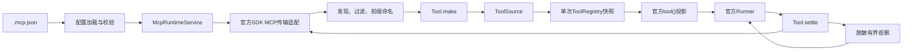

# Agent Runtime 通用 MCP 接入设计方案

## 当前状态

MCP Runtime 已迁移到 OpenAPI Tool Runtime。它仍负责 MCP Server 生命周期、工具发现、
过滤和原始调用，但不再实现 `RuntimeToolRegistry`、`RuntimeToolExecutor` 或 Harness
专用执行协议。当前 Tool 总体边界以
`design-docs/Agent/openapi-tool-runtime.md` 为唯一事实入口。

## 目标

- 兼容常见 `mcpServers` JSON 配置和 stdio、Streamable HTTP、SSE 传输。
- 启动期发现工具，以 `{server}_{tool}` 稳定名称注入规范 Tool 来源。
- 所有模型可调用 MCP 工具都经过 `Tool.make()`、单次运行快照、官方 `tool()` 投影和
  `Tool.settle()` 结算。
- MCP Server 的失败相互隔离，不拖垮其他 Server 和 QQ 主链路。
- 登录检查等系统内部工具不进入模型目录，只能通过 `McpRawToolCaller` 调用。

## 非目标

- 不把 MCP Server 直接交给模型或官方 Runner，从而绕过本地权限和审计。
- 不开放 MCP Resource、Prompt 和 Sampling。
- 不由模型决定风险、审批、超时、调用预算、Server 生命周期或请求凭据。

## 当前结构



## 模型与系统边界

模型可以感知：

- 带 Server 前缀的工具名称。
- 帮助选择能力的中文说明。
- MCP Server 提供的对象 JSON Schema。
- 经过通用脱敏和长度限制的工具观察。

系统私有维护：

- Server 地址、Header、环境变量、OAuth 声明和客户端会话。
- 原始工具名到公开名称的路由。
- 允许、禁用与内部工具规则。
- 风险、审批、超时、真实 SDK `callId`、预算、幂等和完整结果。
- 连接失败隔离、关闭顺序和原始登录调用。

## 关键实现

### 配置

- 入口：`packages/kitty-service/src/agent-runtime/tools/mcp/config.ts`
- 支持：`command`、`url`、`type`、`transport`、`allowedTools`、
  `disabledTools`、`internalTools`、`defaultRiskLevel` 和 `toolRiskLevels`。
- 安全：stdio 拒绝 OAuth；OAuth 与 Authorization Header 互斥；日志不输出配置值。

### 传输

- 入口：`packages/kitty-service/src/agent-runtime/tools/mcp/client.ts`
- 复用 `@openai/agents` 的 `MCPServerStdio`、`MCPServerStreamableHttp` 和
  `MCPServerSSE`。
- SDK 只提供传输与会话，不拥有 Agent Tool 目录和权限。

### 发现与执行

- 入口：`packages/kitty-service/src/agent-runtime/tools/mcp/runtime.ts`
- `listTools()` 返回 `Readonly<Record<string, Tool>>`，直接实现 `ToolSource`。
- 顶层非对象 Schema、非法函数名和跨 Server 名称冲突会被隔离。
- `low` 风险工具无需人工审批；`medium`、`high` 必须声明官方 SDK 审批。
- 工具调用异常返回受控失败，完整错误不进入模型观察。

### 系统内部工具

`internalTools` 只写入原始调用表，不进入 `listTools()`。小红书登录检查通过
`hasTool()` 和 `callToolRaw()` 使用这些能力。该入口只允许系统编排调用，不能向模型投影。

## 配置示例

```json
{
  "mcpServers": {
    "filesystem": {
      "command": "npx",
      "args": ["-y", "@modelcontextprotocol/server-filesystem", "/tmp"],
      "allowedTools": ["read_file", "list_*"],
      "internalTools": ["login_*"],
      "defaultRiskLevel": "medium",
      "toolRiskLevels": {
        "read_file": "low",
        "list_directory": "low"
      }
    },
    "xiaohongshu": {
      "type": "http",
      "url": "http://127.0.0.1:18060/mcp",
      "defaultRiskLevel": "low"
    }
  }
}
```

## 风险与处理

| 风险                   | 系统处理                                      |
| ---------------------- | --------------------------------------------- |
| stdio 配置启动本地命令 | 只加载明确配置；配置本身视为本机执行授权      |
| 中高风险工具被模型选择 | 官方 Runner 产生审批中断，未审批不调用 Server |
| 工具重名               | Server 前缀与全局冲突检查                     |
| 单 Server 不可用       | 关闭失败客户端并隔离，其他 Server 继续        |
| 返回数据过大或含凭证   | 通用 Output 投影截断、递归限深和凭证脱敏      |
| 内部登录工具被模型发现 | `internalTools` 不进入 ToolSource             |

## 验收

- 配置、传输、过滤、内部工具、风险和调用路由测试通过。
- MCP Tool 实际为 `Tool.make()` 创建的不透明对象。
- MCP 调用只经过 `Tool.settle()`，不存在旧 Executor 旁路。
- `medium`、`high` 工具的官方 FunctionTool 会产生审批中断。
- MCP 运行时与 OpenAPI Tool Runtime 文档、Task 和架构说明一致。

## 唯一入口

- 使用入口：项目根目录 `.mcp.json` 或 `YE_KITTY_MCP_CONFIG_PATH`。
- 代码入口：`packages/kitty-service/src/agent-runtime/tools/mcp/runtime.ts`
- 测试入口：`packages/kitty-service/src/agent-runtime/tools/mcp/__test__/`
- 总体 Tool 设计：`design-docs/Agent/openapi-tool-runtime.md`

## 进度记录

| 日期       | 状态   | 说明                                                                                     |
| ---------- | ------ | ---------------------------------------------------------------------------------------- |
| 2026-07-16 | 待验收 | 完成多传输、配置、生命周期、过滤与风险治理。                                             |
| 2026-07-23 | 待验收 | 迁移为规范 ToolSource，接入官方 FunctionTool 与统一系统结算，删除旧 RuntimeTool 执行链。 |
