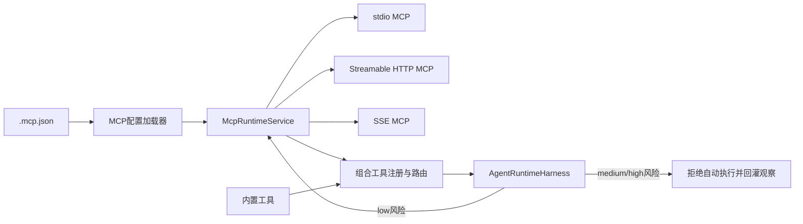

# Agent Runtime 通用 MCP 接入设计方案

## 背景

Ye-Kitty 的 Harness 已经具备 `tool_call -> ToolRegistry -> ToolExecutor -> observation` 循环，但当前只注册进程内工具，无法从市面上的 MCP Server 动态发现并执行工具。小红书浏览器驱动等实验能力需要先通过统一 MCP 边界接入，不能让具体平台或模型 Runner 绕过 Harness 直接执行外部工具。

LangGraph 的 `MultiServerMCPClient` 会把多个 MCP Server 的工具合并后交给 Agent；Deep Agents Code 使用项目级 `.mcp.json`，在启动时连接 Server、发现工具，并保持 stdio 会话。本方案复用多 Server、启动发现、JSON 兼容和工具过滤思想，同时保留 Ye-Kitty 自己的权限、预算和执行循环。

## 目标

- 支持常见 `mcpServers` JSON 配置，兼容 stdio、Streamable HTTP 和旧版 SSE。
- 在服务启动期连接多个 MCP Server、发现工具，并以稳定前缀注入 Harness。
- 所有 MCP 调用继续经过 Ye-Kitty 的工具注册、风险判断、调用预算和执行结果回灌。
- 单个 MCP Server 连接失败时隔离故障，不影响其他 Server 和 QQ 主链路。

## 非目标

- 本次不实现 MCP OAuth 登录、Token 持久化和浏览器授权流程。
- 本次不把 Harness 主循环迁移到 LangGraph、Deep Agents 或 OpenAI Agents SDK。
- 本次不开放 `medium`、`high` 风险工具的自主执行；正式外发动作仍等待 `risk/actions` 链路。
- 本次不实现 MCP Resource、Prompt 和 Sampling 能力，只接入 Tool。

## 角色共识

- 产品关注：配置一个标准 MCP Server 后，Agent 能发现其工具；单个 Server 故障不会拖垮聊天能力。
- 设计关注：工具名称包含 Server 前缀，Prompt 能展示来源、输入结构和风险等级。
- 开发关注：MCP SDK 只存在于 `infrastructure`，Harness 只依赖端口；连接和调用有超时、过滤、脱敏日志和优雅关闭。
- Agent 关注：只调用注册表可见工具；只有 `low` 风险工具允许自动执行；工具失败必须作为 observation 继续决策。

## 整体设计



## 设计思想

配置形状优先兼容 Claude Code、Deep Agents Code 和 LangGraph MCP Adapter，而不是设计 Ye-Kitty 私有协议。Ye-Kitty 扩展字段只负责风险治理，不改变 MCP 连接字段。

MCP 工具不会直接注册到 OpenAI `Agent`。OpenAI Agents SDK 只提供 stdio、Streamable HTTP、SSE 客户端实现，工具发现结果转换为 Ye-Kitty `RuntimeTool`，真实调用由 Harness 的 `ToolExecutor` 触发。这样现有循环、预算、日志和后续审计入口保持不变。

## 关键实现

### 模块一：MCP 配置

- 入口：`packages/kitty-service/src/services/agent-runtime/application/mcp-runtime-config.ts`
- 职责：解析和校验 `mcpServers`，识别传输方式、过滤规则、环境变量和风险扩展。
- 重要细节：`command` 默认识别为 stdio；`url` 默认识别为 HTTP；`http`、`streamable-http`、`streamable_http` 等价；`type` 与 `transport` 兼容。
- 边界：不读取 Cookie，不负责 OAuth，不在日志输出 Header 或环境变量值。

### 模块二：MCP 客户端适配

- 入口：`packages/kitty-service/src/services/agent-runtime/infrastructure/mcp/openai-mcp-client.factory.ts`
- 职责：把领域配置转换为 `MCPServerStdio`、`MCPServerStreamableHttp` 或 `MCPServerSSE`。
- 重要细节：复用项目已有 `@openai/agents`；HTTP Header 通过 `requestInit` 传入；连接和调用使用配置超时。
- 边界：SDK 不拥有 Agent loop，也不直接接收模型请求。

### 模块三：工具发现与执行

- 入口：`packages/kitty-service/src/services/agent-runtime/application/mcp-runtime.service.ts`
- 职责：管理多 Server 生命周期、缓存工具目录、过滤工具、路由调用并转换 observation。
- 重要细节：公开名称为 `{server}_{tool}`，避免多 Server 重名；单个 Server 失败只记录状态并跳过；工具返回内容会转换为有限长度中文观察。
- 边界：不判断聊天是否应该回复，不执行未注册工具。

### 模块四：Harness 装配与风险治理

- 入口：`packages/kitty-service/src/services/agent-runtime/application/qq-reply-agent.factory.ts`
- 职责：组合内置工具与已启动 MCP Runtime，并注入 Harness。
- 重要细节：MCP 工具默认风险为 `medium`；配置 `defaultRiskLevel` 或 `toolRiskLevels` 为 `low` 后才能自主执行。
- 边界：`medium`、`high` 工具只向模型返回需要人工治理的失败观察，不触发远端调用。

## 数据与接口

| 名称               | 方向 | 说明                                                      |
| ------------------ | ---- | --------------------------------------------------------- |
| `mcpServers`       | 输入 | Server 名称到 stdio、HTTP 或 SSE 配置的映射               |
| `allowedTools`     | 输入 | 允许列表，支持 `*`、`?` 通配；与 `disabledTools` 互斥     |
| `disabledTools`    | 输入 | 禁止列表，支持 `*`、`?` 通配；与 `allowedTools` 互斥      |
| `defaultRiskLevel` | 输入 | Ye-Kitty 扩展，默认 `medium`                              |
| `toolRiskLevels`   | 输入 | Ye-Kitty 扩展，按原始工具名覆盖风险等级                   |
| `McpClientPort`    | 双向 | 连接、关闭、发现工具和执行工具的基础设施端口              |
| `RuntimeTool`      | 输出 | 带 Server 前缀、输入 Schema 和风险等级的 Harness 工具定义 |

## 配置示例

```json
{
  "mcpServers": {
    "filesystem": {
      "command": "npx",
      "args": ["-y", "@modelcontextprotocol/server-filesystem", "/tmp"],
      "allowedTools": ["read_file", "list_*"],
      "defaultRiskLevel": "medium",
      "toolRiskLevels": {
        "read_file": "low",
        "list_directory": "low"
      }
    },
    "xiaohongshu": {
      "type": "http",
      "url": "http://127.0.0.1:18060/mcp",
      "allowedTools": ["check_login_status", "search_feeds", "get_feed_detail"],
      "defaultRiskLevel": "low"
    },
    "legacy": {
      "transport": "sse",
      "url": "https://example.com/sse",
      "headers": {
        "Authorization": "Bearer ${MCP_ACCESS_TOKEN}"
      }
    }
  }
}
```

## 风险与边界条件

| 风险                 | 触发条件                           | 处理方式                                                |
| -------------------- | ---------------------------------- | ------------------------------------------------------- |
| 配置注入本地进程     | 仓库中的 stdio 配置执行任意命令    | 只自动发现明确配置文件；文档提示配置等同本机执行权限    |
| 高风险工具被模型调用 | MCP Server 同时暴露读写工具        | 默认 `medium`，只有显式 `low` 自动执行                  |
| 工具重名             | 多个 Server 暴露相同名称           | 统一增加 Server 前缀，并拒绝组合后重名                  |
| 单 Server 不可用     | 连接、鉴权或发现工具失败           | 标记失败并跳过，其他 Server 和 QQ 主链路继续运行        |
| 返回数据过大         | MCP 工具返回网页、图片或大 JSON    | observation 截断并说明，结构化结果不直接写入日志        |
| 敏感信息泄漏         | Header、环境变量或工具结果包含密钥 | 日志只记录 Server、传输、工具名和错误原因，不记录配置值 |

## 测试方案

- 单元测试：覆盖三种传输、别名、配置错误、环境变量替换、通配过滤、工具前缀、风险覆盖和结果转换。
- 集成测试：使用模拟 MCP Client 验证多 Server 启停、单 Server 故障隔离、调用路由和错误回灌。
- Harness 测试：验证 `low` 风险工具可执行，`medium/high` 不触发执行器。
- 回归范围：内置最近消息、自定义表情、QQ Agent factory、启动和优雅关闭。
- 覆盖率：新增 MCP 核心文件行、函数、分支和语句均不低于 80%。

## 验收方式

- 产品验收：在项目根目录放置标准 `.mcp.json` 后启动 QQ 服务，日志能看到 Server 和工具数量，Agent Prompt 能看到带前缀工具。
- 设计验收：配置兼容字段和 Ye-Kitty 风险扩展有明确区分。
- 开发验收：定向测试、覆盖率、类型、Lint、Prettier、架构校验和根目录 `pnpm check` 通过。
- Agent 验收：实现、本文档、`Task.md` 和 `src/ARCHITECTURE.md` 描述一致。

## 唯一入口

- 使用入口：项目根目录 `.mcp.json`，或环境变量 `YE_KITTY_MCP_CONFIG_PATH` 指向显式配置文件。
- 代码入口：`packages/kitty-service/src/services/agent-runtime/application/mcp-runtime.service.ts`
- 测试入口：`packages/kitty-service/src/services/agent-runtime/__test__/mcp-runtime*.test.ts`
- 文档入口：`design-docs/Agent/mcp-runtime.md`

## 进度记录

| 日期       | 状态   | 说明                                                              |
| ---------- | ------ | ----------------------------------------------------------------- |
| 2026-07-16 | 开发中 | 完成配置兼容、运行时边界、风险治理和测试方案设计，开始 TDD 实现。 |
