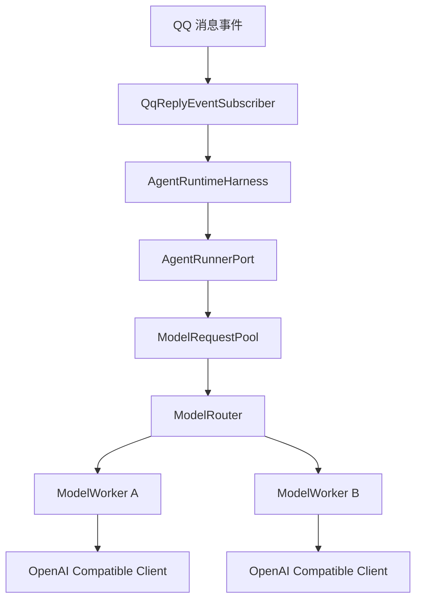

# 模型请求池第一版设计方案

## 背景

Ye-Kitty 当前的 Agent Harness 已经具备循环观察、Skill 注入、工具调用和结构化决策能力，但底层模型调用仍由单个 OpenAI 兼容配置承载。当多个 QQ 消息同时触发 Harness，或者同一群聊短时间内产生大量回复需求时，单个模型入口容易触发 429 限流。

模型请求池第一版要解决的是“模型调用由谁调度”的问题。答案不是 QQ 订阅器，也不是 Harness 主循环，而是 `agent-runtime` 内独立的模型调度层。Harness 只表达需要模型理解，模型请求池负责选择具体模型节点、控制并发、处理请求间隔和 429 退避。

## 目标

- 将底层模型调用从单个 `OpenAiHarnessAgentRunner` 配置演进为统一模型请求池。
- 支持多个 OpenAI 兼容模型节点，并按节点独立控制并发量、请求间隔和退避状态。
- 遇到 429 时按模型节点进行指数退避，避免后续请求继续压向同一受限节点。
- 保持 Harness 的职责纯粹，避免模型路由、队列和重试逻辑进入 Prompt、Skill 或 QQ 平台层。

## 非目标

- 第一版不统一视觉 Agent、自定义表情理解、Embedding、长任务或外部工具模型调用。
- 第一版不实现控制面配置编辑，只实现运行时配置形态和日志观测口径。
- 第一版不引入跨服务全局模型平台，先收敛在 `agent-runtime` 内服务 QQ 短链路 Harness。
- 第一版不通过 Prompt 让模型选择模型节点，模型路由必须由运行时代码完成。

## 角色共识

- 产品关注：群聊爆发或模型限流时，叶猫猫不要连续失败、重复刷屏或延迟很久才回复旧消息。
- 设计关注：用户可见体验应优先保证明确 @ 和私聊，普通群聊触发可以被合并或静默丢弃。
- 开发关注：模型池是基础设施调度层，不能污染 Harness 决策协议和工具权限边界。
- Agent 关注：后续实现时必须同步 `design-docs/Task.md`、本设计文档和测试结果。

## 整体设计

模型请求池位于 `AgentRunnerPort` 的下游。Runner 负责把 Harness Observation 转成模型输入，并把模型输出解析成 `AgentDecision`；模型请求池负责把一次模型请求调度到具体模型节点。这样 Harness、Runner 和模型池各自只承担一层职责。

## 设计思想

第一版采用“服务内局部抽象”，不把模型池上沉到 `shared`。原因是当前稳定需求来自 `agent-runtime` 的 Harness 决策请求，视觉 Agent 和长任务模型调用还没有形成统一协议。等多个服务出现稳定复用后，再考虑抽到独立 `llm` 服务或共享基础设施。

并发治理分为两层：上游通过会话级合并减少无意义请求，下游通过模型请求池保护模型服务。模型请求池不能替代消息节奏门控，也不能理解 QQ 业务语义；它只处理请求调度和模型节点健康。

## 关键实现

### 模块一：AgentRunnerPort

- 入口：`packages/kitty-service/src/services/agent-runtime/ports/agent-runner.port.ts`
- 职责：维持 Harness 到模型决策的稳定端口，输入 `AgentObservation`，输出 `AgentDecision`。
- 重要细节：端口不暴露具体模型节点，也不执行工具。
- 边界：不负责模型路由、队列、429 退避和配置解析。

### 模块二：ModelRequestPoolPort

- 入口：`packages/kitty-service/src/services/agent-runtime/ports/model-request-pool.port.ts`
- 职责：接收一次模型生成请求，返回模型原始输出和调度元信息。
- 重要细节：请求需要携带优先级、TTL、超时和调用来源，便于队列过期和日志审计。
- 边界：不解析 `AgentDecision`，不理解 Harness 状态机。

### 模块三：InMemoryModelRequestPool

- 入口：`packages/kitty-service/src/services/agent-runtime/application/in-memory-model-request-pool.ts`
- 职责：从可用模型节点中选择一个节点处理请求。
- 重要细节：第一版默认过滤退避中的节点，再选择 `queueLength + activeCount` 最小的节点；如果全部退避，则选择最早恢复的节点等待。
- 边界：不直接发起 HTTP 请求。

### 模块四：ModelWorker

- 入口：`packages/kitty-service/src/services/agent-runtime/application/in-memory-model-request-pool.ts`
- 职责：维护单个模型节点的队列、并发令牌、请求间隔和退避状态。
- 重要细节：请求发起前必须同时满足并发、间隔、退避和 TTL 约束。
- 边界：不在队列内无限等待过期请求。

### 模块五：OpenAI Compatible Client

- 入口：`packages/kitty-service/src/services/agent-runtime/infrastructure/openai-compatible-model.client.ts`
- 职责：封装 OpenAI 兼容接口调用，返回模型原始文本和错误信息。
- 重要细节：429 错误需要保留状态码、`Retry-After` 和原始错误摘要。
- 边界：不决定是否重试，重试由 `ModelWorker` 统一治理。

## 数据与接口

| 名称                   | 方向 | 说明                                                                   |
| ---------------------- | ---- | ---------------------------------------------------------------------- |
| `ModelNodeConfig`      | 输入 | 单个模型节点配置，包含 `id`、`baseURL`、`apiKey`、`model` 和限流参数。 |
| `ModelRequestPoolPort` | 输入 | Runner 调用模型池的端口，承载 prompt、优先级、TTL 和来源。             |
| `ModelRequestPriority` | 输入 | 第一版建议支持 `high`、`normal`、`low`，用于区分私聊、@ 和群聊触发。   |
| `ModelWorkerState`     | 输出 | 模型节点运行状态，包含队列长度、运行中数量、下次可用时间和退避时间。   |
| `ModelRequestTrace`    | 输出 | 单次请求调度摘要，包含模型节点、排队耗时、重试次数、429 和错误原因。   |

第一版配置入口为 `YE_KITTY_MODEL_POOL`，支持 JSON 数组和 `{ "models": [...] }` 对象。未配置时继续兼容 `OPENAI_API_KEY`、`OPENAI_BASE_URL` 和 `YE_KITTY_AGENT_MODEL`，并自动生成 `default-openai-agent` 单节点配置。

## 调度规则

- 每个模型节点独立维护 `queue`、`activeCount`、`nextAvailableAt` 和 `backoffUntil`。
- 单个模型默认 `maxConcurrency` 为 3 或 4，按配置覆盖。
- 同一模型默认 `minIntervalMs` 为 2000，保证两次真实请求至少间隔 2 秒。
- 请求遇到 429 时，优先使用 `Retry-After`；没有该字段时按指数退避翻倍等待。
- 单次请求最多重试 `maxRetries` 次，超过后返回结构化失败。
- 请求优先级第一版只用于默认 TTL 和后续扩展，不改变每模型独立队列结构。

## 风险与边界条件

| 风险           | 触发条件                             | 处理方式                                                     |
| -------------- | ------------------------------------ | ------------------------------------------------------------ |
| 队列积压       | 群聊消息爆发或多个群同时触发         | 请求必须配置 TTL，过期后降级或丢弃。                         |
| 429 连续发生   | 某个模型节点限流或供应商不可用       | 模型节点进入退避，其他健康节点继续服务。                     |
| 配置迁移失败   | 从单模型环境变量切到模型池配置时缺项 | 保留单模型配置兼容路径，模型池配置存在时优先使用模型池。     |
| 回复旧消息     | 请求排队时间超过聊天语境有效期       | 上游订阅器和模型池都需要记录触发时间，过期请求不得继续外发。 |
| 分支内已有改动 | 当前分支存在未提交代码和 Skill 修改  | 文档落地不回滚、不格式化、不顺手修，只在后续实现时重新核对。 |

## 测试方案

- 单元测试：已覆盖模型路由选择、单节点并发限制、请求间隔、队列过期和 429 退避翻倍。
- 集成测试：已用假 OpenAI 兼容客户端模拟成功、429、超时和不可重试错误。
- 回归测试：已确认 `AgentRuntimeHarness` 的结构化决策协议不变，`AgentRunnerPort.decide()` 调用方不感知具体模型节点。
- 文档验证：`design-docs/Task.md`、本文档和 `docs/agent-model-request-pool.md` 的职责边界保持一致。

## 验收方式

- 产品验收：模型限流时，明确 @ 和私聊仍优先得到降级或回复，普通群聊不会排队很久后补发旧回复。
- 设计验收：模型请求池职责、Harness 职责、QQ 节奏门控职责边界清晰。
- 开发验收：已存在可测试的模型池端口、路由、单节点 Worker 和 429 退避逻辑。
- Agent 验收：已同步 `Task.md`、测试结果和真实代码入口，不让文档停留在概念层。

## 唯一入口

- 使用入口：Agent Harness 请求结构化模型决策。
- 代码入口：`packages/kitty-service/src/services/agent-runtime/ports/agent-runner.port.ts`
- 测试入口：`packages/kitty-service/src/services/agent-runtime/__test__/model-request-pool.test.ts`
- 文档入口：`design-docs/Agent/model-request-pool-v1.md`

## 后续完善

- 会话级单飞和消息合并：同一会话最多一个运行中 Agent，加一个待处理标记。
- 成本路由：按请求复杂度选择低成本或高能力模型。
- 健康评分：根据近期成功率、延迟、429 频率动态调整路由权重。
- RunTrace 持久化：记录模型节点、排队耗时、请求耗时、重试次数和失败原因。
- 控制面展示：展示模型节点状态、队列长度、退避截止时间和近期错误。
- 跨 Agent 统一：等视觉 Agent、长任务和聊天 Agent 的请求协议稳定后，再抽到更通用的 `llm` 服务边界。

## 进度记录

| 日期       | 状态   | 说明                                                         |
| ---------- | ------ | ------------------------------------------------------------ |
| 2026-07-09 | 设计中 | 完成第一版模型请求池设计，等待后续代码实现和测试方案落地。   |
| 2026-07-09 | 待验收 | 完成进程内模型请求池、OpenAI兼容客户端、配置解析和单元测试。 |
