# OpenAPI Tool Runtime 改装设计方案

## 背景

当前 Agent Runtime 使用自定义 JSON `AgentAction` 协议：模型输出工具名、`callId` 和输入，
`LM` 负责 `JSON.parse`，`Agent` 自己维护循环，`Schedule` 再定位、授权并执行工具。这条链路
把官方 Agents SDK 降级成了文本生成器，也把轮次、工具预算、状态阶段等严格系统约束暴露给
不稳定的模型。

本次改装严格参考 opencode 的 Tool 边界：系统内部只有一种不可伪造的规范 Tool；模型边界
只得到临时的 OpenAPI/JSON Schema 能力投影；权限、调用标识、预算、状态、审批、副作用和
审计始终由程序维护。

## 目标

- 用 `@openai/agents` 官方 `tool()` 封装全部本地、Skill、Code 和 MCP 工具。
- 让官方 `Runner` 负责模型与工具的循环，不再解析模型生成的 JSON Action。
- 建立唯一、不可伪造的内部 Tool 表示和统一结算管线。
- 明确区分模型可见能力信息与系统私有治理信息。
- 用 `finish` Tool 提交候选终态，由系统校验后决定回复、静默或转人工。
- 保留现有 MCP 生命周期、模型池限流、Skill 渐进读取和 QQ 受控动作边界。

## 非目标

- 不把平台发送目标、账号凭据、权限规则或预算开放给模型。
- 不把全部 MCP Server 直接交给 Agents SDK 绕过本地治理。
- 不在本次重构中增加长期任务控制面、持久化审批队列或新的外部依赖。
- 不升级模型、不改变现有模型池配置格式。

## 角色共识

- 产品关注：工具调用可解释、可恢复，高风险动作不会仅因模型请求而执行。
- 设计关注：模型看到的是简洁能力目录，系统错误和审批反馈可形成稳定交互。
- 开发关注：Tool 定义唯一，执行链唯一，权限与副作用不能存在旁路。
- Agent 关注：模型只负责理解和提出调用，Runtime 负责验证、授权、执行和提交结果。

## 整体设计

```mermaid
flowchart LR
  Source["本地、Skill、Code、MCP来源"] --> Make["Tool.make"]
  Make --> Registry["ToolRegistry规范注册表"]
  Registry --> Snapshot["单次运行不可变快照"]
  Snapshot --> Materialize["materialize官方tool()"]
  Materialize --> Model["模型仅见名称、说明、JSON Schema"]
  Model --> Runner["官方Runner工具循环"]
  Runner --> Settle["Tool.settle系统结算"]
  Settle --> Validate["输入与预算校验"]
  Validate --> Authorize["权限与审批"]
  Authorize --> Execute["超时、取消、幂等执行"]
  Execute --> Effects["受控副作用提交"]
  Effects --> Audit["完整结算与审计"]
  Audit --> Projection["有界、脱敏的模型观察"]
  Projection --> Runner
  Runner --> Finish["finish候选终态"]
  Finish --> Commit["系统终态校验与提交"]
```



## 设计思想

### 模型与系统的职责边界

模型可以感知：

- Tool 的稳定名称、帮助选择能力的中文说明和 OpenAPI/JSON Schema。
- 必要的 Skill 正文、reference 和有界工具观察。
- 当前任务中真正影响选择的业务约束，例如“本轮必须回复”。

系统必须私有维护：

- `runId`、`traceId`、`callId`、模型节点和重试次数。
- 最大轮次、工具预算、Skill reference 预算、并发和队列状态。
- 风险等级、权限策略、审批状态、幂等键、超时和取消信号。
- 已启用 Skill、已读取 reference、工具调用记录和完整返回值。
- 平台目标、凭据、外发白名单、结果脱敏、终态提交和审计信息。

两侧只通过两个显式变换连接：

1. `materialize()`：把规范 Tool 白名单投影成官方 FunctionTool。
2. `toModelOutput()`：把完整系统结算压缩成模型可见观察。

禁止通过对象展开把系统策略顺带交给 SDK 或 Prompt。

### 唯一 Tool 表示

`Tool.make()` 返回带私有 TypeId 的不透明对象。名称由注册表键决定，运行时实现保存在私有
`WeakMap`，普通对象不能伪装成合法 Tool。Registry 只接受该规范对象，官方 FunctionTool
只在单次运行物化时临时创建，不能反向注册。

### Schema 双层校验

- 本地工具使用 Zod，SDK 严格模式和 Runtime 输入校验复用同一来源。
- MCP 保留服务端 JSON Schema，模型能力允许时可投影严格模式。
- SDK 对原始 JSON Schema 只负责反序列化，不作为系统验证依据。
- Runtime 始终在执行前调用自身 `decode()`；未知或不兼容 Schema 隔离该工具。
- Provider 不支持严格工具时只降级模型投影，不能关闭服务端校验。

现阶段不增加 Ajv。MCP 输入先用项目内 JSON Schema 子集校验器覆盖对象、必填字段、基础类型、
组合分支、固定值、字符串、数值、数组、枚举和 `additionalProperties` 等常用约束；无法完整
验证的关键字直接隔离整项工具，不做静默降级。后续确需完整 Draft 兼容时再单独评审依赖。

### Tool 结算管线

所有工具调用必须经过同一 `Tool.settle()`：

1. 校验规范 Tool 身份和注册名称。
2. 读取 SDK 提供的真实 `callId`，建立幂等记录。
3. 解码并验证不可信输入。
4. 校验运行预算和工具可见快照。
5. 执行资源级权限判断；需要审批时暂停，不执行副作用。
6. 使用统一超时和 `AbortSignal` 调用 Tool。
7. 验证输出并只提交声明过的受控 Effect。
8. 写入完整 `ToolSettlement` 和结构化日志。
9. 生成脱敏、截断后的 `ToolModelOutput` 返回模型。

业务工具不做隐式重试。模型请求 429 重试只允许重放当前模型请求，不能重放已经成功的工具
副作用。

### 结果双视图

系统结算保留完整状态、输出、Effect、错误和审计。模型观察只包含
`status`、`summary`、受控 `data` 和可选 `retryable`。

所有工具统一执行长度限制、递归深度限制和敏感字段过滤。当前 MCP 专属的 12000 字符截断升级
为通用策略；完整结果只保留在系统结算，不进入 Prompt。

### 权限与审批

- Tool 可见性只代表模型可以提出调用，不代表获准执行。
- `needsApproval` 只承载可在调用前静态判断的粗粒度审批。
- `Tool.settle()` 内的资源级 `authorize()` 是最终权限边界。
- `medium`、`high` 或资源策略要求审核时，SDK 返回 `interruptions` 与可恢复 `state`。
- 当前 QQ 端没有持久化审批入口时，暂停结果映射为 `human_review`，绝不自动批准。
- 后续控制面接入时保存 SDK state，并从同一 RunState 恢复，不创建新用户轮次。

### finish 终态

`finish` 是官方 FunctionTool，不是普通文本输出。模型提交 `result`、可选 `text`、候选
`actions` 和 `reason`。系统负责强制回复、动作白名单、平台目标移除、自定义表情来源、
文本去重和风险升级。仅当候选结果通过校验时设置终态；非法 finish 作为工具错误回灌，
Runner 继续循环。

### Skill 状态

Skill Tool 只返回 `enable_skill` 或 `load_skill_reference` 受控 Effect。
`AgentRunState` 统一应用 Effect 并生成下一轮 instructions。Skill Tool 不能直接修改 Agent
数组，普通 MCP 工具也不能伪造 Skill Effect。

### 模型池边界

模型池移动到 Agents SDK `Model.getResponse()` / `getStreamedResponse()` 边界。每次模型请求独立
进入队列、并发和 429 退避；一次完整 `Runner.run()` 固定使用同一模型节点。禁止把整个
Runner 包进重试，否则可能重放已执行工具。

## 关键实现

### 模块一：Tool

- 入口：`packages/kitty-service/src/agent-runtime/tools/tool.ts`
- 职责：定义不透明 Tool、模型定义、系统策略和执行实现。
- 边界：不依赖具体 SDK FunctionTool。

### 模块二：ToolRegistry

- 入口：`packages/kitty-service/src/agent-runtime/tools/registry.ts`
- 职责：名称注册、冲突检查、生命周期和单次运行不可变快照。
- 边界：不执行、不授权、不重试、不拼 Prompt。

### 模块三：ToolSettlement

- 数据入口：`packages/kitty-service/src/agent-runtime/tools/result.ts`
- 结算入口：`packages/kitty-service/src/agent-runtime/tools/tool.ts`
- 职责：定义完整结算，并统一校验、授权、超时、取消、幂等、Effect 和审计。
- 边界：不把完整系统结果暴露给模型。

### 模块四：官方工具投影

- 入口：`packages/kitty-service/src/agent-runtime/tools/materialize.ts`
- 职责：用 `@openai/agents` `tool()` 生成单次运行 FunctionTool。
- 边界：不成为第二种内部 Tool 协议。

### 模块五：AgentRunState

- 入口：`packages/kitty-service/src/agent-runtime/state.ts`
- 职责：运行阶段、预算、Skill、reference、调用、终态和审批的系统真相。
- 边界：只把最小业务上下文投影给 Prompt。

### 模块六：Agent

- 入口：`packages/kitty-service/src/agent-runtime/agent.ts`
- 职责：准备前置观察、物化工具、调用官方 Runner、处理 interruption 和提交终态。
- 边界：不再手写模型/工具循环，不解析 JSON Action。

### 模块七：模型池

- 入口：`packages/kitty-service/src/agent-runtime/lm/pool.ts`
- 职责：在 SDK Model 请求级别执行路由、限流和 429 退避。
- 边界：不重试完整 Agent run。

## 数据与接口

| 名称                   | 方向     | 说明                                            |
| ---------------------- | -------- | ----------------------------------------------- |
| `ToolModelDefinition`  | 输出     | 仅含模型可见说明和 Schema，名称由 Registry 决定 |
| `ToolPolicy`           | 系统内部 | 来源、风险、审批、超时、幂等和平台限制          |
| `ToolExecutionContext` | 系统内部 | run、trace、call、signal、状态、授权与日志      |
| `ToolSettlement`       | 系统内部 | 完整状态、输出、Effect、错误和审计              |
| `ToolModelOutput`      | 输出     | 有界、脱敏的模型观察                            |
| `AgentRunState`        | 系统内部 | 预算、Skill、调用、审批和终态                   |
| `FinishCandidate`      | 输入     | 模型通过 finish Tool 提交的候选结果             |

## 风险与边界条件

| 风险          | 触发条件                      | 处理方式                                |
| ------------- | ----------------------------- | --------------------------------------- |
| 伪造 Tool     | 普通对象进入 Registry         | TypeId 与私有实现校验后拒绝             |
| Schema 不兼容 | MCP 返回非对象或未知关键字    | 隔离工具并记录中文警告                  |
| 权限旁路      | 工具直接调用远端或平台        | 所有来源转换为规范 Tool，删除旧执行入口 |
| 副作用重放    | 模型请求失败后重试完整 Runner | 重试下沉到单次 Model 请求               |
| 输出注入      | Tool 返回伪造系统指令         | 标注不可信来源、脱敏、截断并只作为观察  |
| 模型终态越权  | finish 声明目标或非法动作     | 系统白名单解析并补齐真实目标            |
| 审批不可恢复  | 当前平台无审批控制面          | 返回 `human_review`，不执行工具         |
| 状态泄露      | Prompt 渲染内部预算或追踪信息 | Prompt 只渲染业务必要上下文             |

## 测试方案

### 单元测试

- Tool：不透明身份、名称归属、Zod/JSON Schema 输入、严格模式投影。
- Registry：冲突、快照不可变、可见性不等于授权。
- Settlement：真实 callId、重复调用幂等、预算、拒绝、审核、超时、取消、异常归一化。
- Output：长度、深度、敏感字段和循环对象。
- Skill：启用、重复启用、reference 顺序、越界和 Effect 防伪。
- finish：合法 reply/ignore/review、强制回复、空回复、非法动作和目标字段过滤。
- MCP：前缀、过滤、Schema 隔离、远端超时、结果投影和生命周期。

### 集成测试

- 假 Model 依次调用最近消息、Skill、MCP 与 finish，Runner 自动完成循环。
- 生产 Agent 的 `tools` 实际包含官方 FunctionTool。
- 非法 finish 返回工具错误并继续模型循环。
- 中高风险工具产生 interruption，执行函数未被调用。
- 429 只重试当前模型请求，已完成 Tool 不重复执行。
- Prompt 中不存在 JSON Action、`callId`、内部阶段、预算、风险目录和追踪标识。

### 回归测试

- QQ 最近消息前置观察和强制群聊回复。
- QQ Skill 自动注入、受控动作和自定义表情。
- MCP 三种传输、过滤、登录和优雅关闭。
- Code Agent 取消、工具上抛和终态输出。
- Fallback 与 SafeQqReplyAgent 行为。

### 验证命令

```bash
pnpm --filter @ye-kitty/kitty-service test
pnpm --filter @ye-kitty/kitty-service test:coverage:tool-runtime
pnpm check
```

新增 Tool Runtime 核心文件要求每文件行、函数、分支和语句覆盖率不低于 80%。

## 验收方式

- 产品验收：Agent 可通过官方 Tool 连续获取信息并安全完成 QQ 决策。
- 设计验收：模型投影和系统治理字段有明确、不可越过的转换边界。
- 开发验收：生产链无 JSON Action 解析、无旧 Schedule 执行旁路，本地确定性全量检查通过。
- Agent 验收：设计文档、Task、架构说明、代码与测试结论一致。

## 唯一入口

- 使用入口：平台消息进入 `Agent.run()`。
- 代码入口：`packages/kitty-service/src/agent-runtime/tools/tool.ts`
- 投影入口：`packages/kitty-service/src/agent-runtime/tools/materialize.ts`
- 测试入口：`packages/kitty-service/src/agent-runtime/tools/__test__/`
- 文档入口：`design-docs/Agent/openapi-tool-runtime.md`
- 团队进度入口：`design-docs/Task.md`

## 进度记录

| 日期       | 状态   | 说明                                                                                                                                                                                                                                                                           |
| ---------- | ------ | ------------------------------------------------------------------------------------------------------------------------------------------------------------------------------------------------------------------------------------------------------------------------------ |
| 2026-07-23 | 待验收 | 已完成规范 Tool、官方投影、系统结算、finish、全部工具来源、官方 Runner、SDK 审批和模型请求池改装；旧协议已删除。58 项核心测试和 311 项全量测试通过，7 个核心文件逐文件四项覆盖率均超过 80%。真实模型评估因涉及向本机配置的外部服务发送提示词、Skill 和用例，等待用户明确授权。 |
