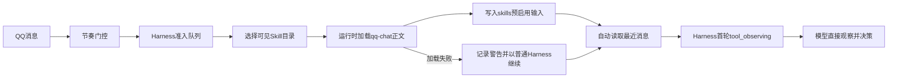

# QQ 默认 Skill 自动注入设计方案

## 背景

QQ 消息进入 Harness 后，`qq-chat` 是所有私聊与群聊回复都必须遵守的平台方法论。旧链路只提供 Skill 目录，模型需要先返回一次 `skill_call` 才能获得正文；大量 QQ 消息会重复消耗一次模型决策和一轮上下文组装。

## 目标

- QQ 消息通过节奏门控与准入队列后，由运行时自动预启用 `qq-chat`。
- Harness 首轮即可看到 `qq-chat` 正文，模型不再为该 Skill 返回 `skill_call`；最近消息前置观察完成后首轮 phase 为 `tool_observing`。
- 保留其他 Skill 的目录优先、按需加载机制。

## 非目标

- 不为非 QQ 平台自动启用 `qq-chat`。
- 不删除 `skill_call`、`skill_reference_call` 或通用 Skill 渐进加载能力。
- 不把平台判断写进通用 `AgentRuntimeHarness`。

## 角色共识

- 产品关注：QQ 回复减少一轮无业务价值的模型决策，降低延迟和调用量。
- 设计关注：自动注入不改变回复表现，只减少内部准备步骤。
- 开发关注：QQ 规则停留在 QQ 订阅边界，Harness 只接收通用的预启用 Skill 输入。
- Agent 关注：Prompt、端口、实现、测试与任务状态必须同步。

## 整体设计

## 设计思想

平台默认能力由平台入口决定，通用循环只接受结构化上下文。`QqReplyEventSubscriber` 已经是 QQ 到 Harness 的真实入口，因此由它固定加载 `qq-chat`；`AgentRuntimeHarness` 不识别平台名称，只把 `skills` 视为调用方已确认的预启用正文。这样既消除重复模型决策，也不把 QQ 特例扩散到通用 Harness。

## 关键实现

### QQ 默认 Skill 装配

- 入口：`packages/kitty-service/src/services/agent-runtime/application/qq-reply-event-subscriber.ts`
- 职责：在准入锁内调用 `SkillRuntimeService.loadSkillContent('qq-chat')`，并通过 `QqReplyAgentInput.skills` 传给回复 Agent。
- 重要细节：正文加载失败时输出中文警告，并降级为不带预启用 Skill 的普通 Harness，避免消息处理链路中断。
- 边界：不决定其他 Skill 是否启用。

### Harness 首轮上下文

- 入口：`packages/kitty-service/src/services/agent-runtime/application/agent-runtime-harness.ts`
- 职责：将 `AgentRuntimeRunInput.skills` 去重后写入 `enabledSkills` 和 `skill_content` 消息。
- 重要细节：预启用正文从首轮开始生效，并从可请求 Skill 目录中排除已启用项；随后最近消息前置观察把首轮 phase 推进到 `tool_observing`，模型异常重复请求相同 Skill 时仍走已有幂等逻辑。
- 边界：不根据 `event.platform` 自动选择 Skill。

## 数据与接口

| 名称                          | 方向 | 说明                                     |
| ----------------------------- | ---- | ---------------------------------------- |
| `QqReplyAgentInput.skills`    | 输入 | QQ 边界已经预启用的 Skill 正文。         |
| `AgentRuntimeRunInput.skills` | 输入 | Harness 调用方确认后直接注入首轮的正文。 |
| `enabledSkills`               | 内部 | 本次运行已生效的 Skill，按名称保持唯一。 |
| `toolResults`                 | 内部 | 首项为 Harness 自动读取的最近消息结果。  |

## 风险与边界条件

| 风险                     | 触发条件                     | 处理方式                                     |
| ------------------------ | ---------------------------- | -------------------------------------------- |
| `qq-chat` 资产不可读     | 文件缺失、格式错误或权限异常 | 记录警告，继续普通 Harness，不中断 QQ 回复。 |
| 调用方重复传入同名 Skill | 装配错误或未来多来源合并     | Harness 按 Skill 名称去重。                  |
| 模型仍请求 `qq-chat`     | 模型未遵守状态或旧 Prompt    | Harness 返回已启用观察，不重复读取正文。     |

## 测试方案

- 单元测试：预启用 Skill 在 Harness 首轮生效，最近消息读取后状态为 `tool_observing`，已从可请求目录排除且正文加载器不被重复调用。
- 集成测试：QQ 消息固定加载 `qq-chat` 并通过 `skills` 传入 Agent。
- 异常测试：`qq-chat` 加载失败时 Agent 仍被调用且 `skills` 为空。
- 真实模型评估：QQ 观察默认带有已启用 `qq-chat`，分别验证低风险消息直接 `reply` 和其他未启用 Skill 仍能 `skill_call`。
- 回归范围：其他 Skill 继续通过 `skill_call` 按需加载，非 QQ 和空文本事件不触发加载。

## 验收方式

- 产品验收：QQ 消息的第一轮模型观察已包含 `qq-chat` 和最近消息，无需额外 `skill_call` 或固定的历史读取 `tool_call`。
- 设计验收：用户可见回复协议不变。
- 开发验收：定向测试、覆盖率、类型、Lint 通过；根目录 `pnpm check` 中既有反向 WebSocket 时序测试需单独验收。
- Agent 验收：代码、Prompt、架构文档与 `design-docs/Task.md` 状态一致。

## 唯一入口

- 使用入口：QQ 私聊或满足门控的群聊消息。
- 代码入口：`packages/kitty-service/src/services/agent-runtime/application/qq-reply-event-subscriber.ts`
- 测试入口：`packages/kitty-service/src/services/agent-runtime/__test__/qq-reply-event-subscriber.test.ts`、`packages/kitty-service/eval/cases.ts`
- 文档入口：`design-docs/Agent/qq-chat-skill-auto-injection.md`

## 进度记录

| 日期       | 状态   | 说明                                                                                                                                                                                                                                                                                       |
| ---------- | ------ | ------------------------------------------------------------------------------------------------------------------------------------------------------------------------------------------------------------------------------------------------------------------------------------------ |
| 2026-07-15 | 待验收 | 已完成设计、红绿灯实现、Prompt 和真实模型 eval 协议同步；32 项定向测试通过，Harness 行覆盖率 90.39%、QQ 订阅器行覆盖率 100%。根目录检查中 142/143 项通过，剩余一项为既有反向 WebSocket 1 秒响应超时；8 项真实模型 eval 已按新协议执行 warning-only，当前环境因模型连接失败无实际决策结果。 |
