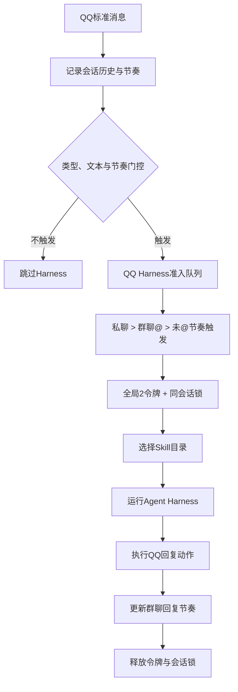

# QQ 消息 Harness 准入队列设计方案

## 背景

QQ 平台消息通过 RxJS 订阅后会异步调用 `QqReplyEventSubscriber.handleMessage()`。当前订阅入口不会等待上一条消息完成，因此多个私聊或群聊触发可以同时进入 Agent Harness。下游模型请求池只能限制单轮模型请求，不能限制一条 QQ 消息对应的完整 Harness 循环，也不能保证同一会话的回复顺序。

本方案在群聊节奏门控与 Harness 之间增加进程内准入队列，先按 QQ 消息语义排序，再用全局并发令牌和会话锁控制完整消息处理流程。

## 目标

- 全局最多同时处理两条准备进入 Harness 的 QQ 消息。
- 等待队列最多保存十条消息，并优先处理私聊和明确 @ 叶猫猫的群聊。
- 同一私聊或群聊严格串行，避免后到消息先回复。
- 队列满载时允许高优先级消息替换低优先级等待消息。
- 保留被丢弃消息的会话历史和节奏计数，不让后续上下文缺失。

## 非目标

- 第一版不增加队列 TTL、持久化、运行中任务抢占或环境变量配置。
- 第一版不改变模型请求池、Harness Prompt 和 Agent 决策协议。
- 第一版不把准入队列上沉到 `shared`，只服务 QQ 到 Agent Harness 的具体入口。

## 角色共识

- 产品关注：高负载时私聊和明确 @ 优先得到响应，普通群聊不能挤占关键消息。
- 设计关注：满载丢弃和优先级替换必须有可排障日志，但不向用户暴露内部队列细节。
- 开发关注：并发限制覆盖 Skill 选择、Harness 循环、QQ 动作发送和节奏状态更新；同会话不能并行。
- Agent 关注：设计、代码、测试和 `design-docs/Task.md` 状态同步，所有注释与日志使用中文。

## 整体设计

调度器只接收已经通过门控、确实需要触发 Harness 的消息。未 @ 且未命中节奏门控的群聊不会占用队列；被满载策略丢弃的消息已在入队前写入历史，因此仍能被后续 `get_recent_messages` 读取。

## 设计思想

准入队列属于 `agent-runtime` 的 QQ 入口治理，不属于 QQ 平台适配层，也不属于下游模型请求池。它控制的是“一条消息对应的完整处理任务”，模型请求池控制的是“Harness 某一轮如何调用模型节点”，两层职责不合并。

第一版使用进程内非抢占调度。JavaScript 事件循环内同步更新等待队列、活动数量和活动会话集合，不引入额外锁库。运行中任务不会因为新私聊到达而中断；优先级只决定等待任务的启动顺序和满载淘汰对象。

## 关键实现

### 模块一：准入队列端口

- 入口：`packages/kitty-service/src/services/agent-runtime/ports/qq-harness-admission-queue.port.ts`
- 职责：定义 QQ 消息任务入队、完成和丢弃结果。
- 重要细节：任务携带标准事件、是否明确 @ 叶猫猫以及完整处理回调。
- 边界：不理解 Skill、Harness 决策或 QQ 发送动作的内部结构。

### 模块二：进程内调度器

- 入口：`packages/kitty-service/src/services/agent-runtime/application/in-memory-qq-harness-admission-queue.ts`
- 职责：维护等待队列、全局活动数、活动会话集合和入队序号。
- 重要细节：全局并发为 2，等待容量为 10；同级按入队序号先来后到。
- 边界：不抢占运行中任务，不持久化等待队列。

### 模块三：QQ 回复订阅器

- 入口：`packages/kitty-service/src/services/agent-runtime/application/qq-reply-event-subscriber.ts`
- 职责：完成消息过滤和节奏门控后，把 Skill 选择、Harness、动作发送和节奏更新封装为一个准入任务。
- 重要细节：消息历史和节奏记录继续发生在准入队列之前。
- 边界：不自行实现排序、容量和锁算法。

## 数据与接口

| 名称                            | 方向 | 说明                                                                                  |
| ------------------------------- | ---- | ------------------------------------------------------------------------------------- |
| `QqHarnessAdmissionTask`        | 输入 | 包含 `event`、`mentionsAgent` 和返回 `Promise<void>` 的 `execute`。                   |
| `QqHarnessAdmissionResult`      | 输出 | 返回 `completed`，或带 `queue_full`、`replaced_by_higher_priority` 原因的 `dropped`。 |
| `QqHarnessAdmissionQueuePort`   | 输入 | 暴露 `enqueue()`，调用方等待任务完成或得知任务被丢弃。                                |
| `QqHarnessAdmissionQueueConfig` | 输入 | 固定装配 `maxConcurrency: 2` 与 `maxQueueSize: 10`。                                  |

优先级从事件和订阅器已经计算出的 `mentionsAgent` 得到：私聊最高，明确 @ 当前机器人 QQ 号的群聊次之，节奏门控触发的未 @ 群聊最低。不同会话不增加额外权重，同级使用单调递增的入队序号排序。

## 满载与锁规则

- 容量 10 只统计等待任务，不包含最多 2 个运行中任务。
- 新任务入队后先尝试使用可用令牌；仍处于等待且容量超过 10 时才执行满载淘汰。
- 高优先级新任务替换最低优先级中最后到达的等待任务，保留该级别更早到达的任务。
- 新任务与当前最低优先级同级或更低时，新任务自身被丢弃。
- `activeConversationIds` 阻止同一会话同时运行；被该锁阻塞的高优先级任务不会阻止其他会话使用空闲令牌。
- 任务成功或抛错都必须在 `finally` 中释放全局令牌和会话锁，再继续调度。

## 日志方案

- 调试日志：入队、开始、完成，记录优先级、活动数、等待数、等待毫秒和脱敏消息/会话 ID。
- 警告日志：队列满载拒绝和优先级替换，说明被丢弃任务优先级及当前处理方式。
- 不记录消息正文、发送者资料、完整消息 ID 或完整会话 ID。

## 风险与边界条件

| 风险             | 触发条件                          | 处理方式                                                         |
| ---------------- | --------------------------------- | ---------------------------------------------------------------- |
| 低优先级饥饿     | 私聊持续占满等待队列              | 第一版接受严格优先级；后续如有真实数据再设计老化机制。           |
| 同会话任务堆积   | 单个会话连续发送多条触发消息      | 保持串行并计入十条等待容量，满载时仍按全局优先级和入队顺序淘汰。 |
| 任务异常锁泄漏   | Skill、Harness 或 QQ 动作执行抛错 | 统一在 `finally` 释放活动数和会话锁，并通过单元测试锁定。        |
| 进程退出丢失等待 | 服务重启时队列仍有任务            | 第一版采用进程内队列，重启即清空，不补发过期聊天回复。           |

## 测试方案

- 单元测试：覆盖全局并发 2、三级优先级、同级 FIFO、同会话串行、十条容量、满载替换和异常释放。
- 集成测试：覆盖被丢弃消息保留历史但不调用 Agent、不选择 Skill、不发送 QQ 动作。
- 覆盖率：新增调度器和订阅器变更的行、函数、分支、语句覆盖率均不低于 80%。
- 回归范围：现有群聊节奏门控、私聊触发、QQ 受控动作、Skill 渐进加载和模型请求池行为不能回退。

## 验收方式

- 产品验收：同时出现多条触发消息时，最多处理两条，私聊和明确 @ 优先于普通群聊。
- 设计验收：同级消息保持先来后到，满载替换不会淘汰同级中更早到达的消息。
- 开发验收：19 项定向测试、每文件 80% 覆盖率门槛、类型、Lint、架构检查和格式检查已通过；根目录 `pnpm check` 仍被既有 OneBot WebSocket 动作响应 1 秒超时阻断，本次无关的其余 138 项测试通过。
- Agent 验收：本文档、Harness 总设计、`Task.md`、代码与测试状态一致。

## 唯一入口

- 使用入口：QQ 消息通过门控后申请进入 Agent Harness。
- 代码入口：`packages/kitty-service/src/services/agent-runtime/application/in-memory-qq-harness-admission-queue.ts`
- 测试入口：`packages/kitty-service/src/services/agent-runtime/__test__/qq-harness-admission-queue.test.ts`
- 文档入口：`design-docs/Agent/qq-harness-admission-queue.md`
- 团队进度入口：`design-docs/Task.md`

## 进度记录

| 日期       | 状态   | 说明                                                           |
| ---------- | ------ | -------------------------------------------------------------- |
| 2026-07-14 | 开发中 | 已完成准入优先队列、并发锁、满载策略和测试验收方案，进入实现。 |
| 2026-07-14 | 待验收 | 完成代码、装配、19 项定向测试及覆盖率校验，等待产品验收。      |
