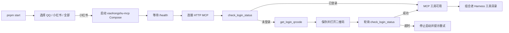

# 小红书 MCP 启动与登录设计方案

## 背景

Ye-Kitty 已经能够从通用 `.mcp.json` 连接 HTTP MCP，但项目启动入口仍只有 QQ，且不会主动检查小红书账号是否登录。`xpzouying/xiaohongshu-mcp` 提供 `http://localhost:18060/mcp`、`check_login_status`、`get_login_qrcode` 和持久化 Cookies，适合作为小红书浏览器自动化边界。

本迭代把小红书 MCP 变成项目启动时的明确选项，并在 Agent 使用小红书工具前完成服务启动、扫码登录和登录状态验证。

## 目标

- 根目录 `pnpm start` 提供 QQ、小红书、QQ + 小红书三个启动选项，并支持等价命令行参数。
- 选择小红书后启动项目管理的 `xiaohongshu-mcp` Docker Compose 服务，等待健康检查成功再连接 MCP。
- 通过 MCP 工具检查登录状态；未登录时获取二维码、保存并打开图片，扫码后轮询直到确认登录成功或超时。
- 登录完成后保持 MCP Runtime 连接，让 Harness 能看到上游实际提供的 13 个工具。
- Cookies 只由上游 MCP 持久化到 Docker 数据卷，Ye-Kitty 不读取、不打印、不复制 Cookie。

## 非目标

- 本次不监听小红书通知、评论或私信事件，不建立小红书事件订阅器。
- 本次不绕过 MCP 调用小红书未公开 HTTP 接口。
- 本次不安装 Docker、Go 或浏览器环境；缺少 Docker 时给出可执行错误说明。
- 本次不把发布、评论、点赞等写操作默认降为 `low` 风险。

## 角色共识

- 产品关注：一次启动即可看见小红书选项；未登录时能直接扫码；扫码后必须得到明确成功或超时反馈。
- 设计关注：菜单、启动进度、二维码位置、扫码等待和失败原因使用中文展示。
- 开发关注：启动编排位于 `bootstrap`，登录流程依赖 MCP 原始工具调用端口；Docker、二维码打开和时间等待均可替换测试。
- Agent 关注：登录工具和读取工具可为 `low`；发布、评论、回复、点赞、收藏和删除 Cookies 保持 `medium`，继续受 Harness 风险门禁约束。

## 整体设计

## 设计思想

小红书登录属于外部工具连接前置条件，不属于模型决策。登录检查在启动编排中确定执行，避免让 Agent 先收到业务请求后才发现 Cookie 失效。

Ye-Kitty 只调用 MCP 工具，不理解上游浏览器和 Cookie 文件格式。二维码图片是 MCP `image` 内容块，由登录服务解析后交给本地展示端口；通用 Harness observation 仍不携带 Base64 图片。

默认配置只在用户明确选择小红书时合并，普通 QQ 启动不会静默连接或启动小红书容器。用户在 `.mcp.json` 中提供同名 Server 时优先使用自定义 URL、过滤和风险设置。

## 关键实现

### 模块一：项目启动选择

- 入口：`packages/kitty-service/scripts/start.ts`
- 职责：解析交互选择或 `qq`、`xiaohongshu`、`all` 参数，并进入对应启动脚本。
- 重要细节：无参数且终端可交互时显示中文菜单；非交互环境必须显式传参，避免 CI 挂起。
- 边界：不创建平台运行时，不持有连接。

### 模块二：小红书 MCP 部署启动

- 入口：`deploy/xiaohongshu/compose.yml`
- 职责：使用上游镜像启动 18060 端口，并把 Cookies、浏览器缓存和发布图片目录持久化。
- 重要细节：项目启动只调用 Docker Compose，不安装 Docker；健康检查失败时不继续登录。
- 边界：不读取 Cookies 内容，不负责小红书账号风控。

### 模块三：小红书 MCP 登录

- 入口：`packages/kitty-service/src/services/agent-runtime/application/xiaohongshu-mcp-login.service.ts`
- 职责：调用 `check_login_status` 和 `get_login_qrcode`，展示二维码并轮询最终登录状态。
- 重要细节：二维码最长等待四分钟；已经登录时不请求二维码；工具错误、图片缺失和超时都中断小红书启动。
- 边界：不调用 `delete_cookies`，不执行发布或互动工具。

### 模块四：MCP 默认配置与 Harness 装配

- 入口：`packages/kitty-service/src/services/agent-runtime/application/xiaohongshu-mcp-config.ts`
- 职责：在明确选择小红书时补充默认 HTTP Server，并标记工具风险。
- 重要细节：登录、搜索、列表和详情读取为 `low`；删除 Cookie、发布、评论、回复、点赞和收藏保持 `medium`。
- 边界：存在用户同名 Server 时不覆盖用户配置。

## 数据与接口

| 名称                             | 方向 | 说明                                                 |
| -------------------------------- | ---- | ---------------------------------------------------- |
| `StartupPlatformSelection`       | 输入 | `qq`、`xiaohongshu`、`all`                           |
| `YE_KITTY_XIAOHONGSHU_MCP_URL`   | 输入 | 默认 `http://127.0.0.1:18060/mcp`                    |
| `YE_KITTY_XIAOHONGSHU_MCP_NAME`  | 输入 | 默认 `xiaohongshu`                                   |
| `McpRawToolCallerPort`           | 双向 | 按公开工具名调用 MCP，并保留文本和图片原始内容块     |
| `XiaohongshuQrcodePresenterPort` | 输出 | 保存二维码并尽力用系统默认图片应用打开，返回文件路径 |

## 风险与边界条件

| 风险                     | 触发条件                         | 处理方式                                                     |
| ------------------------ | -------------------------------- | ------------------------------------------------------------ |
| Docker 不存在或未启动    | 选择小红书但本机无可用 Docker    | 中断并提示安装或启动 Docker，不自动改动系统环境              |
| 首次拉取镜像耗时         | 本机没有上游镜像                 | 保留 Compose 进度；启动超时给出 `pnpm xiaohongshu:logs` 入口 |
| 二维码过期               | 四分钟内未扫码                   | 中断登录并提示重新启动，不复用过期图片                       |
| Cookie 失效              | 上游检查返回未登录               | 重新请求二维码；Cookie 仍只保存在 Docker 数据卷              |
| 写工具被 Agent 误调用    | 上游同时暴露发布和互动工具       | 默认 `medium`，Harness 拒绝自主执行                          |
| 同账号被其他网页端挤下线 | 同一账号在其他网页端再次登录     | 启动时重新检查；文档提示只使用移动 App 查看                  |
| 二维码打开失败           | 系统缺少默认图片应用或命令不可用 | 保留 PNG 文件并打印绝对路径，用户仍可手动打开                |

## 测试方案

- 单元测试：覆盖启动参数和交互选项、默认配置合并、自定义配置保留、已登录、未登录扫码成功、二维码缺失、工具错误和登录超时。
- 集成测试：使用模拟 MCP Client 验证原始图片内容可被登录服务读取，登录完成后工具仍由同一 Runtime 提供给 Harness。
- 基础设施测试：覆盖二维码 PNG 写入、打开失败降级、Docker Compose 启动和健康检查超时。
- 手动验证：运行 `pnpm start -- xiaohongshu`，扫描自动打开的二维码，日志出现“小红书账号登录状态确认成功”。
- 回归范围：QQ 单独启动不启动小红书容器；通用 `.mcp.json`、多 Server、风险门禁和优雅关闭行为不回退。
- 覆盖率：新增核心文件行、分支、函数和语句覆盖率均不低于 80%。

## 验收方式

- 产品验收：项目启动菜单存在小红书选项，未登录能扫码，扫码后能明确确认登录成功。
- 设计验收：登录进度、二维码路径、超时和失败原因均为中文，并提供下一步命令。
- 开发验收：56 项小红书 MCP 定向测试通过；新增核心文件每文件行覆盖率不低于 91.66%，分支覆盖率不低于 90.56%，函数覆盖率不低于 83.33%。Lint、Prettier、类型、架构检查和无效参数启动冒烟通过。全量测试只剩既有 OneBot `fetch_custom_face` 固定 1 秒响应测试超时，脱离本次修改仍可复现。
- Agent 验收：13 个上游工具进入 Harness；登录与读取工具可执行，写工具仍被风险门禁拒绝。

## 唯一入口

- 使用入口：`pnpm start -- xiaohongshu` 或 `pnpm start` 后选择“小红书”。
- 代码入口：`packages/kitty-service/scripts/start-platform-xiaohongshu.ts`
- 测试入口：`packages/kitty-service/src/services/agent-runtime/__test__/xiaohongshu-mcp*.test.ts`
- 文档入口：`design-docs/Agent/xiaohongshu-mcp-bootstrap.md`

## 进度记录

| 日期       | 状态   | 说明                                                                                                                                     |
| ---------- | ------ | ---------------------------------------------------------------------------------------------------------------------------------------- |
| 2026-07-16 | 待验收 | 已完成启动选项、Docker 健康检查、13 个工具配置、二维码登录与状态轮询；自动化验收通过，等待用户明确批准第三方镜像并扫码完成真实账号验收。 |
