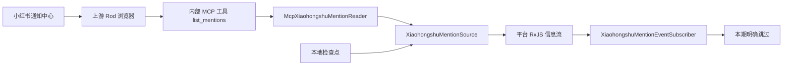

# 小红书被提及信息源设计方案

## 背景

当前 `xpzouying/xiaohongshu-mcp` 只暴露登录、内容读取和互动工具，Ye-Kitty 只能主动调用工具，无法获知账号在任意笔记或评论中被 `@` 的提醒。小红书网页版通知中心会读取评论与被提及提醒，因此本迭代在项目管理的上游镜像中补充只读 `list_mentions` 工具，再由 `packages/kitty-service/src/platforms/xiaohongshu` 把通知轮询转换为平台信息源。

本期只完成“上游通知可读、平台事件可订阅、Agent Runtime 已接入”的链路。Agent Runtime 收到事件后明确跳过，不调用模型、不生成回复、不执行互动动作，为后续单独设计智能反应策略保留稳定输入边界。

## 目标

- 基于固定上游提交构建项目管理的小红书 MCP 镜像，新增只读内部工具 `list_mentions`。
- 复用上游浏览器登录态读取小红书通知中心，不让 Ye-Kitty 读取、复制或打印 Cookie。
- 在 `packages/kitty-service/src/platforms/xiaohongshu` 建立独立信息源，完成轮询、持久化去重、失败退避和平台事件发布。
- 将小红书被提及事件接入 Agent Runtime 订阅边界，但本期只记录跳过，不进入 Harness。
- 在 QQ + 小红书组合启动和小红书单独启动两条路径中保持一致生命周期。

## 非目标

- 本期不让 Agent 理解、回复、点赞、收藏或转发被提及信息。
- 本期不监听私信、点赞、新增关注或系统通知。
- 本期不从 Ye-Kitty 直接请求小红书未公开 HTTP 接口，不实现网页签名算法。
- 本期不把 `list_mentions` 暴露到 Agent 工具目录，也不允许 Skill 主动调用。
- 本期不承诺 Webhook 级实时性；默认提供约 30 秒轮询周期的近实时信息源。

## 角色共识

- 产品关注：无论 `@` 发生在自己还是他人的笔记中，只要进入账号的“@我的”提醒，就应形成一个可追踪事件；本期不自动回应。
- 设计关注：启动、首次基线、发现新提醒、失败退避和暂不处理都要有中文状态反馈，日志不得展示提醒正文和账号凭据。
- 开发关注：上游浏览器读取、平台信息源和 Agent Runtime 订阅三层解耦；平台模块只能依赖自身端口和共享平台消息基类。
- Agent 关注：`list_mentions` 是运行时内部工具；被提及内容属于不可信外部输入，本期不得进入 Prompt。

## 整体设计



数据链路分为三段：

1. 上游 MCP 负责用浏览器打开通知中心并截获页面自身发出的 `/api/sns/web/v1/you/mentions` 响应。
2. 小红书平台模块负责调用内部工具、解析稳定事件、建立首次基线、去重和广播。
3. Agent Runtime 只负责确认已经订阅该平台信息流，并明确停止在 Harness 之前。

## 设计思想

### 复用页面请求，不复刻私有签名

`list_mentions` 不由 Ye-Kitty 拼装 Cookie、`x-s` 或 `x-s-common`。上游 Rod 浏览器加载通知中心，由网页自身完成认证和接口调用，工具只截获目标响应并返回必要数据。这样 Cookie 继续只存在于项目管理的 Docker 数据卷和上游浏览器进程内。

### 内部工具与 Agent 工具分离

MCP Runtime 增加 `internalTools` 配置。内部工具参与连接和原始调用注册，但不会出现在 `listTools()`、`getTool()` 和 Harness 执行入口中。`McpRawToolCallerPort` 仍可由启动编排和平台基础设施调用。

### 平台下层只发布，上层决定订阅行为

`XiaohongshuMentionSource` 继承 `PlatformMessageService`，只暴露 `subscribe()`。轮询、去重和事件发布由平台模块持有，Agent Runtime 通过 `XiaohongshuMentionEventSubscriber` 订阅，不允许平台模块反向依赖 Agent Runtime。

### 首次建立基线，不回放历史提醒

首次成功读取只保存最新一页通知 ID，不发布历史事件。后续每轮仍读取最新一页，对最近 200 个 ID 做持久化去重，并将未见提醒按旧到新发布。上游页面请求的游标与签名耦合，本期不篡改已签名 URL 做主动分页。

### 本期接入但不处理

订阅器收到事件后只输出脱敏的跳过日志。它不持有 Agent、Harness、Skill、工具执行器或动作发送端口，从类型结构上保证本期无法产生平台响应。

## 关键实现

### 模块一：上游 `list_mentions`

- 入口：`deploy/xiaohongshu/patches/list-mentions.patch`
- 构建：`deploy/xiaohongshu/Dockerfile.mentions`
- 职责：固定上游提交、应用补丁、构建替换后的 MCP 二进制。
- 重要细节：工具无输入，返回页面自身请求的最新一页 JSON 文本；工具标记只读；浏览器页面和响应等待受调用上下文约束。
- 边界：不保存通知正文，不标记通知已处理，不执行回复。

### 模块二：MCP 内部工具隔离

- 入口：`packages/kitty-service/src/services/agent-runtime/domain/mcp.ts`
- 职责：允许运行时注册仅供系统组件原始调用的工具。
- 重要细节：`hasTool()` 和 `callToolRaw()` 可访问内部工具；Harness 目录和 `execute()` 不可访问。
- 边界：不新增通用后台任务框架，不改变现有 13 个公开工具的风险等级。

### 模块三：小红书被提及信息源

- 入口：`packages/kitty-service/src/platforms/xiaohongshu/application/xiaohongshu-mention-source.ts`
- 职责：按配置轮询 `list_mentions`，建立基线、去重、发布标准事件并管理启停。
- 重要细节：递归 `setTimeout` 保证单实例不重叠；默认并发为 1；失败使用有上限的指数退避；停止时不再调度新请求。
- 边界：不判断内容含义，不请求模型，不回复小红书。

### 模块四：检查点持久化

- 入口：`packages/kitty-service/src/platforms/xiaohongshu/infrastructure/json-xiaohongshu-mention-checkpoint.repository.ts`
- 职责：原子保存最近 200 个通知 ID。
- 重要细节：默认路径位于 `deploy/xiaohongshu/data/mention-watcher-state.json`；目录已被 Git 忽略；文件不保存 Cookie 和完整通知正文。
- 边界：不作为历史消息库，不支持跨账号共享。

### 模块五：Agent Runtime 暂不处理订阅

- 入口：`packages/kitty-service/src/services/agent-runtime/application/xiaohongshu-mention-event-subscriber.ts`
- 职责：订阅小红书信息源，证明事件已经到达 Agent Runtime 边界。
- 重要细节：仅记录事件类型和脱敏 ID，随后返回；没有 Agent 或动作依赖。
- 边界：不进入 Harness，不追加 Prompt observation，不执行 `reply_comment_in_feed`。

### 模块六：启动与关闭装配

- 入口：`packages/kitty-service/scripts/start-platform-xiaohongshu.ts`、`packages/kitty-service/scripts/start-platform-qq.ts`
- 职责：登录成功后创建信息源、先注册订阅再启动轮询；退出时先停止信息源，再关闭 MCP Runtime。
- 重要细节：QQ 单独启动且未启用小红书时不创建信息源；小红书单独启动和组合启动行为一致。
- 边界：Docker 容器继续保留登录状态，不随进程退出删除数据卷。

## 数据与接口

| 名称                                         | 方向     | 说明                                                |
| -------------------------------------------- | -------- | --------------------------------------------------- |
| `list_mentions`                              | MCP 输出 | 返回通知中心最新一页评论和被提及提醒，不暴露 Cookie |
| `XiaohongshuMentionReaderPort`               | 平台输入 | 读取一页上游提醒并转换为平台领域对象                |
| `XiaohongshuMentionCheckpointRepositoryPort` | 双向     | 读取和保存最近通知检查点                            |
| `XiaohongshuMentionEventContract`            | 平台输出 | 进入上层订阅边界的稳定被提及事件                    |
| `XiaohongshuMentionSource.subscribe()`       | 平台输出 | 只读订阅入口，发布能力不对上层开放                  |

事件最小结构：

```json
{
  "id": "xiaohongshu:mention:通知ID",
  "platform": "xiaohongshu",
  "eventType": "mention.received",
  "senderId": "xiaohongshu:participant:用户ID",
  "senderDisplayName": "用户昵称",
  "content": "@叶猫猫 的上下文文本",
  "source": {
    "noteId": "笔记ID",
    "commentId": "评论ID",
    "url": "来源链接"
  },
  "receivedAt": "2026-07-16T00:00:00.000Z"
}
```

## 配置

| 环境变量                                        | 默认值       | 说明                           |
| ----------------------------------------------- | ------------ | ------------------------------ |
| `YE_KITTY_XIAOHONGSHU_MENTION_POLL_INTERVAL_MS` | `30000`      | 正常轮询间隔                   |
| `YE_KITTY_XIAOHONGSHU_MENTION_MAX_BACKOFF_MS`   | `120000`     | 失败退避上限                   |
| `YE_KITTY_XIAOHONGSHU_MENTION_STATE_PATH`       | 项目数据目录 | 检查点文件覆盖路径             |
| `YE_KITTY_XIAOHONGSHU_MCP_BASE_IMAGE`           | 按架构选择   | 构建补丁镜像使用的上游基础镜像 |

## 风险与边界条件

| 风险               | 触发条件                               | 处理方式                                                                 |
| ------------------ | -------------------------------------- | ------------------------------------------------------------------------ |
| 网页内部接口变化   | 通知中心不再请求已知路径或返回结构变化 | `list_mentions` 返回明确错误；平台源退避并记录结构错误，不发布不完整事件 |
| 页面读取会标记已读 | 打开通知中心改变账号未读状态           | 手动验收确认；检查点以通知 ID 为准，不依赖未读数                         |
| 高频调用触发风控   | 轮询过密或并发浏览器过多               | 默认 30 秒、并发 1、失败退避，禁止 Agent 自主调用内部工具                |
| 单页窗口溢出       | 30 秒内产生超过上游一页的新提醒        | 当前保守吞吐下可能漏事件；后续需通过页面原生滚动触发已签名分页           |
| 首次启动回放历史   | 没有检查点时读取到旧提醒               | 首次只建立基线，不广播历史消息                                           |
| 进程重启重复事件   | 检查点未落盘或写入中断                 | 临时文件写入后原子替换；事件 ID 保持稳定供上层再次去重                   |
| 通知正文提示注入   | 用户在 @内容中写入恶意指令             | 本期不进入 Harness；后续接入 Prompt 前必须作为不可信输入治理             |
| 上游源码漂移       | 补丁基于的提交变化                     | Dockerfile 固定提交并在构建时执行 `git apply --check`                    |

## 测试方案

- 上游契约测试：覆盖工具注册、输入边界、JSON 透传、超时和接口结构错误。
- MCP Runtime 单元测试：覆盖内部工具可原始调用、不可出现在 Harness 目录、不可经 `execute()` 执行。
- 平台单元测试：覆盖首次基线、增量事件、重复通知、失败退避、停止后不再轮询和检查点恢复。
- 基础设施测试：覆盖 MCP 文本/结构化结果解析、非法结果拒绝、JSON 检查点原子保存。
- 装配测试：覆盖小红书单独启动和组合启动都先订阅后启动，并在关闭时停止信息源。
- 回归范围：现有 13 个小红书工具、扫码登录、QQ 单独启动、MCP 多 Server 隔离和 Harness 工具治理。
- 覆盖率：新增核心 TypeScript 文件行、分支、函数和语句均不低于 80%。

## 验收方式

- 产品验收：在他人笔记或评论中 `@` 当前账号后，平台信息源产生一次稳定事件；Agent Runtime 日志明确显示已接收但暂不处理。
- 设计验收：启动、基线、发现、失败、退避和跳过日志均为中文，且不输出提醒正文、Cookie 或完整用户 ID。
- 开发验收：上游补丁可对固定提交应用并构建；TypeScript 定向测试、覆盖率、`pnpm check` 和 `git diff --check` 通过。
- Agent 验收：`list_mentions` 不出现在 Harness 工具目录；订阅器没有模型、Harness 和动作发送依赖。

## 唯一入口

- 使用入口：`pnpm start -- xiaohongshu` 或 `pnpm start -- all`
- 上游入口：`deploy/xiaohongshu/patches/list-mentions.patch`
- 平台入口：`packages/kitty-service/src/platforms/xiaohongshu/application/xiaohongshu-mention-source.ts`
- Agent Runtime 入口：`packages/kitty-service/src/services/agent-runtime/application/xiaohongshu-mention-event-subscriber.ts`
- 测试入口：`packages/kitty-service/src/platforms/xiaohongshu/__test__` 和 Agent Runtime/MCP 定向测试
- 文档入口：`design-docs/Agent/xiaohongshu-mention-event-source.md`

## 进度记录

| 日期       | 状态       | 说明                                                                                                                                                                                                                   |
| ---------- | ---------- | ---------------------------------------------------------------------------------------------------------------------------------------------------------------------------------------------------------------------- |
| 2026-07-16 | 开发中     | 已确认上游固定提交、通知页面路径、内部工具隔离和三层信息流设计，开始按 TDD 落地。                                                                                                                                      |
| 2026-07-16 | 待产品验收 | 已完成补丁镜像、内部工具隔离、轮询信息源、检查点和暂不处理订阅。真实登录态读取 20 条建立基线，第二轮约 1.45 秒成功且无重复广播；待人工产生新 `@` 做产品验收。                                                          |
| 2026-07-16 | 工程验证   | 新增核心文件每文件 80% 覆盖率门槛通过，总分支 94.5%、函数 100%；Lint、格式、类型、架构和 241 项回归通过。全量门禁仍被既有 QQ WebSocket 在无普通消息处理器时不解析 echo 回执的 1 项超时阻断，本迭代未越界修改 QQ 模块。 |
