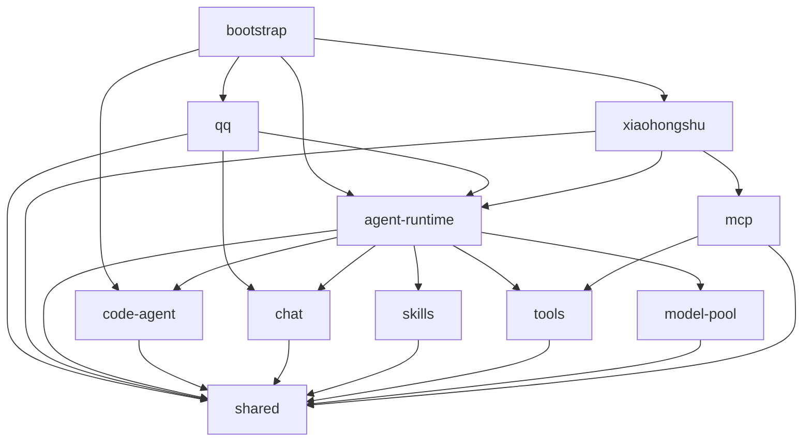

# Kitty Service 扁平模块化重构方案

## 背景

`kitty-service` 当前按“微服务模块 + 四层目录”组织：

```text
services/{服务名}/{application|domain|infrastructure|ports}
```

截至 2026-07-21，`services` 下共有 8 个服务目录。其中 `agent-runtime` 有 71 个非测试 TypeScript 文件，`llm` 有 21 个；其余 6 个服务合计只有 14 个非测试 TypeScript 文件，且多个目录主要由类型、空目录和 `.gitkeep` 组成。

上一版方案试图把这些服务内层级翻转成全局 `Core`、`Application`、`Adapters`、`Entrypoints` 等层级。用户在 2026-07-21 明确否决该方向：本次重构不是“换一种分层”，而是彻底取消 `application`、`domain`、`infrastructure`、`ports`，改成“能力模块 + shared”。因此上一版六层方案废弃，以本文档为唯一有效方案。

本方案继续参考 OpenClaude 在 `0a9bc187a469d492c20fe41d18f75ce693fe2898` 提交中的组织方式：顶层使用 [`entrypoints`](https://github.com/Gitlawb/openclaude/tree/main/src/entrypoints)、[`services`](https://github.com/Gitlawb/openclaude/tree/main/src/services)、[`tools`](https://github.com/Gitlawb/openclaude/tree/main/src/tools)、`tasks` 等能力目录，同一能力的实现和测试靠近放置。Ye-Kitty 进一步收敛为更少的顶层概念：每个顶层目录就是一个完整能力模块，除此之外只有 `shared`。

## 目标

- 彻底删除 `application`、`domain`、`infrastructure`、`ports` 四类架构目录。
- 以真实能力作为顶层模块，每个模块同时拥有自身的数据结构、业务流程、外部实现、配置和测试。
- 模块之间只能通过各自 `index.ts` 公开能力协作，禁止跨模块读取内部文件。
- 只有稳定、无单一模块归属且被多个模块使用的内容才能进入 `shared`。
- 保持 QQ、小红书、MCP、Harness、模型请求池和 Code Agent 的现有行为、配置及启动命令兼容。

## 非目标

- 不把现有四层目录替换成另一组 `core`、`adapters`、`entrypoints` 等架构层。
- 不建立全局 `ports`、`contracts`、`interfaces`、`repositories` 或统一服务基类。
- 不拆分 npm 包、独立进程、数据库或消息队列。
- 不在移动目录时重写 Harness、Prompt、模型路由、MCP 或 Code Agent 算法。
- 不为 persona、policy、risk、actions 等尚未形成真实能力的概念预建模块。

## 角色共识

- 产品关注：目录重构不改变 QQ、小红书、MCP 和 Code Agent 的可见行为。
- 设计关注：启动日志、错误提示、扫码登录和人工确认流程保持原有信息层级。
- 开发关注：查找代码时先按能力定位模块，不再判断某段代码属于四层中的哪一层。
- Agent 关注：禁止重新创建任何架构分层目录；迁移后必须同步本文档、`Task.md`、`src/ARCHITECTURE.md`、测试路径和架构校验脚本。

## 整体设计

### 目标目录

```text
packages/kitty-service/
├── scripts/                          # 兼容现有 pnpm 命令的极薄转发脚本
└── src/
    ├── agent-runtime/                # Harness 循环、Prompt、决策、运行记录
    ├── chat/                         # 会话历史、群聊节奏、准入队列
    ├── skills/                       # Skill 市场、选择、正文与引用加载
    ├── tools/                        # Tool 定义、注册、执行、组合与权限
    ├── model-pool/                   # 模型节点、路由、限流、退避与客户端
    ├── mcp/                          # MCP 配置、连接、工具发现与调用
    ├── code-agent/                   # Code Agent 协议、编排、CLI 与 HTTP
    ├── qq/                           # OneBot、QQ 事件、回复与自定义表情
    ├── xiaohongshu/                  # 登录、被提及、轮询、检查点与容器启动
    ├── bootstrap/                    # 配置读取、模块装配、启动和关闭
    ├── shared/                       # 多模块稳定共享的类型与通用能力
    │   ├── events/
    │   ├── actions/
    │   ├── ids/
    │   ├── errors/
    │   └── logging/
    ├── ARCHITECTURE.md
    └── index.ts                      # 包级稳定公开 API
```

`src` 下每个非 `shared` 目录都是一个完整模块，而不是架构层。不存在 `modules/` 总目录，因为它只会增加一次无意义嵌套。

### 模块内部结构

模块默认平铺：

```text
agent-runtime/
├── index.ts
├── harness.ts
├── decision.ts
├── observation.ts
├── runner.ts
├── prompt-state.ts
├── prompt-composer.ts
├── harness.test.ts
└── prompt-composer.test.ts
```

只有当模块内出现清晰的业务子能力时才增加目录：

```text
agent-runtime/prompt/
code-agent/process/
mcp/transports/
qq/onebot/
xiaohongshu/mentions/
```

以下目录名称在 `src` 任意深度都禁止新增：

```text
application
domain
infrastructure
ports
```

`api`、`prompt`、`process`、`onebot`、`transports` 等目录允许存在，因为它们描述具体业务或技术子能力，而不是强迫所有模块遵循同一套架构层。

### 模块公开规则

1. 每个模块必须有 `index.ts`，它是其他模块的唯一导入入口。
2. 模块内部使用相对路径，跨模块只能使用 `@kitty/{模块名}`。
3. 不提供 `@kitty/{模块名}/*` 通配 alias，防止深层穿透。
4. 一个模块可以同时包含类型、流程、配置解析和第三方实现，不再为了“纯净分层”拆散同一能力。
5. 需要测试替身时，在模块内声明描述能力的接口，例如 `AgentRunner`、`ToolExecutor`、`ConversationHistory`；不建立 `ports` 目录，也不使用无必要的 `Port` 后缀。
6. 测试与被测能力就近放置；大型模块可以使用模块内 `__test__`，但不建立全局测试层。
7. 一个文件出现两个独立变化原因时，在当前模块内拆文件，而不是抽到 `shared`。

## 模块依赖

本方案不定义全局层级方向，只定义模块依赖图和三个底线：`shared` 不反向依赖业务模块、业务模块之间不能成环、`bootstrap` 不能被其他模块依赖。



初始依赖约束：

| 模块            | 允许依赖的项目模块                                              |
| --------------- | --------------------------------------------------------------- |
| `shared`        | 无                                                              |
| `chat`          | `shared`                                                        |
| `skills`        | `shared`                                                        |
| `tools`         | `shared`                                                        |
| `model-pool`    | `shared`                                                        |
| `code-agent`    | `shared`、`tools`                                               |
| `mcp`           | `shared`、`tools`                                               |
| `agent-runtime` | `shared`、`chat`、`skills`、`tools`、`model-pool`、`code-agent` |
| `qq`            | `shared`、`chat`、`agent-runtime`                               |
| `xiaohongshu`   | `shared`、`mcp`、`agent-runtime`                                |
| `bootstrap`     | 所有模块                                                        |

如果后续出现新依赖，必须先确认不会形成环，再更新架构校验表。禁止通过把代码移动到 `shared` 的方式绕过依赖环。

## Shared 边界

内容进入 `shared` 必须同时满足：

1. 至少被两个业务模块实际使用。
2. 没有更明确的单一模块 owner。
3. 名称和语义不包含具体平台、SDK 或运行流程。
4. 变更不会只由某一个业务模块驱动。

建议保留：

- 跨平台稳定事件，例如 `ChatEvent`、`XiaohongshuMentionEvent`。
- 跨模块动作结构，例如 `OutgoingAction`。
- 稳定 ID、Logger 接口、通用错误序列化。

禁止进入：

- Harness Prompt、Skill 选择器、MCP 配置、OneBot 消息段。
- 只被一个模块使用的 Repository、Factory、配置读取器。
- 为解决循环依赖而搬出的业务对象。
- 预想未来可能复用、但当前只有一个调用方的辅助函数。

## 关键模块

### Agent Runtime

- 入口：`src/agent-runtime/index.ts`
- 职责：Harness 主循环、结构化 Prompt、观察回灌、预算、Skill/Tool 调度和最终决策。
- 重要细节：`AgentRuntimeHarness` 继续作为循环唯一 owner；OpenAI Harness Runner 若只服务于该模块，可直接留在模块内。
- 边界：不得引用 QQ、OneBot 或小红书具体类型。

### Chat

- 入口：`src/chat/index.ts`
- 职责：近期消息、群聊节奏、Harness 准入队列和平台无关会话状态。
- 重要细节：通过 `shared/events` 接收平台无关消息。
- 边界：不发送 QQ 消息，不调用模型。

### Skills、Tools 与 Model Pool

- 入口：`src/skills/index.ts`、`src/tools/index.ts`、`src/model-pool/index.ts`
- 职责：分别拥有完整的 Skill、Tool 和模型调度能力，包括只属于自身的文件系统或网络实现。
- 重要细节：不再拆成定义层、用例层和基础设施层；接口与实现留在同一模块。
- 边界：三个模块互不反向依赖，由 Agent Runtime 负责组合。

### MCP

- 入口：`src/mcp/index.ts`
- 职责：`.mcp.json`、多 Server 生命周期、工具发现、风险元数据、原始调用和传输实现。
- 重要细节：MCP 工具通过 `tools` 模块公开协议接入 Agent Runtime；小红书私有配置留在小红书模块。
- 边界：不判断聊天回复，不持有平台业务流程。

### Code Agent

- 入口：`src/code-agent/index.ts`
- 职责：Definition、Session、事件、失败分类、Orchestrator、Gate、Claude Code/Codex 子进程和本地 HTTP API。
- 重要细节：当前 `services/llm` 与 `control-plane/api` 合并为一个纵向完整模块；只有第二个非 Code Agent 消费者出现时才重新拆 HTTP。
- 边界：不接管 Harness 的 Prompt、会话和工具权限。

### QQ 与小红书

- 入口：`src/qq/index.ts`、`src/xiaohongshu/index.ts`
- 职责：各自拥有平台协议、连接、配置、事件转换、平台动作和与 Agent Runtime 的桥接。
- 重要细节：平台桥接放在平台模块，依赖方向为平台 → Agent Runtime，Agent Runtime 不再反向引用平台基础设施类型。
- 边界：跨平台稳定事件进入 `shared`；平台原始载荷永远留在平台模块。

### Bootstrap

- 入口：`src/bootstrap/start.ts`
- 职责：读取环境、选择启动模式、创建模块实例、控制启动和关闭顺序。
- 重要细节：`scripts/start*.ts` 只保留极薄转发；Bootstrap 是唯一允许依赖全部业务模块的模块。
- 边界：不实现业务算法，不提供全局 Service Locator。

## 当前目录到目标模块映射

| 当前路径或职责                                       | 目标模块                                                        | 处理方式                                             |
| ---------------------------------------------------- | --------------------------------------------------------------- | ---------------------------------------------------- |
| `services/agent-runtime/domain`                      | `agent-runtime`、`skills`、`tools`                              | 按真实 owner 移动，删除 `domain`                     |
| `services/agent-runtime/application`                 | `agent-runtime`、`chat`、`skills`、`tools`、`model-pool`、`mcp` | 按能力拆分，删除 `application`                       |
| `services/agent-runtime/infrastructure/prompt`       | `agent-runtime/prompt`                                          | Prompt 是 Harness 自身能力，不是基础设施             |
| `services/agent-runtime/infrastructure/mcp`          | `mcp`                                                           | 配置、Client 和传输放在同一 MCP 模块                 |
| `services/agent-runtime/infrastructure/skill-market` | `skills`                                                        | 文件系统 Skill 实现仍属于 Skills                     |
| `services/agent-runtime/ports`                       | 对应 owner 模块                                                 | 接口平铺并去掉无必要的 `Port` 后缀，删除 `ports`     |
| `services/llm`                                       | `code-agent`                                                    | 当前内容实际是 Code Agent，不再保留错误的 LLM 服务名 |
| `control-plane/api`                                  | `code-agent`                                                    | 当前只有 Code Agent HTTP，用纵向模块直接拥有         |
| `platforms/qq`                                       | `qq`                                                            | OneBot、消息、回复和桥接归入 QQ 模块                 |
| `platforms/xiaohongshu`                              | `xiaohongshu`                                                   | 读取、轮询、检查点、登录和容器启动归入小红书模块     |
| `contracts/events`、`contracts/actions`              | `shared/events`、`shared/actions`                               | 只保留真正跨模块的稳定结构                           |
| `services/conversation`                              | `chat`                                                          | 迁移真实会话对象，删除空四层骨架                     |
| `services/persona`、`policy`、`risk`、`actions`      | 暂不建模块                                                      | 有调用方的类型移至 owner；无调用方骨架直接删除       |
| `services/event-gateway`                             | `qq`、`xiaohongshu` 或 `shared/events`                          | 事件转换由来源模块拥有，不保留空 Gateway 服务        |
| `bootstrap/*`、`scripts/start*.ts`                   | `bootstrap`                                                     | 装配与生命周期集中，脚本只转发                       |
| `service-registry.ts`、统一 ServiceModule 类型       | 删除                                                            | 不参与真实发现和运行时装配                           |

## 模块协作流程

### QQ 消息

```text
qq 接收 OneBot 载荷并转换为 shared ChatEvent
  -> chat 记录历史、判断节奏并进入准入队列
  -> agent-runtime 调用 skills、tools、model-pool 执行 Harness
  -> qq 根据结构化决策执行平台回复
```

### 小红书被提及

```text
bootstrap 启动 xiaohongshu
  -> xiaohongshu 通过 mcp 读取 list_mentions
  -> xiaohongshu 去重并转换为 shared 事件
  -> xiaohongshu 调用 agent-runtime 当前“记录后跳过”入口
```

### Code Agent

```text
code-agent HTTP 或 agent-runtime 发起任务
  -> code-agent 完成门禁、进程编排与事件映射
  -> 工具请求经 tools 协议交回 agent-runtime
  -> code-agent 接收工具结果并继续子进程会话
```

## 迁移策略

### 阶段 0：建立模块规则

1. 记录当前架构、类型和定向测试基线。
2. 将 `validate-architecture.mjs` 从“四层目录必须存在”改成“禁止四层目录、禁止深层跨模块导入、禁止依赖环”。
3. 增加模块根 alias，例如 `@kitty/agent-runtime`、`@kitty/code-agent`，不提供通配子路径 alias。
4. 旧 alias 临时保留，但旧目录文件数量只能减少不能增加。

### 阶段 1：迁移 Code Agent

1. 将 `services/llm` 全量迁入 `code-agent`，保持模块内部现有功能子目录。
2. 将 `control-plane/api` 合并进 `code-agent`。
3. 统一通过 `code-agent/index.ts` 导出公开能力。
4. 更新测试与 Bootstrap，删除旧路径兼容入口。

Code Agent 边界相对完整，适合先验证“模块纵向拥有全部实现”的新规则。

### 阶段 2：拆分 Agent Runtime 中的独立能力

依次迁移 `chat`、`skills`、`tools`、`model-pool`、`mcp`。每次只迁移一个模块，并保持原测试断言不变。`agent-runtime` 最终只留下 Harness、Prompt、决策和运行记录。

### 阶段 3：迁移平台模块

1. 将 `platforms/qq`、QQ 订阅和动作执行合并为 `qq`。
2. 将小红书来源、登录、容器启动和事件桥接合并为 `xiaohongshu`。
3. 消除 Agent Runtime 对 QQ、小红书具体类型的 import。
4. 将启动装配收敛到 `bootstrap`，保持现有命令不变。

### 阶段 4：清理旧骨架

1. 删除旧 `services`、`platforms`、`contracts`、`control-plane` 目录。
2. 删除所有 `application`、`domain`、`infrastructure`、`ports` 目录和 `.gitkeep`。
3. 删除 `serviceRegistry`、旧 alias、兼容 re-export 和无调用方抽象。
4. 收窄包级 `src/index.ts`，同步全部设计文档代码入口。

### 阶段 5：完整回归

1. 运行 `pnpm check` 和全部定向覆盖率测试。
2. 真实验证 QQ 收发、小红书扫码与被提及、MCP 工具发现、Claude Code/Codex 任务。
3. 确认四层目录为零、跨模块深层 import 为零、模块依赖环为零。

## 架构校验设计

新的架构校验只验证简单且可执行的规则：

- `src` 下只允许已登记的能力模块、`shared`、`ARCHITECTURE.md` 和 `index.ts`。
- 任意深度禁止目录名 `application`、`domain`、`infrastructure`、`ports`。
- 每个能力模块必须有 `index.ts`。
- 跨模块只能导入 `@kitty/{模块名}`，不能导入 `@kitty/{模块名}/具体文件`。
- 依赖必须符合模块允许表，且完整依赖图无环。
- `shared` 不得 import 任何业务模块。
- 非 Bootstrap 模块不得 import `bootstrap`。
- 旧目录白名单计数只能下降，阶段 4 后白名单删除。
- 不检查某个模块必须有哪些内部目录，不再生成空骨架。

## 风险与边界条件

| 风险                   | 触发条件                              | 处理方式                                                |
| ---------------------- | ------------------------------------- | ------------------------------------------------------- |
| 模块变成新的巨型目录   | 所有 Agent 能力仍堆在 `agent-runtime` | 按真实变化原因拆出 chat、skills、tools、model-pool、mcp |
| 没有分层后依赖失控     | 模块互相深层 import 或形成环          | 强制公开入口、显式依赖允许表和环检测                    |
| `shared` 变成垃圾桶    | 为规避依赖环把业务代码移入 Shared     | Shared 四项准入条件全部满足才允许进入                   |
| 接口与实现耦合影响测试 | 删除 Ports 后直接实例化具体对象       | 模块内保留描述能力的接口和构造注入，不保留 Ports 架构   |
| 移动时误改行为         | 路径迁移同时重写算法                  | 一个提交只迁移一个模块，先保持测试断言和实现内容不变    |
| Phase 2 与目录迁移冲突 | Code Agent Harness 继续改旧路径       | 先迁移 Code Agent，再在新模块路径继续 Phase 2           |
| 启动关闭顺序回归       | 平台和 MCP 生命周期合并时顺序变化     | 保留 Bootstrap 生命周期测试和真实环境烟测               |

## 测试方案

- 单元测试：随模块移动，不因目录变化重写断言。
- 架构测试：覆盖禁用目录、公开入口、非法依赖、循环依赖、Shared 反向依赖。
- 集成测试：覆盖 QQ 到 Harness、MCP Tool 回灌、模型池调度、Code Agent 进程与 HTTP。
- 启动测试：覆盖 QQ、小红书、组合模式、无 MCP、无 Code Agent Key 和优雅关闭。
- 手动验证：真实 QQ、小红书、MCP、Claude Code 与 Codex 各完成一次主流程。

每个阶段至少运行：

```bash
pnpm --filter @ye-kitty/kitty-service run validate:architecture
pnpm --filter @ye-kitty/kitty-service run typecheck
pnpm --filter @ye-kitty/kitty-service test
```

阶段完成时运行：

```bash
pnpm check
```

设计阶段基线（2026-07-21）：

- 当前 `validate:architecture` 通过，但仍在验证 8 个旧服务的四层骨架，新校验需要在阶段 0 替换。
- 根目录 `pnpm check` 在 Lint 阶段被 21 个既有 Code Agent 问题阻断；阶段 0 必须先修复或记录基线豁免。

## 验收方式

- 产品验收：相同配置下，QQ、小红书、MCP 和 Code Agent 行为与重构前一致。
- 设计验收：代码只按能力模块和 Shared 组织，不存在任何全局或模块内架构层。
- 开发验收：旧架构目录和 alias 被删除；四层目录、深层跨模块 import、模块环均为零。
- Shared 验收：每个 Shared 导出都能指出至少两个真实调用模块，且没有更明确 owner。
- Agent 验收：本文档、`Task.md`、`src/ARCHITECTURE.md`、代码入口和测试结果一致。

## 唯一入口

- 使用入口：`pnpm start`
- 代码入口：`packages/kitty-service/src/bootstrap/start.ts`（目标路径）
- 测试入口：`pnpm check`
- 文档入口：`design-docs/Architecture/flat-modular-refactor.md`

## 进度记录

| 日期       | 状态   | 说明                                                                                                                                       |
| ---------- | ------ | ------------------------------------------------------------------------------------------------------------------------------------------ |
| 2026-07-21 | 设计中 | 用户明确否决六层重构，要求摧毁 application、domain、infrastructure、ports；方案已改为顶层能力模块 + Shared，等待确认模块清单后进入阶段 0。 |
