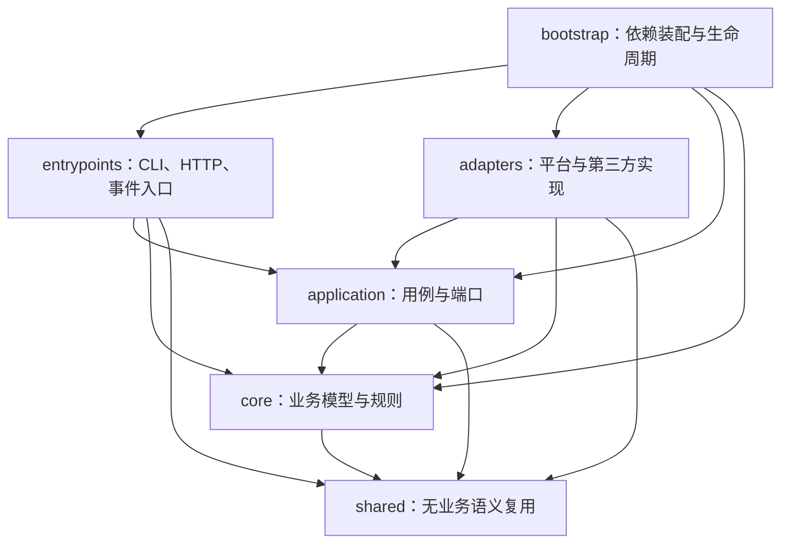

# Kitty Service 分层模块化重构方案

## 背景

`kitty-service` 当前名义上采用“模块化单体、微服务边界”的结构，但代码目录仍按微服务模板组织：

```text
services/{服务名}/{domain|application|ports|infrastructure}
```

截至 2026-07-21，`services` 下共有 8 个服务目录。其中 `agent-runtime` 有 71 个非测试 TypeScript 文件，`llm` 有 21 个；其余 6 个服务合计只有 14 个非测试 TypeScript 文件，且多个目录只有类型、端口或 `.gitkeep`。这造成了三个直接问题：

1. 小能力也被迫复制四层目录，空壳服务比真实实现更醒目。
2. `agent-runtime` 同时容纳 Harness、Prompt、Skill、Tool、模型池、MCP、QQ 节奏和小红书登录等多种职责，服务名已经不能准确表达边界。
3. 目录边界没有阻止反向依赖，例如 Agent Runtime 直接引用 QQ 基础设施类型；`scripts/start-platform-qq.ts` 也承担了过多依赖装配和生命周期逻辑。

本方案参考 OpenClaude 在 2026-07-21 的 `0a9bc187a469d492c20fe41d18f75ce693fe2898` 提交。参考重点不是复制其业务代码，而是吸收以下组织方式：

- 顶层目录按运行职责区分，例如 [`entrypoints`](https://github.com/Gitlawb/openclaude/tree/main/src/entrypoints)、[`services`](https://github.com/Gitlawb/openclaude/tree/main/src/services)、[`tools`](https://github.com/Gitlawb/openclaude/tree/main/src/tools)、`tasks`、`integrations` 和 `types`。
- 同一职责层内按具体能力建立模块，例如每一种 Tool 拥有自己的目录，测试与实现就近放置。
- 入口只负责选择运行模式，核心循环与外部集成拥有不同目录。
- 公共类型集中表达跨模块协议，具体实现按能力归档。

OpenClaude 也存在需要避免的反例：`QueryEngine.ts`、`Tool.ts` 和部分模型适配文件过大，`utils` 与全局状态较多。因此 Ye-Kitty 只借鉴“按职责分区、按能力建模块”，不引入大一统引擎或无边界工具箱。

## 目标

- 将目录从“服务优先、每个服务重复四层”改成“层优先、每层包含多个能力模块”。
- 保持模块化单体和单进程部署，不再用尚未独立部署的目录模拟微服务。
- 让依赖方向可以通过静态脚本检查，并消除应用逻辑对具体平台、SDK 和基础设施类型的直接依赖。
- 保持 QQ、MCP、小红书、Harness、模型请求池和 Code Agent 的现有行为与外部配置兼容。
- 允许未来把某个模块拆成独立进程，但不为尚未发生的拆分预建空目录和统一基类。

## 非目标

- 本次不拆分 npm 包，不创建新的微服务、数据库或消息队列。
- 本次不重写 Harness 循环、Prompt 协议、模型路由算法或 Code Agent 协议。
- 本次不顺带实现仍为空壳的 persona、policy、risk 和 actions 业务能力。
- 本次不照搬 OpenClaude 的 UI、CLI、Provider 或全局状态实现。
- 本次不改变 `.env`、`.mcp.json`、Docker Compose、HTTP 路由和现有启动命令的用户侧语义。

## 角色共识

- 产品关注：重构后 QQ 对话、小红书监听、MCP 工具和 Code Agent 的可见行为保持不变。
- 设计关注：本次没有视觉界面改动；启动日志、错误提示和人工扫码流程保持原有信息层级。
- 开发关注：目录能直接回答“这是业务规则、用例编排、外部实现、入口还是装配”；跨层依赖受自动检查约束。
- Agent 关注：迁移期间必须同步本文档、`design-docs/Task.md`、`src/ARCHITECTURE.md`、测试路径和架构校验脚本，不能只移动文件后依赖编译器兜底。

## 参考仓库结论

### 值得采用

| OpenClaude 做法                             | Ye-Kitty 采用方式                                                   |
| ------------------------------------------- | ------------------------------------------------------------------- |
| `entrypoints` 集中 CLI、SDK、MCP 等运行入口 | 建立 `entrypoints`，承载 CLI、HTTP 和事件入口                       |
| `tools`、`services`、`tasks` 按运行职责分区 | 建立 `core`、`application`、`adapters` 等稳定层级，每层按能力建模块 |
| Tool 以能力目录组织，测试靠近实现           | 每个模块允许就近放置 `*.test.ts`，不再要求统一 `__test__`           |
| `QueryEngine` 是会话循环的明确 owner        | 保留 `AgentRuntimeHarness` 作为 Harness 循环唯一 owner              |
| 外部 Provider、MCP 与核心工具调用分开       | OpenAI、MCP、Code Agent CLI、平台 SDK 全部进入 `adapters`           |
| 多入口共享同一核心运行能力                  | QQ、小红书、HTTP 入口通过 `bootstrap` 复用相同应用模块              |

### 明确不采用

| OpenClaude 现象              | Ye-Kitty 约束                                                     |
| ---------------------------- | ----------------------------------------------------------------- |
| 核心文件可能增长到上千行     | 单文件出现多个独立变化原因时立即拆成同模块内的小文件              |
| `utils` 容纳大量业务辅助逻辑 | `shared` 只接受无业务语义且至少被两个模块复用的能力               |
| 部分入口和初始化逻辑较重     | `entrypoints` 禁止创建具体 SDK Client，实例化统一进入 `bootstrap` |
| 目录依赖主要依靠约定         | 用 `validate-architecture.mjs` 校验层级和公开入口                 |

## 整体设计

### 目标目录

```text
packages/kitty-service/
├── scripts/                         # 兼容现有 pnpm 命令的极薄转发脚本
└── src/
    ├── core/                        # 纯业务模型、规则和跨用例稳定协议
    │   ├── agent/
    │   ├── chat/
    │   ├── code-agent/
    │   ├── governance/
    │   ├── skill/
    │   └── tool/
    ├── application/                 # 用例编排与由用例拥有的端口
    │   ├── harness/
    │   ├── chat/
    │   ├── code-agent/
    │   ├── skills/
    │   ├── tools/
    │   ├── model-routing/
    │   └── accounts/
    ├── adapters/                    # 平台、SDK、进程、文件系统等具体实现
    │   ├── qq/
    │   ├── xiaohongshu/
    │   ├── openai/
    │   ├── mcp/
    │   ├── code-agents/
    │   ├── filesystem/
    │   ├── persistence/
    │   └── logging/
    ├── entrypoints/                 # 进入应用的可执行边界
    │   ├── cli/
    │   ├── http/
    │   └── events/
    ├── bootstrap/                   # Composition Root 与生命周期
    │   ├── app/
    │   ├── qq/
    │   ├── xiaohongshu/
    │   ├── mcp/
    │   └── code-agent/
    ├── shared/                      # 无业务语义的稳定复用能力
    │   ├── errors/
    │   ├── ids/
    │   └── types/
    ├── ARCHITECTURE.md
    └── index.ts                     # 仅导出包级稳定公开 API
```

这里的“模块”不是预先固定的微服务。一个目录只有在存在真实代码和单一变化原因时才创建；禁止用 `.gitkeep` 批量生成未来能力。

### 依赖方向



强制规则：

1. `core` 只能依赖 `shared` 和 Node.js 标准库，不读取环境变量、不访问网络、不引用 SDK。
2. `application` 只能依赖 `core`、`shared` 和其他应用模块的公开入口；外部能力以端口表达。
3. `adapters` 实现应用端口，可以依赖 `application`、`core`、`shared` 和第三方库；不同适配器之间禁止直接互相引用。
4. `entrypoints` 只解析输入并调用应用用例，不能实例化具体 SDK Client，不能包含业务规则。
5. `bootstrap` 是唯一可以同时引用所有层的地方，也是唯一负责具体实现装配、启动顺序和关闭顺序的地方。
6. `shared` 不依赖任何其他项目层，不接受 QQ、Agent、MCP、Prompt 等业务词汇。
7. 跨模块只能从该模块 `index.ts` 导入；同模块内部可以使用相对路径。
8. 端口跟随使用者放置，例如 Harness 使用的 `AgentRunnerPort` 放在 `application/harness`，而不是建立全局 `ports` 目录。

### 模块内部约定

不再强制每个模块拥有 `domain/application/ports/infrastructure` 四个子目录。默认采用平铺结构，只有文件数量或职责确实增长后才增加子目录：

```text
application/harness/
├── agent-runtime-harness.ts
├── agent-runner.port.ts
├── prompt-composer.ts
├── prompt-state.ts
├── index.ts
├── agent-runtime-harness.test.ts
└── prompt-composer.test.ts
```

模块公开规则：

- `index.ts` 只导出其他模块真正需要的类型和能力。
- 测试、配置解析器、内部工厂和辅助函数默认不导出。
- 一个模块不得通过 `../../其他模块/具体文件` 绕过公开入口。
- 文件名表达能力，不重复目录名。例如使用 `harness.ts`，避免 `agent-runtime-harness-service-impl.ts`。
- 模板方法和策略接口仍按现有项目约束按需引入，不建立全局服务基类或统一注册器。

## 关键实现

### 模块一：Core 层

- 入口：`src/core/*/index.ts`
- 职责：承载纯 TypeScript 业务模型、值对象、决策结果、状态转换和稳定事件语义。
- 重要细节：当前 `contracts` 中真正属于业务的 Chat、Action、Code Agent 事件迁入对应 Core 模块；HTTP 请求体、OneBot 载荷等外部 DTO 不进入 Core。
- 边界：不包含存储、日志、SDK、文件系统、环境变量或生命周期管理。

建议初始模块：

- `core/chat`：ChatEvent、Conversation、Message、ConversationId 相关语义。
- `core/agent`：AgentDecision、AgentObservation、HarnessPromptState、AgentConversationMessage。
- `core/tool`：Tool 定义、调用、结果和风险元数据。
- `core/skill`：Skill、SkillReference、SkillSelectionContext。
- `core/code-agent`：Definition、Session、Event、Failure。
- `core/governance`：PolicyDecision、RiskAssessment、OutgoingAction；在规则真正变复杂前不拆成三个空模块。

### 模块二：Application 层

- 入口：`src/application/*/index.ts`
- 职责：编排用例、保存运行期状态，并声明所需外部能力端口。
- 重要细节：`AgentRuntimeHarness` 仍是 Agent 循环唯一 owner；Skill、Tool、模型路由和聊天节奏分别成为同层模块，通过公开 API 协作。
- 边界：不直接引用 Fastify、OpenAI Agents SDK、OneBot、MCP SDK、`child_process` 或具体文件路径实现。

建议初始模块：

- `application/harness`：Harness 循环、Prompt 组装、观察回灌、预算和最终决策。
- `application/chat`：近期消息、群聊节奏、Harness 准入队列和通用消息处理用例。
- `application/skills`：Skill 选择、正文加载流程和 reference 读取流程。
- `application/tools`：Tool Registry、Executor、组合工具和内置只读工具。
- `application/model-routing`：模型请求池、限流、退避和节点降级。
- `application/code-agent`：Orchestrator、Gate、Registry 和会话用例。
- `application/accounts`：小红书登录检查等账号级用例；不放 Docker、二维码窗口等具体实现。

### 模块三：Adapters 层

- 入口：`src/adapters/*/index.ts`
- 职责：把外部协议转换为应用端口，或把应用输出发送到外部系统。
- 重要细节：QQ 与小红书归入平台适配器；OpenAI、MCP 和 Code Agent CLI 归入技术适配器；JSON 检查点和文件系统 Skill 市场归入持久化类适配器。
- 边界：不得持有跨模块业务流程，不得反向调用 `bootstrap` 或 `entrypoints`。

建议初始模块：

- `adapters/qq`：OneBot 载荷、反向 WebSocket、QQ Client、消息段和自定义表情目录访问。
- `adapters/xiaohongshu`：被提及读取、轮询源、检查点和平台事件转换。
- `adapters/openai`：模型 Client、Harness Runner、QQ Reply Agent、视觉 Agent。
- `adapters/mcp`：配置加载、连接工厂、Runtime Tool 实现和原始调用能力。
- `adapters/code-agents`：Claude Code/Codex 映射器、子进程协议、环境与会话生命周期。
- `adapters/filesystem`：Skill 市场、正文和 reference 加载。
- `adapters/persistence`：进程内或 JSON Repository 的具体实现。
- `adapters/logging`：统一中文结构化日志实现。

### 模块四：Entrypoints 层

- 入口：`src/entrypoints/cli/main.ts`
- 职责：接收 CLI、HTTP 或平台事件输入，做输入解析和输出映射，然后调用一个应用用例。
- 重要细节：当前 `control-plane/api` 迁入 `entrypoints/http/code-agent`；QQ 与小红书订阅器迁入 `entrypoints/events`，订阅器只把平台事件交给应用用例。
- 边界：不决定模型、工具权限、聊天节奏或风险规则，不创建具体外部客户端。

### 模块五：Bootstrap 层

- 入口：`src/bootstrap/app/start.ts`
- 职责：读取运行配置、创建具体实现、连接端口、确定启动与关闭顺序。
- 重要细节：当前 `scripts/start-platform-qq.ts` 的装配逻辑迁入 `bootstrap/qq`；`scripts` 中保留一到三行动态导入作为兼容入口。MCP、Code Agent、小红书容器和平台生命周期分别拥有独立 Bootstrap 模块。
- 边界：不实现业务算法，不向其他层导出全局 Service Locator。

## 当前目录到目标目录的映射

| 当前路径或职责                                                 | 目标模块                                                                                   | 迁移说明                                              |
| -------------------------------------------------------------- | ------------------------------------------------------------------------------------------ | ----------------------------------------------------- |
| `contracts/events`、`conversation/domain`                      | `core/chat`                                                                                | 合并重复的聊天事件与会话语义                          |
| `contracts/actions`、`policy`、`risk`、`actions`               | `core/governance`                                                                          | 只迁移真实类型，删除空四层骨架                        |
| `services/agent-runtime/domain`                                | `core/agent`、`core/tool`、`core/skill`                                                    | 按类型实际语义拆分，不保留 `domain` 总目录            |
| `agent-runtime/application/agent-runtime-harness.ts` 与 Prompt | `application/harness`                                                                      | 保留 Harness owner，Prompt 与状态机就近放置           |
| Agent Runtime 的 Skill 选择和加载流程                          | `application/skills`                                                                       | 文件系统实现移至 `adapters/filesystem`                |
| Agent Runtime 的 Tool Registry、Executor、Runtime Tools        | `application/tools`                                                                        | MCP 连接与 SDK 代码移至 `adapters/mcp`                |
| 模型请求池                                                     | `application/model-routing`                                                                | OpenAI HTTP Client 移至 `adapters/openai`             |
| 近期消息、群聊节奏、准入队列                                   | `application/chat`                                                                         | 只依赖 Core ChatEvent 和应用端口                      |
| QQ 回复订阅、动作执行、自定义表情                              | `entrypoints/events/qq-chat` + `adapters/qq`                                               | 订阅编排与平台实现分开                                |
| 小红书被提及订阅与登录流程                                     | `entrypoints/events/xiaohongshu-mention` + `application/accounts` + `adapters/xiaohongshu` | MCP 与 Docker 实现分别进入对应 Adapter/Bootstrap      |
| `services/llm` 中的 Code Agent                                 | `core/code-agent` + `application/code-agent` + `adapters/code-agents`                      | 去掉不准确的 `llm` 服务名                             |
| `control-plane/api`                                            | `entrypoints/http/code-agent`                                                              | HTTP 只是入站接口，不作为独立控制面层                 |
| `platforms/qq`、`platforms/xiaohongshu`                        | `adapters/qq`、`adapters/xiaohongshu`                                                      | 平台不再作为特殊架构层                                |
| `bootstrap/*`                                                  | `bootstrap/{app                                                                            | qq                                                    | xiaohongshu | mcp | code-agent}` | Composition Root 仍保留，但按生命周期模块化 |
| `shared/types`、`shared/infrastructure`                        | `shared` 或具体 Adapter                                                                    | RxJS Event Source 归使用它的适配器；纯类型才留 Shared |
| `service-registry.ts`                                          | 删除                                                                                       | 当前注册表只描述目录，不参与真实运行时发现或装配      |

## 核心运行流

### QQ 消息

```text
adapters/qq 接收 OneBot 载荷
  -> entrypoints/events/qq-chat 转为 Core ChatEvent
  -> application/chat 执行历史、节奏和准入
  -> application/harness 执行观察、Skill、Tool 和模型循环
  -> application/chat 形成回复动作
  -> adapters/qq 发送 OneBot 消息
```

### 小红书被提及

```text
bootstrap/xiaohongshu 确保容器和账号就绪
  -> adapters/mcp 调用内部 list_mentions
  -> adapters/xiaohongshu 轮询、去重并转换事件
  -> entrypoints/events/xiaohongshu-mention
  -> application/chat 当前执行“记录后跳过”的既有用例
```

### Code Agent

```text
entrypoints/http/code-agent 接收任务
  -> application/code-agent 编排与门禁
  -> adapters/code-agents 启动 Claude Code 或 Codex 子进程
  -> 工具请求回到 application/tools / application/harness
  -> 事件映射后返回 HTTP 或内部调用方
```

## 数据与接口

| 名称                            | 方向                             | 说明                                                        |
| ------------------------------- | -------------------------------- | ----------------------------------------------------------- |
| `ChatEvent`                     | Adapter/Entrypoint → Application | 平台无关的聊天输入，不含 OneBot 或小红书原始对象            |
| `AgentDecision`                 | Harness → Chat 用例              | 结构化最终决策，继续保留 reply、ignore、human_review 等协议 |
| `ToolDefinition` / `ToolResult` | Application Tools ↔ Harness      | 不暴露 MCP SDK 类型                                         |
| `AgentRunnerPort`               | Application → Adapter            | 由 OpenAI Harness Runner 实现                               |
| `ChatEventSourcePort`           | Entrypoint/Bootstrap → Adapter   | 由 QQ WebSocket 或小红书轮询源实现                          |
| `ReplyDispatcherPort`           | Application → Adapter            | 由 QQ Adapter 实现，应用层不读取 QQ 基础设施类型            |
| `CodeAgentRunnerPort`           | Application → Adapter            | 由 Claude Code/Codex 子进程适配器实现                       |
| `SkillContentLoaderPort`        | Application → Adapter            | 由文件系统适配器实现                                        |
| `McpRawToolCallerPort`          | Application → Adapter            | 仅账号登录和内部平台读取等受控用例可使用                    |

## 迁移策略

重构采用“先建边界、再搬能力、最后删除兼容层”，每个阶段保持可编译和可回滚。禁止一次性移动全部文件后集中修复。

### 阶段 0：冻结基线与依赖规则

1. 记录当前 `pnpm check`、QQ Harness、MCP、Code Agent 定向测试结果。
2. 修改 `validate-architecture.mjs`，先允许旧目录和新目录并存，同时禁止新代码继续写入旧服务骨架。
3. 在 `tsconfig.json` 增加 `@kitty/core/*`、`@kitty/application/*`、`@kitty/adapters/*`、`@kitty/entrypoints/*`，保留旧 alias 作为过渡。

完成条件：没有业务文件移动，架构检查可以识别新旧目录并输出迁移进度。

### 阶段 1：迁移 Code Agent 纵向切片

1. 先迁移 `core/code-agent` 的定义、事件、会话和失败类型。
2. 再迁移 `application/code-agent` 的 Orchestrator、Gate 和 Registry。
3. 把 Claude Code/Codex、进程环境和生命周期迁入 `adapters/code-agents`。
4. 把 Fastify Controller 与 Server 迁入 `entrypoints/http/code-agent`。
5. 旧路径仅保留临时 re-export，确认所有调用方改用模块公开入口后删除。

选择该切片的原因：它边界相对完整，能先验证新分层、公开入口和测试迁移方法。

### 阶段 2：迁移平台与启动入口

1. 迁移 QQ 和小红书 Adapter，消除应用层对 `platforms/*/infrastructure` 的引用。
2. 将平台事件订阅器迁入 `entrypoints/events`，只调用应用用例。
3. 把 `scripts/start*.ts` 中的装配和关闭逻辑迁入 `bootstrap`。
4. 保留原启动命令和环境变量名，增加启动/关闭顺序集成测试。

完成条件：应用层代码中不存在 `@kitty/platforms`、OneBot、Fastify 或具体 MCP SDK import。

### 阶段 3：拆分 Agent Runtime

按以下顺序逐模块迁移，每次只处理一个变化原因：

1. `core/agent`、`core/tool`、`core/skill`。
2. `application/skills`。
3. `application/tools`。
4. `application/model-routing`。
5. `application/chat`。
6. `application/harness` 与 Prompt。
7. `adapters/openai`、`adapters/mcp`、`adapters/filesystem`。

迁移期间保留 `services/agent-runtime/index.ts` 兼容外观，但禁止新增实现。最后一个调用方迁出后整体删除。

### 阶段 4：清理骨架和旧架构

1. 删除空壳服务目录、`.gitkeep`、`serviceRegistry` 和无调用方的统一 Service 类型。
2. 删除旧 alias、兼容 re-export 和旧路径测试配置。
3. 将 `src/index.ts` 收窄为真正的包级稳定 API，不再批量导出内部实现。
4. 更新 `src/ARCHITECTURE.md`、各设计文档代码入口和根目录说明。

### 阶段 5：完整回归与人工验收

1. 运行根目录 `pnpm check`。
2. 运行 QQ Harness、MCP、小红书、模型池和 Code Agent 定向覆盖率测试。
3. 进行 QQ 消息、MCP 发现、小红书登录/被提及和 Code Agent HTTP 的真实环境烟测。
4. 对照迁移清单确认旧目录、旧 alias 和跨层深层 import 为零。

## 架构校验设计

新的 `validate-architecture.mjs` 不再检查每个服务是否存在四个固定目录，而应检查以下事实：

- 只允许定义的顶层目录。
- `core`、`application`、`adapters`、`entrypoints`、`bootstrap`、`shared` 的依赖方向合法。
- 非 `bootstrap` 文件不得同时依赖应用端口和具体适配器。
- 跨模块 import 必须指向模块 `index.ts` 暴露的 alias，不得深层穿透。
- `application` 和 `core` 不得依赖 Fastify、OpenAI Agents SDK、RxJS、WebSocket、MCP SDK 或 Node 子进程模块。
- `shared` 文件路径和导出符号不得包含业务模块名称。
- 旧目录在迁移阶段采用白名单计数，只能减少不能增加；阶段 4 后完全禁止。
- 不再要求目录必须存在，避免再次生成空架构骨架。

## 风险与边界条件

| 风险                           | 触发条件                            | 处理方式                                              |
| ------------------------------ | ----------------------------------- | ----------------------------------------------------- |
| 大规模路径变更掩盖行为变化     | 搬文件时同时重写算法                | 每个提交只迁移一个能力，先保留实现和测试内容不变      |
| 循环依赖从服务内转移到层内模块 | Harness、Tool、Skill 互相深层引用   | 端口归消费者、只依赖公开入口，架构脚本检查模块环      |
| 兼容 re-export 长期残留        | 新旧路径都能工作但无人清理          | 为每个兼容入口记录删除阶段，阶段 4 设零容忍检查       |
| Core 被外部 DTO 污染           | 直接复用 OneBot、MCP、Fastify 类型  | Adapter 在边界完成转换，Core 只保留平台无关语义       |
| `shared` 再次膨胀              | 为避免依赖方向把业务代码丢入 Shared | 只有两个以上模块稳定复用且无业务词汇时才能进入 Shared |
| 启动生命周期回归               | Composition Root 拆分后关闭顺序变化 | 为启动/关闭建立集成测试，真实环境烟测保留原日志锚点   |
| 当前 Phase 2 开发与迁移冲突    | Code Agent Harness 接入继续改旧路径 | 先完成 Code Agent 新分层，后续 Phase 2 只在新路径开发 |
| Git 历史难以追踪               | 同时改名、格式化和重写内容          | 使用 `git mv`，提交内不做无关格式化，按模块拆成小提交 |

## 测试方案

- 单元测试：测试文件随模块移动，断言内容不因路径迁移而修改；新增公开入口和端口适配测试。
- 架构测试：覆盖每条依赖规则的正例与反例，校验旧目录数量只能下降、跨模块深层 import 被拒绝。
- 集成测试：覆盖 QQ 事件到 Harness、Tool/MCP 回灌、模型池调度、Code Agent 子进程事件映射和 HTTP 路由。
- 启动测试：覆盖 QQ、小红书、组合模式、未配置 MCP、未配置 Code Agent API Key 和优雅关闭。
- 端到端或手动验证：真实 QQ 收发、小红书扫码及被提及、MCP 工具发现、Claude Code/Codex 各一次完整任务。
- 回归范围：Prompt 文本、结构化决策协议、环境变量、`.mcp.json`、日志脱敏、HTTP 鉴权、Docker 健康检查和 Cookie 权限。

建议每个阶段至少运行：

```bash
pnpm --filter @ye-kitty/kitty-service run validate:architecture
pnpm --filter @ye-kitty/kitty-service run typecheck
pnpm --filter @ye-kitty/kitty-service test
```

阶段完成时运行：

```bash
pnpm check
```

设计阶段基线（2026-07-21）：

- `validate:architecture` 通过，当前仍校验 8 个旧服务骨架。
- 本文档与 `Task.md` 的 Prettier 检查通过。
- 根目录 `pnpm check` 在 Lint 阶段被 21 个既有 Code Agent 问题阻断，涉及未使用变量、显式 `any`、类型导入和 `case` 词法声明；本次文档改动未修改这些文件。阶段 0 必须先确定这些问题的修复提交或基线豁免，不能把失败误归因于目录迁移。

## 验收方式

- 产品验收：相同配置下，QQ、小红书、MCP 和 Code Agent 的可见行为与重构前一致。
- 设计验收：开发者能从顶层目录判断代码职责，并能从模块 `index.ts` 找到唯一公开入口。
- 开发验收：旧 `services`、`platforms`、`control-plane`、`contracts` 目录和旧 alias 被删除；架构、类型、Lint、格式和测试全部通过。
- 依赖验收：Core/Application 对具体平台和 SDK 的 import 为零，非 Bootstrap 的跨 Adapter import 为零，跨模块深层 import 为零。
- Agent 验收：本文档、`Task.md`、`src/ARCHITECTURE.md`、真实代码入口和测试结果保持一致。

## 唯一入口

- 使用入口：`pnpm start`
- 代码入口：`packages/kitty-service/src/entrypoints/cli/main.ts`（目标路径）
- 装配入口：`packages/kitty-service/src/bootstrap/app/start.ts`（目标路径）
- 测试入口：`pnpm check`
- 文档入口：`design-docs/Architecture/layered-modular-refactor.md`

## 进度记录

| 日期       | 状态   | 说明                                                                                                                                                                                                                                  |
| ---------- | ------ | ------------------------------------------------------------------------------------------------------------------------------------------------------------------------------------------------------------------------------------- |
| 2026-07-21 | 设计中 | 完成现有目录与依赖审计，阅读 OpenClaude 顶层结构、入口、Tool、Service、Task、核心循环和 Provider/MCP 组织，形成分层模块化方案；架构与文档格式检查通过，`pnpm check` 被 21 个既有 Code Agent Lint 问题阻断，等待方案评审后进入阶段 0。 |
