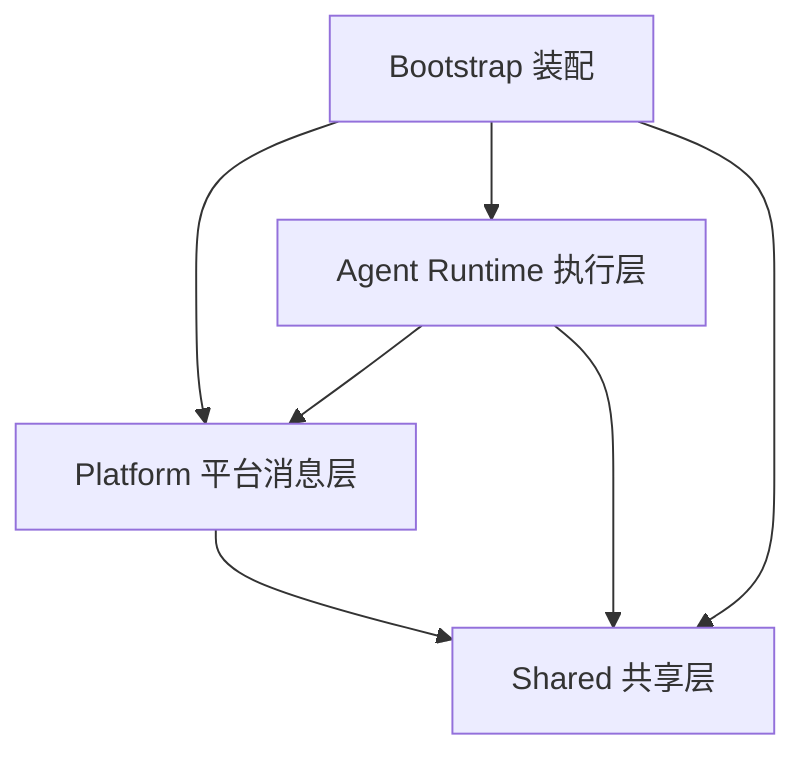
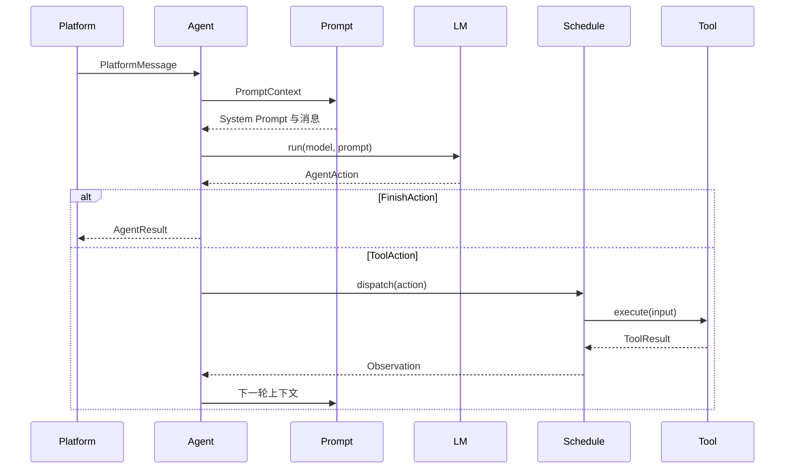

# Kitty Service 三层模块化重构方案

## 背景

`kitty-service` 当前主要按“微服务模块 + application/domain/infrastructure/ports”组织。真实运行方式却是一个进程内的 Agent 系统：平台接收消息，Agent 组织上下文并调用模型，模型产生 Action，运行时调度工具，最终回复平台。四层骨架把一个连续流程拆散到大量目录、Port 和带平台前缀的文件中，增加了查找与修改成本。

本轮重构明确摧毁四层目录，不再把它们翻转成另一套全局分层。最终只保留三个业务层级：

- `platforms`：平台消息层，负责外部消息和动作的协议转换。
- `agent-runtime`：Agent 执行层，负责 Prompt、LM、Action 调度和工具执行循环。
- `shared`：真正跨层稳定共享的基础类型与通用能力。

另保留 `bootstrap` 作为进程装配目录。它不是第四个业务层级，只负责创建实例、连接依赖以及控制启动和关闭。

## OpenCode 参考结论

本方案参考 [OpenCode 仓库](https://github.com/anomalyco/opencode) 2026-07-21 的 [`cb562b2c6289c2eee707078f9ab644cbe1d3d8a9`](https://github.com/anomalyco/opencode/tree/cb562b2c6289c2eee707078f9ab644cbe1d3d8a9) 提交，重点借鉴职责划分，而不是复制目录：

| OpenCode 职责                                                                                                                                            | Ye-Kitty 对应职责                 | 借鉴点                                                                 |
| -------------------------------------------------------------------------------------------------------------------------------------------------------- | --------------------------------- | ---------------------------------------------------------------------- |
| [`session/system.ts`](https://github.com/anomalyco/opencode/blob/cb562b2c6289c2eee707078f9ab644cbe1d3d8a9/packages/opencode/src/session/system.ts)       | `agent-runtime/prompt`            | System Prompt 有唯一组织者，根据模型、环境、Skill 和工具动态治理内容。 |
| [`session/prompt.ts`](https://github.com/anomalyco/opencode/blob/cb562b2c6289c2eee707078f9ab644cbe1d3d8a9/packages/opencode/src/session/prompt.ts)       | `agent-runtime/agent.ts`          | Agent 拥有一次运行循环，组合 Prompt、LM、Action 和 Observation。       |
| [`session/processor.ts`](https://github.com/anomalyco/opencode/blob/cb562b2c6289c2eee707078f9ab644cbe1d3d8a9/packages/opencode/src/session/processor.ts) | `agent-runtime/schedule`          | 统一消费模型产生的 Action，管理工具调用状态和下一轮循环。              |
| [`session/llm.ts`](https://github.com/anomalyco/opencode/blob/cb562b2c6289c2eee707078f9ab644cbe1d3d8a9/packages/opencode/src/session/llm.ts)             | `agent-runtime/lm`                | LM 负责模型解析、运行选择和统一流式事件，不把供应商细节泄漏给 Agent。  |
| [`tool/registry.ts`](https://github.com/anomalyco/opencode/blob/cb562b2c6289c2eee707078f9ab644cbe1d3d8a9/packages/opencode/src/tool/registry.ts)         | `agent-runtime/tools/registry.ts` | 所有内建、MCP 和扩展工具经同一注册表发现、过滤与执行。                 |
| [`tool/skill.ts`](https://github.com/anomalyco/opencode/blob/cb562b2c6289c2eee707078f9ab644cbe1d3d8a9/packages/opencode/src/tool/skill.ts)               | `agent-runtime/tools/skill.ts`    | Skill 的渐进式读取作为普通 Tool 接入 Agent 循环。                      |

OpenCode 的文件名通常只表达当前目录中的核心元素，例如 `system.ts`、`prompt.ts`、`processor.ts`、`llm.ts` 和 `registry.ts`。Ye-Kitty 同样让目录提供上下文，不再在文件名中重复 `harness`、平台名或架构角色后缀。

## 目标

- 删除任意深度的 `application`、`domain`、`infrastructure`、`ports` 目录。
- 形成 Platform → Agent Runtime → Shared 的清晰依赖方向。
- 将全部 System Prompt 文本、拼装和动态治理集中到 `agent-runtime/prompt`。
- 将 Skill 收敛为渐进式读取能力，并通过 Tool 接入 Agent。
- 将所有可执行能力集中到 `agent-runtime/tools`，由统一 Registry 管理。
- 新增 Schedule，统一把 AgentAction 调度到对应 Tool。
- 将 `model-pool` 改为 `lm`；LM 内持有 Model Pool，并为 Runtime 提供可运行的语言模型。
- 将 Code Agent 沉淀到 `lm/code-agent`，作为特殊的语言模型执行能力。
- 重新设计文件名，让 Agent、Action、Observation、Tool、LM 成为最小公共元素。
- 保持 QQ、小红书、MCP、模型调用和 Code Agent 的现有可见行为。

## 非目标

- 不拆成多个 npm 包、独立进程或远程微服务。
- 不建立全局 Port、Adapter、Repository、Factory 或 Service 基类。
- 不让 `shared` 成为解决依赖环的临时堆放区。
- 不在目录迁移期间同时改写模型策略、平台协议或业务 Prompt 内容。
- 不把 Schedule 扩展为 cron、延迟队列或跨进程任务系统。

## 角色共识

- 产品：目录重构不能改变 QQ、小红书、MCP 与 Code Agent 的用户行为。
- 设计：扫码登录、人工确认、风险拒绝和工具执行反馈保持当前信息层级。
- 开发：按 Platform、Agent Runtime、Shared 定位代码，再按 Agent 元素找到具体模块。
- Agent：禁止重新创建四层目录和 `Harness` 命名；变更必须同步本方案、文件映射、`Task.md`、源码架构说明与架构校验。

## 最终目录

```text
packages/kitty-service/src/
├── platforms/                       # 平台消息层
│   ├── index.ts
│   ├── message.ts                   # 归一化平台消息
│   ├── action.ts                    # 归一化平台动作
│   ├── channel.ts                   # 平台消息订阅接口
│   ├── qq/
│   │   ├── index.ts
│   │   ├── config.ts
│   │   ├── message.ts
│   │   ├── channel.ts
│   │   ├── client.ts
│   │   ├── ingress.ts
│   │   ├── reply.ts
│   │   ├── faces.ts
│   │   ├── vision.ts
│   │   ├── cadence.ts
│   │   ├── queue.ts
│   │   └── onebot/
│   │       ├── schema.ts
│   │       ├── server.ts
│   │       ├── client.ts
│   │       ├── ingress.ts
│   │       └── action.ts
│   └── xiaohongshu/
│       ├── index.ts
│       ├── config.ts
│       ├── message.ts
│       ├── source.ts
│       ├── reader.ts
│       ├── checkpoint.ts
│       ├── login.ts
│       ├── qrcode.ts
│       ├── docker.ts
│       └── mcp.ts
├── agent-runtime/                   # Agent 执行层
│   ├── index.ts
│   ├── agent.ts
│   ├── action.ts
│   ├── observation.ts
│   ├── message.ts
│   ├── state.ts
│   ├── history.ts
│   ├── subscriber.ts
│   ├── prompt/
│   ├── skills/
│   ├── tools/
│   ├── schedule/
│   └── lm/
├── shared/                          # 稳定共享层
│   ├── index.ts
│   ├── ids.ts
│   ├── logger.ts
│   ├── logging.ts
│   └── error.ts
├── bootstrap/                       # 进程装配，不是业务层
│   ├── start.ts
│   ├── environment.ts
│   ├── platform.ts
│   ├── agent.ts
│   ├── tools.ts
│   └── lm.ts
├── ARCHITECTURE.md
└── index.ts
```

只有模块出现至少三个相互协作且可单独命名的文件时才创建子目录。目录负责提供业务上下文，文件名只表达最小元素。

## 依赖方向



约束如下：

| 模块            | 允许依赖                                   |
| --------------- | ------------------------------------------ |
| `shared`        | 无项目内业务模块                           |
| `platforms`     | `shared`                                   |
| `agent-runtime` | `platforms` 的公开消息与动作类型、`shared` |
| `bootstrap`     | 所有模块                                   |

`platforms` 只暴露消息订阅和动作执行能力，不主动调用 Agent。`agent-runtime/subscriber.ts` 在装配阶段订阅平台 Channel，因此控制流仍是平台消息进入 Agent，但源码依赖不会形成 Platform ↔ Agent 环。

## Agent 最小元素

### Agent

`agent.ts` 是一次 Agent 运行循环的唯一 owner，职责只有：

1. 接收归一化 PlatformMessage。
2. 请求 Prompt 生成当前 System Prompt 和消息上下文。
3. 请求 LM 运行模型并解析 AgentAction。
4. 把 Action 交给 Schedule。
5. 将 Tool Observation 回灌下一轮，直到得到最终结果或触发预算限制。

Agent 不直接拼接 Prompt，不执行 Tool，不选择模型节点，也不认识 QQ、OneBot、小红书和 MCP 的内部类型。

### AgentAction

将当前 `AgentDecision` 重命名为 `AgentAction`，只保留两个动作族：

```ts
type AgentAction = FinishAction | ToolAction;

type FinishAction = {
  type: 'finish';
  result: 'reply' | 'ignore' | 'review';
  output?: string;
};

type ToolAction = {
  type: 'tool';
  callId: string;
  name: string;
  input: unknown;
};
```

原有 `skill_call`、`skill_reference_call`、`tool_call` 和 Code Agent 分支均逐步兼容解析为 ToolAction。迁移期先增加旧结构适配器，再更新 Prompt 和评估用例，最后删除旧 Decision 类型。

### Observation

Observation 是 Agent 唯一可见的外部执行结果，统一表达：

- Tool 成功输出。
- Tool 执行失败。
- 权限或风险策略拒绝。
- 可重试提示与结构化错误。
- 已消耗预算和下一步可用信息。

Tool 不直接修改 Agent 状态；Schedule 将 ToolResult 归一化成 Observation 后交还 Agent。

## Agent 运行流程



## Prompt：System Prompt 的唯一治理模块

目标结构：

```text
agent-runtime/prompt/
├── index.ts
├── system.ts           # System Prompt 基础规则与模型差异
├── context.ts          # 平台、运行环境和会话上下文
├── turn.ts             # 当前轮消息与 Observation
├── action.ts           # AgentAction 输出协议
├── history.ts          # 历史消息渲染
├── skills.ts           # Skill 目录数据渲染
├── tools.ts            # Tool 描述数据渲染
├── composer.ts         # 唯一拼装入口
├── state.ts            # 动态治理状态
└── system.md           # 稳定的基础 System Prompt
```

Prompt 是唯一允许持有 System Prompt 文本和进行 Prompt 字符串拼装的模块。Skills、Tools、Platforms 和 LM 只能提供结构化数据，不能返回“可直接拼到 System Prompt 的字符串”。

Composer 保持三个稳定章节：

1. System：身份、行为边界、Action 协议、安全规则。
2. Context：运行中的 LM、平台上下文、Skill 目录、Tool 目录和预算。
3. Turn：当前消息、近期历史、Observation、错误和人工反馈。

动态治理至少覆盖：

- 根据 LM 能力选择结构化输出、Tool Calling 或文本 Action 协议。
- 根据平台和会话状态注入必要上下文。
- 根据 Skill 渐进式加载状态决定只显示目录、正文或引用。
- 根据 Tool 可见性、权限和风险状态生成当前可用工具清单。
- 控制历史、Observation 和工具结果的预算与裁剪。
- 对每次生成记录 Prompt 版本、启用章节和裁剪原因，日志不记录敏感正文。

## Skills：只负责渐进式读取

```text
agent-runtime/skills/
├── index.ts
├── skill.ts            # Skill 元数据和正文结构
├── catalog.ts          # 发现与列举
├── loader.ts           # 正文按需读取
├── reference.ts        # 引用资源按需读取
├── selector.ts         # 目录候选选择
└── parser.ts           # Markdown 与 Frontmatter 解析
```

读取分三阶段：

1. 目录阶段：只读取名称、描述和触发条件，供 Prompt 展示候选。
2. 正文阶段：Agent 通过 `tools/skill.ts` 指定 Skill 后读取完整 `SKILL.md`。
3. 引用阶段：只有正文明确要求时才读取相关 reference、script 或 asset。

Skills 不负责 Prompt 渲染、Tool 执行、权限判断和 AgentAction 调度。`tools/skill.ts` 是 Skills 进入 Agent 循环的唯一桥梁，行为与 OpenCode 把 Skill 暴露为普通 Tool 的方式一致。

## Tools：所有执行能力的统一组织者

```text
agent-runtime/tools/
├── index.ts
├── tool.ts             # ToolDefinition、ToolContext、ToolResult
├── registry.ts         # 注册、发现、可见性和重名检查
├── executor.ts         # 超时、取消、日志和结果归一化
├── permission.ts       # 风险与人工确认
├── messages.ts         # 平台消息类工具
├── faces.ts            # 自定义表情工具
├── skill.ts            # Skills 渐进式读取桥梁
├── code.ts             # Code Agent 桥梁
└── mcp/
    ├── schema.ts
    ├── config.ts
    ├── client.ts
    └── runtime.ts
```

内建工具、平台工具、MCP 工具、Skill 读取和 Code Agent 都注册为统一 ToolDefinition。Registry 负责“当前有哪些 Tool”，Executor 负责“如何可靠执行”，Permission 负责“是否允许执行”。三者不得相互替代。

Tool 名称是 AgentAction 的稳定协议；文件名和供应商实现可以变化，但已经写入 Prompt、评估和会话记录的 Tool 名称需要显式迁移。

## Schedule：AgentAction 调度器

```text
agent-runtime/schedule/
├── index.ts
├── schedule.ts         # 单次 Action 调度流程
├── dispatcher.ts       # Action 到 Tool 的定位
└── result.ts           # 调度结果与 Observation 转换
```

Schedule 只处理 Agent 单次运行中的 Action，不承担系统定时任务。标准流程为：

1. 接收 AgentAction 并校验 callId、name 和 input。
2. FinishAction 直接返回 AgentResult。
3. ToolAction 通过 Registry 查找 Tool。
4. 运行 Permission 检查，必要时产生人工确认 Observation。
5. 交给 Executor 执行并归一化 ToolResult。
6. 生成 Observation，交给 Agent 决定是否进入下一轮。

Schedule 只依赖 Registry、Executor 和 Permission 的公开能力。它不知道 MCP Client、Skill Loader、Code Agent Runner 或具体平台客户端，因此新增 Tool 不需要修改 Schedule 的条件分支。

## LM：Runtime 可运行模型的提供者

```text
agent-runtime/lm/
├── index.ts
├── lm.ts               # Agent 使用的统一 run/stream API
├── model.ts            # 模型标识、能力与运行信息
├── pool.ts             # Model Pool 节点选择和健康状态
├── config.ts           # 模型与节点配置
├── openai.ts           # OpenAI 兼容协议
├── fallback.ts         # 降级与重试策略
├── error.ts            # 统一错误
└── code-agent/
    ├── index.ts
    ├── agent.ts
    ├── definition.ts
    ├── task.ts
    ├── event.ts
    ├── session.ts
    ├── error.ts
    ├── runner.ts
    ├── registry.ts
    ├── gate.ts
    ├── claude.ts
    ├── codex.ts
    ├── routes.ts
    ├── server.ts
    ├── log.ts
    └── process/
        ├── args.ts
        ├── stream.ts
        ├── environment.ts
        ├── session.ts
        └── command.ts
```

LM 持有 Model Pool。Agent 只向 LM 请求“给定运行需求下可运行的模型”，不直接读取节点、供应商、限流和退避配置。LM 负责：

- 根据模型能力和运行需求选择节点。
- 管理并发、健康状态、退避、重试与降级。
- 把供应商事件归一化为 Agent 可消费的输出。
- 提供当前模型能力给 Prompt，但不生成 Prompt 文本。

Code Agent 沉淀到 `lm/code-agent`，因为它同样为 Runtime 提供语言模型驱动的执行能力，但保留子进程编排、会话协议、Gate 和 HTTP API。`tools/code.ts` 是普通 Agent 调用 Code Agent 的唯一入口；Code Agent 内部产生的工具请求仍回到 Schedule/Tools 执行。

依赖必须保持单向：`tools/code.ts` 可以依赖 `lm/code-agent` 的公开能力，LM 不得反向导入 Tools。这样 Code Agent 既能被 Agent 当作 Tool 使用，也不会让 LM 负责工具权限和执行。

## Platforms：平台消息与动作

Platforms 负责外部世界与 Agent 公共语言之间的转换：

- 原始事件 → PlatformMessage。
- PlatformAction → 平台 SDK 或协议调用。
- 连接、鉴权、重连、检查点和平台特有状态。

QQ 和小红书的原始类型永远留在各自目录。文件已经位于 `platforms/qq` 时使用 `message.ts`，不再使用 `qq-message.ts`；文件已经位于 `onebot` 时使用 `server.ts`，不再使用 `onebot-websocket-server.ts`。

Platforms 不组织 Prompt、不调用 LM、不判断 AgentAction，也不引用 Agent Runtime 内部文件。由 Agent Runtime 主动订阅 Channel 和调用平台公开 Action。

## Shared 边界

内容进入 Shared 必须同时满足：

1. 已被至少两个上层模块实际使用。
2. 没有更明确的业务 owner。
3. 不含平台、模型供应商、Prompt 或运行流程语义。
4. 变更原因不由某一个业务模块独占。

初期只保留 ID、Logger、日志辅助和通用错误。PlatformMessage 属于 Platforms，AgentAction 属于 Agent Runtime，Tool 属于 Tools，Model 属于 LM，均不得为了“方便导入”上沉到 Shared。

## 文件命名规则

1. 目录提供上下文，文件只写最小元素：`prompt/system.ts`、`tools/registry.ts`、`lm/pool.ts`。
2. 删除文件名中的 `harness`、`.service`、`.factory`、`.adapter`、`.port`、`.contract`、`.controller`。
3. 平台目录内删除平台前缀：`qq/message.ts`，不是 `qq/qq-message.ts`。
4. `lm/code-agent` 内删除 `code-agent` 前缀：`session.ts`，不是 `code-agent-session.ts`。
5. 测试名与源文件同名：`agent.test.ts`、`prompt/composer.test.ts`。
6. 对外核心类型只使用 Agent、AgentAction、Observation、Tool、LM、Model。
7. 只有同一目录发生真实重名时才增加语义修饰词，不能用架构后缀消除重名。

完整迁移清单见 [`file-name-map.md`](./file-name-map.md)。

## 迁移步骤

### 阶段 0：固定边界与兼容协议

- 新增目标目录和架构校验，先禁止新的四层目录、Harness 文件名和跨层依赖。
- 定义 PlatformMessage、AgentAction、Observation、Tool、LM 的最小公共类型。
- 增加旧 AgentDecision 到 AgentAction 的兼容解析，不改变现有运行路径。

### 阶段 1：迁移 Prompt 与 Agent 命名

- 将所有 System Prompt 资产、拼装器和动态上下文迁入 `agent-runtime/prompt`。
- 把 Harness 主循环改名为 Agent，并把 Decision 改名为 Action。
- 更新 Prompt 快照、评估用例和日志字段，再删除 Harness Prompt 旧入口。

### 阶段 2：迁移 Skills、Tools 与 Schedule

- 先建立 ToolDefinition、Registry、Executor 和 Permission。
- 将 MCP、平台动作、Skill 读取和现有 Tool 注册到统一 Registry。
- 引入 Schedule，使用统一 ToolAction 替换 Skill、MCP、Code Agent 的专用调度分支。
- 验证每个 Tool 的超时、取消、风险拒绝和 Observation 回灌。

### 阶段 3：迁移 LM 与 Code Agent

- 将 Model Pool 移到 `lm/pool.ts`，由 `lm.ts` 提供统一运行接口。
- 将供应商客户端、重试和降级迁入 LM。
- 将现有 LLM 服务中的 Code Agent 移入 `lm/code-agent` 并完成简名改造。
- 通过 `tools/code.ts` 接入 Schedule，删除 Agent 对 Code Agent 的专用调用分支。

### 阶段 4：迁移 Platforms

- 先迁移公共 PlatformMessage、PlatformAction 和 Channel。
- 分别迁移 QQ/OneBot 与小红书实现并删除目录内重复平台前缀。
- 把回复订阅和 Agent 准入流程移动到 `agent-runtime/subscriber.ts`，消除 Platform → Agent 依赖。

### 阶段 5：清理旧骨架

- 删除 application、domain、infrastructure、ports、Service Registry 和空服务骨架。
- 删除 `Harness`、`Port`、`Adapter`、平台重复前缀等旧文件。
- 更新包导出、路径别名、启动脚本、测试路径和源码架构说明。
- 全量运行架构校验、格式化、Lint、单测、集成测试和 Agent Eval。

每个阶段都必须保持可运行和可回滚，禁止先整体移动目录再集中修复编译错误。

## 架构校验

升级 `validate:architecture`，至少校验：

- `src` 业务目录只有 `platforms`、`agent-runtime`、`shared`，另允许 `bootstrap`。
- 任意深度不存在 `application`、`domain`、`infrastructure`、`ports`。
- Platforms 不导入 Agent Runtime，Shared 不导入任何业务模块。
- Bootstrap 不被其他模块导入，Agent Runtime 不深层穿透 Platform 实现。
- 只有 `agent-runtime/prompt` 可以持有 Prompt 资产或拼装 System Prompt。
- 所有执行能力只能通过 Tools Registry 暴露；Schedule 不导入具体 Tool 实现。
- LM 不导入 Tools；Code Agent 的 Agent 入口只能位于 `tools/code.ts`。
- 文件名不含 `harness`、架构角色后缀、目录上下文中重复的平台前缀。
- 不存在跨模块依赖环和遗留路径别名。

## 测试与验收

### 测试范围

- Prompt：章节顺序、动态开关、预算裁剪、Skill/Tool 可见性和快照兼容。
- Skills：目录、正文、引用三级读取，以及非法路径和缺失资源。
- Tools：注册冲突、权限拒绝、超时、取消、错误归一化和 MCP 生命周期。
- Schedule：FinishAction、未知 Tool、风险确认、Tool 成功/失败和 Observation 回灌。
- LM：节点选择、并发、重试、降级、流式事件和 Code Agent 会话。
- Platforms：原始事件转换、重连、检查点、回复动作和平台类型不外泄。
- Agent：消息 → Prompt → LM → Action → Tool → Observation → 最终结果的闭环。

### 完成条件

- 源码中四层目录数量为零。
- Platform、Agent Runtime、Shared 三层边界通过架构校验且无依赖环。
- System Prompt 只由 Prompt 模块组织和治理。
- Skill 正文与引用只在 Agent 明确调用对应 Tool 后读取。
- 所有 MCP、平台、Skill 和 Code Agent 能力都能通过统一 Tool Registry 调度。
- Agent 不含 MCP、Skill、Code Agent 的专用分支，Schedule 不含具体 Tool 条件分支。
- Agent 只依赖 LM 接口，不直接操作 Model Pool 或供应商客户端。
- 文件和公开元素中不再使用 Harness 与重复平台前缀。
- 原有 QQ、小红书、MCP 和 Code Agent 行为测试保持通过，新增闭环测试通过。
- `pnpm check` 与 Agent Runtime Eval 通过。

## 文档入口与进度

- 唯一方案入口：本文档。
- 文件迁移入口：[`file-name-map.md`](./file-name-map.md)。
- 执行进度与验收入口：[`../Task.md`](../Task.md)。
- 当前状态：设计中，尚未进入源码迁移。
- 下一步：评审 AgentAction 协议、Prompt 唯一治理权和 LM/Tools 单向依赖，确认后从阶段 0 开始实施。
