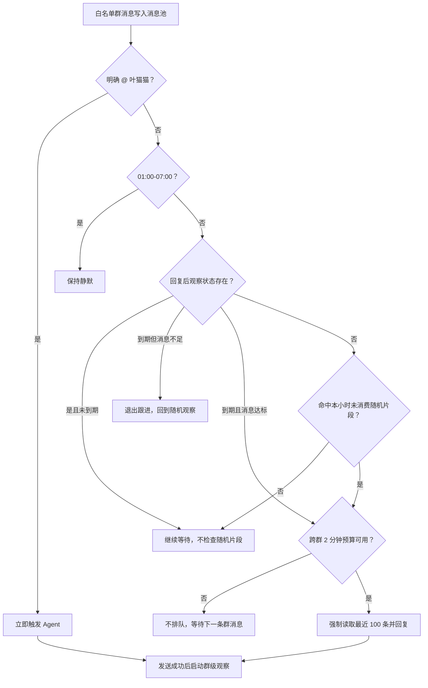

# QQ 群聊低负载节奏回复设计

## 背景

群聊里的叶猫猫需要偶尔主动参与，但旧版节奏在高活跃群中会制造过多模型请求：随机片段内的每条消息都可能触发 Agent，回复后计时器又从 `10 秒 + 1 条消息` 开始，最快一分钟内就能多次强制回复。当前项目并发负载已经无法承受这种积极跟进频率，因此需要把主动参与改为可预测、有上限的低负载节奏。

## 目标

- 所有白名单群聊消息仍先进入消息池，未触发回复的消息不会丢失。
- 未 `@` 群聊只有取得群级节奏机会和跨群主动预算后，才进入 Agent Harness。
- 回复后的首次跟进延长到 `10 分钟 + 10 条新消息`，并逐级提高到 `60 分钟 + 50 条新消息`。
- 每个群每小时只有一个随机片段，每个片段最多触发一次。
- 所有群的未 `@` 主动触发至少间隔 2 分钟，避免同时占满模型请求池。
- 节奏触发后仍强制 Agent 读取最近 100 条群消息并回复。

## 非目标

- 不限制明确 `@叶猫猫` 的群聊消息，直接互动仍立即进入 Agent。
- 不修改私聊触发方式、最近消息窗口或 Harness 的强制回复协议。
- 不把未取得预算的旧消息加入等待队列，也不在后台补发过期回复。
- 不用模型请求池代替 QQ 业务节奏判断；模型池继续只负责模型节点调度和限流。

## 角色共识

- 产品关注：叶猫猫保留偶尔主动接话的感觉，但不会在群聊热闹时连续刷屏。
- 设计关注：`@` 互动保持及时；未 `@` 的主动参与允许因负载预算而跳过。
- 开发关注：群级节奏先筛选候选消息，跨群预算再限制进入 Harness 的总速率。
- Agent 关注：节奏触发仍是强制回复路径，必须先读取最近 100 条群消息。

## 整体设计

## 设计思想

节奏控制分为“群级状态”和“进程级预算”两层。群级状态决定某个群是否值得主动参与，进程级预算决定当前服务是否有能力发起新的主动模型请求。预算必须在进入 Harness 前预占，否则请求已经进入模型池后再限速，无法降低实际并发。

回复后观察状态优先于随机观察：只要计时器还存在，未到期时就直接等待，不再检查随机片段。这样随机入口不会绕过回复后的冷却时间。随机片段在取得预算后立即标记为已消费，即使后续模型或发送失败，也不会让同一片段的其他消息反复发起模型请求。

## 关键实现

### 群级随机观察

- 入口：`packages/kitty-service/src/services/agent-runtime/application/group-chat-cadence-controller.ts`
- 07:00-12:00、14:00-18:00、19:00-21:00：每小时生成一个 2 分钟随机片段。
- 12:00-14:00、18:00-19:00、21:00-01:00：每小时生成一个 5 分钟随机片段。
- 每个小时只有一个片段，取得预算并触发后立即消费，本小时不再主动触发。
- 01:00-07:00 未 `@` 群消息保持静默，并清理回复后观察状态。

### 回复后计时计数器

每次群聊成功回复后，使用“时间到达并且消息数达标”的联合条件：

| 阶段         | 最短等待 | 新消息门槛 |
| ------------ | -------: | ---------: |
| 首次跟进     |  10 分钟 |      10 条 |
| 第二次跟进   |  20 分钟 |      20 条 |
| 第三次跟进   |  30 分钟 |      30 条 |
| 第四次跟进   |  40 分钟 |      40 条 |
| 第五次跟进   |  50 分钟 |      50 条 |
| 第六次及以后 |  60 分钟 |      50 条 |

- 每次命中后等待增加 10 分钟、消息门槛增加 10 条。
- 等待时间最高 60 分钟，消息门槛最高 50 条。
- 计时器到达但消息数不足时，取消回复后观察并回到随机观察。
- 计时器未到达时，即使命中随机片段也不会触发 Agent。

### 跨群主动回复预算

- 随机片段和回复后计数器都属于未 `@` 主动触发，共享一个进程级预算。
- 任意群取得预算后，下一次未 `@` 主动触发至少等待 2 分钟。
- 预算在调用 Agent 前同步预占，防止多个群同时通过门控。
- 未取得预算的消息只保留在消息池，不进入等待队列；后续有新消息时重新判断。
- 明确 `@叶猫猫` 的消息绕过主动预算，但回复成功后仍会启动该群的回复后观察。

### Harness 强制回复

- 入口：`packages/kitty-service/src/services/agent-runtime/application/agent-runtime-harness.ts`
- 随机片段或计时计数器取得预算后，订阅器传入 `required_group_reply`。
- Harness 必须要求 Agent 先调用 `get_recent_messages` 读取最近 100 条群消息。
- 读取后必须输出包含文字或受控动作的 `reply`，不能返回 `ignore` 或空回复。

## 数据与接口

| 名称                       | 方向 | 说明                                                           |
| -------------------------- | ---- | -------------------------------------------------------------- |
| `GroupChatCadenceConfig`   | 输入 | 提供机器人 QQ 号、时间源、随机源、计时计数参数和跨群最小间隔。 |
| `GroupChatCadenceDecision` | 输出 | 返回触发、等待或忽略结果，并标记是否进入强制群聊回复。         |
| `markReplySent`            | 输入 | 仅在实际发送成功后启动或刷新该群的回复后观察。                 |
| `required_group_reply`     | 输出 | 告诉 Harness 本轮必须读取上下文并回复。                        |

## 风险与边界条件

| 风险                   | 触发条件                           | 处理方式                                         |
| ---------------------- | ---------------------------------- | ------------------------------------------------ |
| 高频群长期占用主动机会 | 同一个群持续满足计时计数条件       | 门槛逐级增长并封顶为 60 分钟和 50 条。           |
| 多群同时命中           | 多个群在同一时间满足随机或计数条件 | 进入 Harness 前预占全局 2 分钟预算。             |
| 旧消息延迟发送         | 未取得预算的触发被排队             | 不建立等待队列，只在下一条新消息到达时重新判断。 |
| 随机片段重复触发       | 同一片段内连续收到多条消息         | 片段首次取得预算后立即消费。                     |
| 冷却被随机入口绕过     | 回复后的随机片段先于计时器命中     | 回复后观察状态优先，未到期不检查随机片段。       |

## 测试方案

- 单元测试：覆盖安静时段、`@` 立即触发、2/5 分钟随机片段、片段单次消费、10-60 分钟计时递增、10-50 条计数递增和跨群 2 分钟预算。
- 边界测试：覆盖冷却期命中随机片段、预算被其他群占用、计时器到期但消息不足，以及 `@` 绕过主动预算。
- 集成回归：确认 `QqReplyEventSubscriber` 仍先写入消息池，强制回复仍携带 `required_group_reply`。
- 全量检查：运行根目录 `pnpm check`，统一校验格式、Lint、类型和测试。

## 验收方式

- 产品验收：同一随机片段最多产生一次主动回复，连续跟进最快也需要 10 分钟和 10 条新消息。
- 设计验收：`@` 及时回复、未 `@` 主动参与和跨群负载预算边界清晰。
- 开发验收：节奏控制器定向测试、类型检查、Lint 与根目录 `pnpm check` 通过。
- Agent 验收：本文档、`design-docs/Task.md`、Harness 文档、实现和测试保持一致。

## 唯一入口

- 使用入口：启动 QQ 平台后自动对所有白名单群聊应用。
- 代码入口：`packages/kitty-service/src/services/agent-runtime/application/group-chat-cadence-controller.ts`
- 测试入口：`packages/kitty-service/src/services/agent-runtime/__test__/group-chat-cadence-controller.test.ts`
- 文档入口：`design-docs/QQ/chat-time.md`

## 进度记录

| 日期       | 状态   | 说明                                                                                               |
| ---------- | ------ | -------------------------------------------------------------------------------------------------- |
| 2026-07-08 | 待验收 | 完成首版随机片段和回复后计时计数器。                                                               |
| 2026-07-14 | 待验收 | 完成低负载速率、片段单次消费、冷却优先和跨群主动预算；定向 12 项测试、Lint、类型与架构检查已通过。 |
